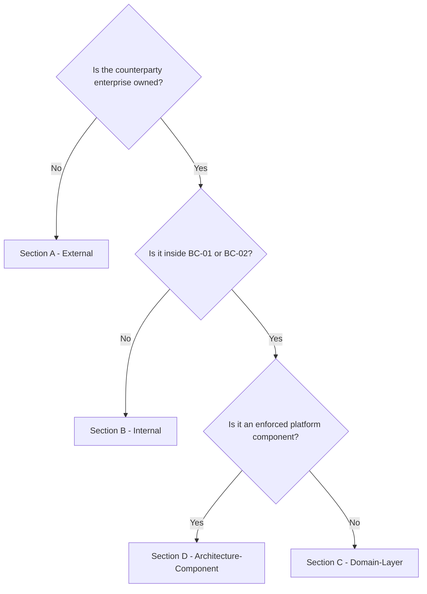
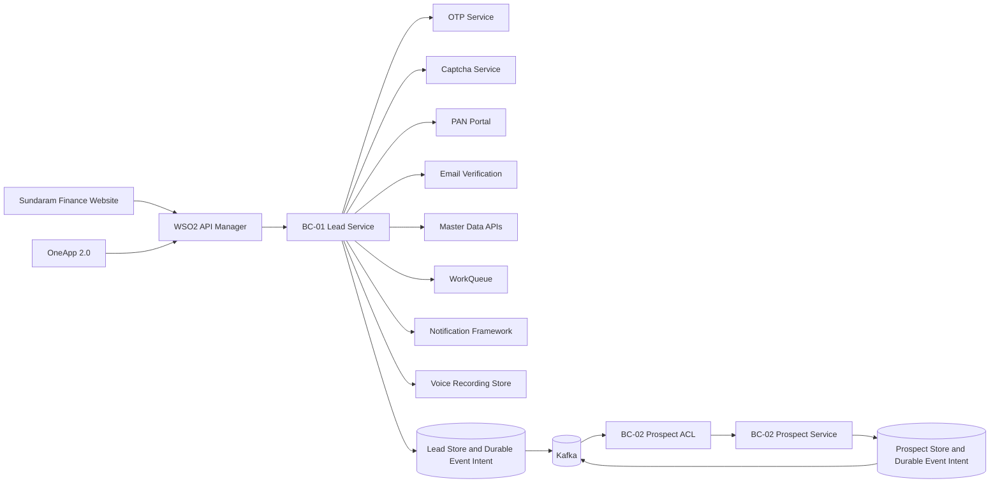
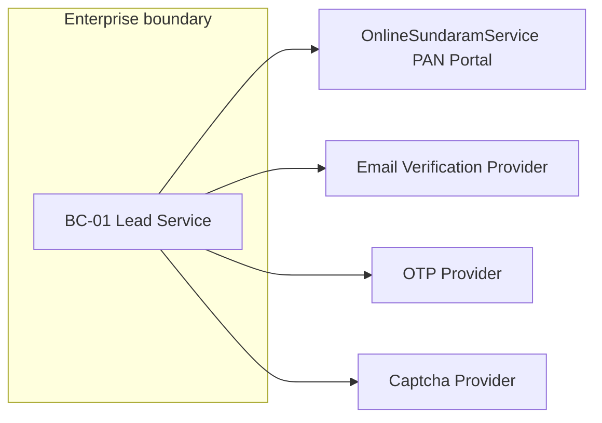
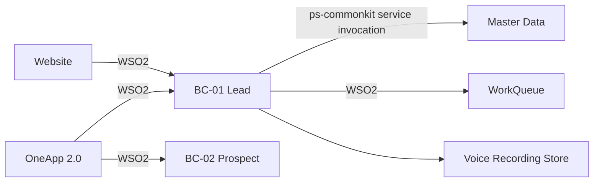
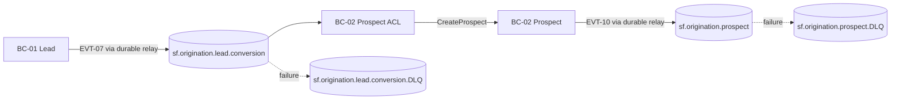

# Lead and Prospect Application Integration Architecture

## Document Control

| Field | Value |
|---|---|
| Document Type | Integration Architecture Specification |
| Artifact Level | Design Integration Artifact |
| Layer | Application |
| Classification | Application |
| Generating Skill | integration-architecture |
| Supporting Skills | workqueue-technical-spec; notification-framework; oneapp; oneapp-functional-spec; oneapp-technical-spec; ps-commonkit; voice-to-text; pan-validation; master-data-lookups |
| Lifecycle Phase | Design |
| Purpose | Define integrations, communication patterns, and approved enterprise products, frameworks, and foundation components to be used for implementation |
| Responsibility | Spec Generation Agent |
| Application / Solution | Lead and Prospect Application |
| Scope | Lead Creation, Lead Follow-up, Lead Conversion, Lead Closure, and Prospect Creation only |
| Bounded Context(s) | BC-01 Lead; BC-02 Prospect |
| Version | 1.0.4 |
| Date | 2026-09-02 |
| Status | Draft |
| Author | GitHub Copilot - Application Spec Agent |
| Approver | TBD - Architecture Guild |
| Traceability | `.github/inputdata/Final_lead_solution.md`; `.github/inputdata/24aug2026-api-specification.md`; `.github/inputdata/24aug2026-event-catalog.md`; `.github/inputdata/24aug2026-domain-model-specification.md`; `.github/inputdata/24aug2026-architecture-decision-records.md`; ADR-001 through ADR-009 (Accepted); ADR-010 (Proposed) |
| Supersedes | N/A |
| Superseded by | N/A |

---

## Section 1 - Purpose and Scope

This specification defines integration behavior for exactly two bounded contexts: BC-01 Lead and BC-02 Prospect. Lead is limited to five capabilities: Lead Creation, Lead Follow-up, Lead Conversion, Lead Closure, and Lead Reassignment. Prospect is limited to Prospect Creation. In scope are the Sundaram Finance website and OneApp 2.0 ingress surfaces, evidence-backed verification and master-data dependencies, WorkQueue lifecycle exchanges needed by the five Lead capabilities (including WorkQueue Reassignment INT-11 per Rule F-3 ordering), the real-time Field Associate notification after successful website Lead allocation, the reassignment notification to the newly assigned Field Associate, voice-recording reference persistence, and the Kafka handoff from `LeadConvertedToProspect` to `ProspectCreated`. Prospect read or post-creation processing, transcription, customer campaign notifications, notification status/callback/scheduling/file flows, Cause and Effect, bulk, batch, file, upload, import, migration, and historical-loading flows are explicitly excluded.

`Prospect` is the canonical BC-02 term under ADR-004. The exact source-defined BC-01 status `Converted to Enquiry` is retained only as the Lead-side lifecycle value. It does not create an Enquiry aggregate, event, API resource, or third bounded context.

### 1.1 Supporting-Skill Activation Record

| Supporting Skill | Status | Evidence Decision |
|---|---|---|
| workqueue-technical-spec | ACTIVATED | Technical endpoint paths, WSO2/Tomcat routes, OAuth2 token contract, request/response contracts, and Reassignment V1 contract are required. Reassignment is in scope per Rule F-14 (Domain Model `ReassignLead` command, Event Catalog EVT-09 `LeadReassigned`, API Specification `POST /api/v1/leads/{leadId}/reassign`). |
| notification-framework | ACTIVATED | `Final_lead_solution.md` requires a real-time notification to the Field Associate after website Lead allocation and identifies OTP SMS plus allocation-failure notification evidence. Only the single allocation notification is sufficiently evidenced for INT-14. OTP remains EXT-03 until its provider is confirmed; duplicate rejection remains synchronous API/UI feedback; missing-pincode notification mechanism/recipient remain a Documentation Gap. `sendMultipleNotifications`, `fetchDispatchStatus`, direct project Kafka, callbacks, scheduling, attachments, and file flows are not evidenced. |
| oneapp | ACTIVATED | OneApp 2.0 is the confirmed enterprise digital workplace and API consumer for Field Associate access. |
| oneapp-functional-spec | ACTIVATED | Role and mobile workflow evidence is needed to constrain OneApp access to the four allowed Lead capabilities. |
| oneapp-technical-spec | ACTIVATED | The scope requires API ingress, bearer-token, session, and mobile integration controls. |
| cause-and-effect | NOT ACTIVATED | No CAE service, cause topic, state rule, timeout rule, effect executor, or replay evidence applies. |
| ps-commonkit | ACTIVATED | Mandatory target-platform overlay for Dapr wrappers, Kafka, Vault, idempotency, observability, audit, and architecture governance. |
| voice-to-text | ACTIVATED | Source evidence permits voice recording references during Lead Follow-up, but explicitly excludes transcription and speech-to-text. Neither transcription API profile is activated. |
| pan-validation | ACTIVATED | Lead Follow-up invokes PAN verification; the embedded `POST /panvalidation` portal contract applies. |
| master-data-lookups | ACTIVATED | Customer Type, Product, Asset Type, Asset Make, Asset Variant, Nature of Asset, and two-step Pincode allocation are required by Lead Creation invariants. |

#### 1.1.1 Notification Framework Evidence Register

| Evidence | Classification | Decision |
|---|---|---|
| `Final_lead_solution.md` around lines 447 and 2117-2141: website Lead allocation requires real-time notification to the assigned Field Associate | Confirmed and in scope | Activates Notification Framework and INT-14 single `sendNotification` evaluation |
| `Final_lead_solution.md` around line 2413: duplicate Lead rejection must give immediate feedback | Confirmed, synchronous caller behavior | Keep in INT-01 response; no separate dispatch flow is evidenced |
| `Final_lead_solution.md` around lines 3747-3760: OTP depends on SMS Gateway | Confirmed dependency; provider identity unresolved | Keep EXT-03; do not assume Notification Framework routing |
| `Final_lead_solution.md` around lines 3920-3956: failed pincode allocation requires notification/flag | Confirmed business need; mechanism and recipient unresolved | Record DG-NF-005; do not create a dispatch integration yet |
| Notification Framework project configuration dated 2026-08-28 in the supporting skill | Confirmed framework baseline | TEST/BETA endpoints, WSO2 OAuth2 dependency, Vault credential reference, and project channel vocabulary may be used |
| OneApp channel OpenAPI/profile and template registry entry for allocation | Baseline supplied by `notification-framework` skill (confirmed TEST/BETA endpoints, `templateName`/`channel[]`/`langCode` project profile, OAuth2 token contract) | INT-14 is rendered from baseline per Rule F-13; only scenario `templateName`, `projectApiId`, device-token lookup, PROD/LIVE endpoint remain owned Documentation Gaps DG-NF-001 through DG-NF-005 |

API inventory decision: `sendNotification` is included once for allocation; token acquisition is its authentication dependency. `sendMultipleNotifications`, `fetchDispatchStatus`, direct project-owned Kafka exchange, provider callback, scheduling, attachments, and file-assisted dispatch are excluded because current project evidence does not require them. Provider-internal persisted Kafka processing remains inside the Notification Framework boundary.

### 1.2 Capability Allow-List

| Bounded Context | Allowed Capability | Integration Consequence |
|---|---|---|
| BC-01 Lead | Lead Creation | Website and OneApp ingress; OTP, captcha, master-data, pincode allocation, WorkQueue save, and Field Associate allocation notification |
| BC-01 Lead | Lead Follow-up | OneApp ingress; interactions, PAN/email verification, funding updates, optional voice-recording references, WorkQueue update |
| BC-01 Lead | Lead Conversion | OneApp ingress; WorkQueue close; `LeadConvertedToProspect` publication |
| BC-01 Lead | Lead Closure | OneApp ingress; WorkQueue close |
| BC-01 Lead | Lead Reassignment | OneApp ingress (Branch Manager AUTH-03); WorkQueue reassignment (INT-11); `LeadReassigned` (EVT-09) publication; Field Associate reassignment notification |
| BC-02 Prospect | Prospect Creation | Consume `LeadConvertedToProspect` through ACL; enforce one Prospect per `sourceLeadId`; publish `ProspectCreated` |

No integration may add a second Prospect capability without an approved scope change and corresponding source-contract update.

---

## Section 2 - Category Definitions and Decision Tree

### 2.1 The four categories

| Section | Category | Definition |
|---|---|---|
| A | External | Systems outside the enterprise trust boundary, governed by provider contracts and SLAs. |
| B | Internal | Enterprise-owned channels and systems outside the Lead and Prospect bounded-context group. |
| C | Domain-Layer | Cross-context events and ACL translation inside this application. |
| D | Architecture-Component | Enforced platform components consumed by the services. |

### 2.2 Category ID prefixes

| Section | ID Prefix | Range |
|---|---|---|
| A External | EXT-`<NN>` | EXT-01 .. EXT-99 |
| B Internal | INT-`<NN>` | INT-01 .. INT-99 |
| C Domain-Layer | DOM-`<NN>` | DOM-01 .. DOM-99 |
| D Architecture-Component | ARC-`<N>` | ARC-1 .. ARC-99 |

### 2.3 Category-selection decision tree



Unconfirmed provider ownership is recorded as a Documentation Gap; it does not authorize a change of category without Architecture Guild review.

---

## Section 3 - Landscape Summary

### 3.1 Master Catalogue

| ID | Name | Category | Direction | Criticality | Owner |
|---|---|---|---|---|---|
| EXT-01 | PAN Verification Portal | External | Outbound request / inbound response | High | OnlineSundaramService owner - TBD |
| EXT-02 | Email Verification Service | External | Outbound request / inbound response | Medium | Process Owner - TBD |
| EXT-03 | OTP Service | External | Outbound request / inbound response | High | Digital Channel Owner - TBD |
| EXT-04 | Captcha Verification Service | External | Outbound request / inbound response | High | Digital Channel Owner - TBD |
| INT-01 | Sundaram Finance Website Lead Capture Ingress | Internal | Inbound | High | Website Product Owner - TBD |
| INT-02 | OneApp Lead API Ingress | Internal | Inbound | High | OneApp Product Owner - TBD |
| INT-03 | Customer Type Lookup | Internal | Outbound request / inbound response | High | Master Data Owner - TBD |
| INT-04 | Asset Type Lookup | Internal | Outbound request / inbound response | Medium | Master Data Owner - TBD |
| INT-05 | Asset Make Lookup | Internal | Outbound request / inbound response | Medium | Master Data Owner - TBD |
| INT-06 | Asset Variant Lookup | Internal | Outbound request / inbound response | Medium | Master Data Owner - TBD |
| INT-07 | WorkQueue OAuth2 Token Acquisition | Internal | Outbound request / inbound response | High | WSO2 / WorkManagement Owner - TBD |
| INT-08 | WorkQueue Save Workitem | Internal | Outbound request / inbound response | High | WorkManagement Owner - TBD |
| INT-09 | WorkQueue Close Workitem | Internal | Outbound request / inbound response | High | WorkManagement Owner - TBD |
| INT-10 | WorkQueue Update Workitem | Internal | Outbound request / inbound response | High | WorkManagement Owner - TBD |
| INT-11 | WorkQueue Reassignment | Internal | Outbound request / inbound response | High | WorkManagement Owner - TBD |
| INT-12 | Voice Recording Save (VTT-01 / commonTranscribe) | Internal | Outbound request / inbound response | Medium | VTT / OneApp Owner - TBD |
| INT-13 | Voice Recording Retrieve (VTT-02 / getSpeechConversionDtls) | Internal | Outbound request / inbound response | Medium | VTT / OneApp Owner - TBD |
| INT-14 | Field Associate Lead Allocation Notification | Internal | Outbound request / queued response | High | Lead Allocation / Notification Framework Owners - TBD |
| INT-16 | Product Lookup | Internal | Outbound request / inbound response | High | Master Data Owner - TBD |
| INT-17 | Nature of Asset Lookup | Internal | Outbound request / inbound response | Medium | Master Data Owner - TBD |
| INT-18 | Pincode Availability Lookup | Internal | Outbound request / inbound response | High | Master Data Owner - TBD |
| INT-19 | Branch and Manager Allocation Lookup | Internal | Outbound request / inbound response | High | Master Data Owner - TBD |
| DOM-01 | LeadConvertedToProspect | Domain-Layer | BC-01 Lead to BC-02 Prospect | Critical | Lead Producer / Prospect Consumer Teams |
| DOM-02 | ProspectCreated | Domain-Layer | BC-02 Prospect to downstream subscribers | High | Prospect Team; consumers TBD |
| DOM-03 | LeadCreated | Domain-Layer | BC-01 Lead to internal allocation service | High | Lead Team / Allocation Owner - TBD |
| DOM-04 | LeadFollowUpInitiated | Domain-Layer | BC-01 Lead to internal monitoring | Medium | Lead Team / Monitoring Owner - TBD |
| DOM-05 | InteractionRecorded | Domain-Layer | BC-01 Lead to internal monitoring | Medium | Lead Team / Monitoring Owner - TBD |
| DOM-06 | PANVerificationRecorded | Domain-Layer | BC-01 Lead to internal monitoring | High | Lead Team / Monitoring Owner - TBD |
| DOM-07 | EmailVerificationRecorded | Domain-Layer | BC-01 Lead to internal monitoring | Medium | Lead Team / Monitoring Owner - TBD |
| DOM-08 | LeadFundingRequirementUpdated | Domain-Layer | BC-01 Lead to internal monitoring | High | Lead Team / Monitoring Owner - TBD |
| DOM-09 | LeadClosed | Domain-Layer | BC-01 Lead to internal MIS and reporting | High | Lead Team / MIS Owner - TBD |
| DOM-10 | LeadReassigned | Domain-Layer | BC-01 Lead to WorkQueue and Notification consumers | High | Lead Team / WorkQueue / NF Owner - TBD |

Integration ID INT-15 remains unused because multiple-notification dispatch, status retrieval, direct project Kafka, callbacks, scheduling, attachment, and file-assisted notification flows are not evidenced. No detailed integration is defined for an unused ID.

### 3.2 Landscape Diagram



### 3.3 Exclusion Guard
  
| Excluded Surface | Enforcement |
|---|---|
| Transcription / speech-to-text | Only VTT-01 `commonTranscribe` save and VTT-02 `getSpeechConversionDtls` retrieve are in scope. UPDATE_SPEECH, UPDATE_FEEDBACK_RATING, VOICE_DELETE, and actual transcription/text-conversion of audio are excluded per project constraints. |
| Notification scope boundary | INT-14 permits the confirmed project notification scenarios only (allocation, duplicate rejection, unallocated alert, reassignment, email verification dispatch). Customer campaigns, multi-dispatch (`sendMultipleNotifications`), direct project Kafka, callbacks, scheduling, attachments, and file-assisted flows are excluded unless separately evidenced. |
| Bulk, batch, file, upload, import, migration, historical load | No such pattern appears in Sections 5 through 7. WorkQueue array contracts must be constrained to one Lead work item per invocation. |
| Post-creation Prospect behavior | DOM-02 is publication-only; downstream processing is outside the two-context application scope. |

---

## Section 4 - Cross-Category Standards

### 4.1 Idempotency conventions (IDEM-01)

| Surface | Format | Store |
|---|---|---|
| Inbound REST | Header `Idempotency-Key` (UUID) plus aggregate/business uniqueness | `ps-commonkit-idempotency` |
| Outbound REST | Provider `X-Idempotency-Key` when supported; otherwise `leadId:operation` | Adapter ledger |

Kafka idempotency is specified per DOM entry. Read-only lookup calls do not use an idempotency key.

### 4.1.1 Event envelope and CloudEvents transport mapping

The JSON contracts in Section 7 reproduce the authoritative API/Event Catalog envelope fields. At the `ps-commonkit-messaging` transport boundary, those fields map to CloudEvents without changing the domain payload:

| Source contract field | CloudEvents transport attribute | NullPolicy |
|---|---|---|
| `eventId` | `id` | REJECT |
| `eventType` | `type` | REJECT |
| `occurredAt` | `time` | REJECT |
| `aggregateType` / `aggregateId` | `source` and `subject` | REJECT |
| Contract schema version | `dataschema` | REJECT |
| JSON serialization | `datacontenttype = application/json` | REJECT |
| `correlationId` / `causationId` | CloudEvents extension attributes | REJECT |

IDEM-01 Format B always uses source `eventId`, mapped to CloudEvents `id`, as the single UUID idempotency key. Exact `source` URI construction and `dataschema` registry URI are DG-DOM-01-002; their absence from the source JSON examples does not permit either attribute to be omitted from the transport envelope.

### 4.2 NullPolicy (NULL-01)

Every ACL mapping declares exactly one of `REJECT`, `USE_DEFAULT: <value>`, or `PASS_THROUGH`. A missing policy blocks CK-05.

### 4.3 Resilience defaults (RES-01)

| Parameter | Default |
|---|---:|
| `timeoutMs` | 5000 |
| `maxRetries` | 3 |
| `backoffBaseMs` | 1000 |
| `circuitBreakerFailureThreshold` | 5 |
| `circuitBreakerWindowMs` | 30000 |

Business validation and authorization failures do not retry. A documented integration-specific override requires Architecture Guild approval.

### 4.4 DLQ naming (DLQ-01)

Every dead-letter topic is `{original-topic}.DLQ`, with uppercase suffix.

### 4.5 Payload encryption defaults

| Aspect | Standard |
|---|---|
| Symmetric algorithm | AES-256-GCM with 12-byte IV and 128-bit authentication tag |
| Key custody | HashiCorp Vault Transit; key material never leaves Vault |
| In transit | TLS 1.2 minimum, TLS 1.3 preferred; Dapr mTLS for east-west |
| PII in telemetry | Redacted; release-blocking on violation |

PAN, mobile number, email address, customer name, address, pincode, voice content/reference, tokens, cookies, and secrets must not appear in log messages, metric labels, or trace attributes.

### 4.6 Environment naming

| Environment | Column Header | Data Class |
|---|---|---|
| DEV / TEST | `DEV/TEST` | Synthetic only |
| UAT / BETA | `UAT/BETA` | Masked production shape |
| PROD / LIVE | `PROD/LIVE` | Production PII |

Every environment matrix uses exactly `DEV/TEST`, `UAT/BETA`, and `PROD/LIVE`.

### 4.7 Observability standards

- Metric names use `lead_prospect_<integration-id>_<operation>_total` and `lead_prospect_<integration-id>_duration_seconds` after replacing hyphens with underscores.
- Correlation fields are `traceId`, `spanId`, `correlationId`, and hashed `idempotencyKey`.
- Each integration alerts on dependency unavailability, timeout ratio, circuit-open state, or DLQ depth as applicable.
- Critical state changes and replay operations produce immutable audit events through `ps-commonkit-audit`.

### 4.8 Error contract (uniform)

| Error Code | HTTP / Event Outcome | Retryable | Meaning |
|---|---|---|---|
| `INT-VALIDATION-001` | 400 or reject | No | Input violates a documented rule |
| `INT-AUTH-001` | 401 / 403 or reject | No | Identity or policy failure |
| `INT-DUPLICATE-001` | 409 or prior result | No | Idempotent replay or business uniqueness conflict |
| `INT-NOT-FOUND-001` | 404 or documented fallback | No | Requested mapping does not exist |
| `INT-DEPENDENCY-001` | 503 or retry | Yes | Dependency unavailable |
| `INT-TIMEOUT-001` | 504 or retry | Yes | Dependency exceeded 5000 ms |
| `INT-MAPPING-001` | 422 or DLQ | No until corrected | ACL cannot translate payload |

### 4.9 Security and ingress controls

WSO2 API Manager is the sole ingress gateway. Website channel requests use the source-defined OTP and captcha gates. OneApp requests use bearer authentication and role/assignment authorization. Service-to-service east-west calls use Dapr sidecars only through approved `ps-commonkit` wrappers. HashiCorp Vault is the sole secret source; plain Kubernetes Secrets and application-config credentials are prohibited.

### 4.10 Non-functional targets

| NFR Category | Metric | Target | Evidence Status |
|---|---|---|---|
| Dependency response | p95 provider latency | `<TBD - provider SLA required>` | Documentation Gap |
| Throughput | Requests per second per integration | `<TBD - workload model required>` | Documentation Gap |
| Availability | Monthly service availability | `<TBD - service owner approval required>` | Documentation Gap |
| Event delivery | Delivery mode | At least once with idempotent consumer | ADR-005 |
| Security | Transport and identity | TLS 1.2 minimum; WSO2; Dapr mTLS; Vault | Platform constraint |
| Observability | Traces, metrics, logs | 100% integration paths correlated; PII redacted | ADR-008 |

---

## Section 5 - A. External Integration

### 5.1 Landscape (external only)



### 5.2 EXT-01 - PAN Verification Portal

#### 5.2.1 Overview

During Lead Follow-up, BC-01 invokes the single `OnlineSundaramService` PAN endpoint through `PANVerificationPort`. The portal hides vendor routing. The adapter records only `Verified`, `Not Verified`, or `Not Attempted`; it never persists or exposes the raw portal payload.

The Domain API and Domain Model identify NSDL as the business verification provider. The mandatory embedded PAN contract defines `OnlineSundaramService` as the application-facing portal and states that vendor routing is internal to that portal; the two statements therefore describe different integration layers rather than competing application endpoints.

#### 5.2.2 Prerequisites

Portal reachability, TLS trust, a Vault-managed `sess_map` session cookie, authorized component/user/branch values, and a valid 10-character PAN are required. The approved portal login/refresh contract is unresolved.

#### 5.2.3 Direction and Pattern

- **Direction:** Outbound request / inbound response
- **Pattern:** Synchronous REST
- **Purpose:** Verify PAN and normalize the provider outcome into the Lead verification record

#### 5.2.4 Environment Matrix

| Attribute | DEV/TEST | UAT/BETA | PROD/LIVE |
|---|---|---|---|
| Host | `https://pstest.sfl.in` | `<TBD - portal owner>` | `<TBD - portal owner>` |
| Endpoint path | `/OnlineSundaramService/resources/sfpanvalidation/panvalidation` | same | same |
| Auth mechanism | Vault-managed `sess_map` cookie | same | same |

#### 5.2.5 Authentication and Authorization

| Surface | Auth Mechanism | Credential Source |
|---|---|---|
| Lead Service to portal | Session cookie `sess_map`; portal policy authorizes component, user, and branch | HashiCorp Vault - path `<TBD - Security owner>` |

The cookie value is never committed, returned, traced, or logged. Expiry triggers the approved refresh flow once; refresh contract and ownership are DG-EXT-01-002.

#### 5.2.6 Request Payload Contract

`POST /OnlineSundaramService/resources/sfpanvalidation/panvalidation`, content type `application/x-www-form-urlencoded`, containing one URL-encoded JSON form field named `pandetails`:

```json
{
    "componentcode": "<application-component-code>",
    "pan": "<10-character PAN>",
    "role": "BORROWER",
    "userid": "<operator-user-id>",
    "branchcode": "<assigned-branch-code>",
    "ckycappl": "Y",
    "name": "<applicant-full-name>",
    "dob": "<DD/MM/YYYY>",
    "refvalue": "",
    "fathername": ""
}
```

| Field | Type | Required | Classification | Notes |
|---|---|---|---|---|
| `componentcode` | String | Yes | Internal | Configured value; production value unresolved |
| `pan` | String | Yes | PII | Ten-character format; never logged |
| `role` | String | Yes | Internal | `BORROWER` for this flow |
| `userid` | String | Yes | Confidential | Authenticated operator claim |
| `branchcode` | String | Yes | Internal | Assigned branch |
| `ckycappl` | String | Yes | Internal | Constant `Y` |
| `name` | String | Yes | PII | Trimmed customer name |
| `dob` | String | Yes | PII | `DD/MM/YYYY` |
| `refvalue` | String | Yes | Internal | Empty string |
| `fathername` | String | Yes | PII | Empty string unless source-backed value is approved |

#### 5.2.7 Response Payload Contract

```json
{
    "status": "0",
    "message": "Success",
    "pandetails": {
        "pan": "<redacted>",
        "availablestatus": "Y",
        "panstatus": "V",
        "panstatusdesc": "EXISTING AND VALID",
        "verifiedstatus": "N",
        "nameasperholder": "<redacted>",
        "nameaspercard": "<redacted>",
        "verifieduserid": null,
        "verifieddate": null,
        "aadhaarseedingstatus": "YES",
        "namematch": "N",
        "fathernamematch": "N",
        "dobmatch": "N"
    }
}
```

| Field | Type | Required | Notes |
|---|---|---|---|
| `status` | String | Yes | `"0"` denotes portal success |
| `message` | String | Yes | Adapter-safe diagnostics only; not propagated |
| `pandetails.verifiedstatus` | String | No | `Y`, `N`, absent, or null mapping below |
| `pandetails.*` | Object fields | No | Raw provider data is neither persisted nor returned |

#### 5.2.8 ACL Field Mapping

| Source | Target | Transformation | NullPolicy | Evidence |
|---|---|---|---|---|
| `Lead.panNumber` | `pandetails.pan` | Validate format and URL-encode | REJECT | PAN embedded contract |
| `Lead.customerName` | `pandetails.name` | Trim | REJECT | PAN embedded contract |
| `Lead.dateOfBirth` | `pandetails.dob` | Format `DD/MM/YYYY` | REJECT | PAN embedded contract; Lead source field availability is DG-EXT-01-003 |
| authenticated actor | `pandetails.userid` | Claim pass-through | REJECT | PAN embedded contract |
| `Lead.assignedBranchId` | `pandetails.branchcode` | Resolve approved branch code | REJECT | PAN embedded contract |
| configured value | `pandetails.componentcode` | Static environment configuration | REJECT | PAN embedded contract |
| `verifiedstatus = Y` | `panVerificationOutcome` | Map to `Verified` | REJECT | PAN embedded contract |
| `verifiedstatus = N` | `panVerificationOutcome` | Record `Not Verified`; throw `INT-VALIDATION-001` | REJECT | PAN embedded contract |
| absent/null or portal failure | `panVerificationOutcome` | Map to `Not Attempted` | USE_DEFAULT: `Not Attempted` | PAN embedded contract |

#### 5.2.9 Encryption / Decryption

TLS 1.2 minimum applies. PAN, name, date of birth, father name, provider names, and `sess_map` are omitted or masked in telemetry. Vault Transit protects persisted PAN data; key ID, AAD, and rotation cadence are DG-EXT-01-004.

#### 5.2.10 Reference Invocation Code

Not applicable - Design specification only. The evidence-backed TEST invocation is `POST https://pstest.sfl.in/OnlineSundaramService/resources/sfpanvalidation/panvalidation` with `Content-Type: application/x-www-form-urlencoded`, cookie `sess_map=<Vault-managed-value>`, and body `pandetails=<URL-encoded-JSON>`.

#### 5.2.11 Idempotency and Concurrency

Key: `{leadId}:{Idempotency-Key}`. One active PAN verification is permitted per Lead and key. Aggregate optimistic locking prevents concurrent verification updates. Provider duplicate behavior is unresolved.

#### 5.2.12 Resilience

| Operation | Timeout ms | Max Retries | Backoff Base ms | Circuit Breaker | Fallback |
|---|---:|---:|---:|---|---|
| POST PAN validation | 5000 | 3 | 1000 | 5 failures / 30000 ms | Record `Not Attempted`; return retryable error |
| Session refresh | 3000 | 2 | 500 | 5 failures / 30000 ms | `INT-AUTH-001`; block until restored |

#### 5.2.13 Error Map

| Condition | Domain Code | HTTP Outcome | Retryable |
|---|---|---|---|
| Missing or malformed PAN | `INT-VALIDATION-001` | 400 | No |
| Invalid/expired cookie | `INT-AUTH-001` | 401 / 403 | No; refresh then retry operation |
| `verifiedstatus = N` | `INT-VALIDATION-001` | 422; record `Not Verified` | No |
| Timeout | `INT-TIMEOUT-001` | 504 | Yes |
| Portal unavailable | `INT-DEPENDENCY-001` | 503 | Yes |
| Unmapped response | `INT-MAPPING-001` | 422; record `Not Attempted` | No until corrected |

#### 5.2.14 Observability

Metrics: `lead_prospect_ext01_verify_total{outcome}`, `lead_prospect_ext01_duration_seconds`, and circuit state. Alert when the breaker opens or five-minute dependency error ratio exceeds `<TBD - Operations owner>`. Labels exclude PAN, name, date of birth, branch code, user ID, and cookie.

#### 5.2.15 Testing

`PANVerificationAdapterContractTest` covers verified, not-verified, absent outcome, malformed response, expired cookie, timeout, circuit opening, form encoding, and PII-log exclusion. `LeadVerifyPANBindingTest` sends a real `leadId` path variable and asserts the API contract.

#### 5.2.16 Support and Operations

L1 observes the dashboard and correlation ID; L2 owns cookie refresh and replay; L3 is the portal owner. Runbook, escalation SLA, UAT/PROD endpoints, provider SLA, login/refresh contract, branch-code mapping, and Vault paths are unresolved.

| Gap ID | Missing Fact | Owner | Blocking |
|---|---|---|---|
| DG-EXT-01-001 | UAT/BETA and PROD/LIVE portal hosts and provider SLA | Portal owner | Yes before production |
| DG-EXT-01-002 | Approved session login/refresh endpoint and rotation procedure | Security / Portal owner | Yes |
| DG-EXT-01-003 | Lead source for mandatory date of birth and branch-code translation | Lead Product Owner | Yes |
| DG-EXT-01-004 | Vault Transit key, AAD, and rotation cadence | Security owner | Yes |

### 5.3 EXT-02 - Email Verification Service

#### 5.3.1 Overview

Lead Follow-up requires email verification and records the normalized outcome. `STUB — awaiting API Specification` because the authoritative API Specification defines only the Lead-facing command and no provider endpoint or payload.

#### 5.3.2 Prerequisites

Provider selection, ownership, endpoint, credentials, consent rule, and SLA must be approved.

#### 5.3.3 Direction and Pattern

- **Direction:** Outbound request / inbound response
- **Pattern:** Synchronous request/response proposed by requirements; provider protocol unresolved
- **Purpose:** Normalize email verification as `Verified`, `Not Verified`, or `Not Attempted`

#### 5.3.4 Environment Matrix

| Attribute | DEV/TEST | UAT/BETA | PROD/LIVE |
|---|---|---|---|
| Host | `STUB — awaiting API Specification` | same | same |
| Endpoint path | `STUB — awaiting API Specification` | same | same |
| Auth mechanism | `STUB — awaiting API Specification` | same | same |

#### 5.3.5 Authentication and Authorization

`STUB — awaiting API Specification`. Any credential must be Vault-managed.

#### 5.3.6 Request Payload Contract

`STUB — awaiting API Specification`. The Lead-facing command accepts only `emailAddress`; this does not establish the provider wire contract.

#### 5.3.7 Response Payload Contract

`STUB — awaiting API Specification`. The ACL target is the domain enum `Verified | Not Verified | Not Attempted`.

#### 5.3.8 ACL Field Mapping

| Source | Target | Transformation | NullPolicy | Evidence |
|---|---|---|---|---|
| `Lead.emailAddress` | `<provider field>` | Provider mapping unresolved | REJECT | API Specification `POST /api/v1/leads/{leadId}/verify-email` |
| `<provider outcome>` | `emailVerificationOutcome` | Provider mapping unresolved | REJECT | `STUB — awaiting API Specification` |

#### 5.3.9 Encryption / Decryption

TLS 1.2 minimum and Vault custody are mandatory. Email address is PII and is prohibited in telemetry.

#### 5.3.10 Reference Invocation Code

Not applicable - Design specification only.

#### 5.3.11 Idempotency and Concurrency

Lead command key: `{leadId}:{Idempotency-Key}`. Provider duplicate behavior and concurrency token are unresolved.

#### 5.3.12 Resilience

| Operation | Timeout ms | Max Retries | Backoff Base ms | Circuit Breaker | Fallback |
|---|---:|---:|---:|---|---|
| Verify email | 5000 | 3 | 1000 | 5 failures / 30000 ms | `Not Attempted`; `LEAD-EMAIL-SERVICE-UNAVAILABLE` |

#### 5.3.13 Error Map

| Condition | Domain Code | HTTP Outcome | Retryable |
|---|---|---|---|
| Invalid input | `INT-VALIDATION-001` | 400 | No |
| Provider unavailable | `INT-DEPENDENCY-001` | 503 | Yes |
| Provider timeout | `INT-TIMEOUT-001` | 504 | Yes |
| Unknown provider outcome | `INT-MAPPING-001` | 422 | No until corrected |

#### 5.3.14 Observability

Metrics: `lead_prospect_ext02_verify_total{outcome}` and `lead_prospect_ext02_duration_seconds`; alert on circuit-open and error ratio. Email address is never a label.

#### 5.3.15 Testing

`EmailVerificationAdapterContractTest` is blocked until the provider contract exists; it must cover every status mapping, timeout, retry, auth failure, malformed payload, and PII exclusion. `LeadVerifyEmailBindingTest` covers the Lead endpoint now.

#### 5.3.16 Support and Operations

| Gap ID | Missing Fact | Owner | Blocking |
|---|---|---|---|
| DG-EXT-02-001 | Provider, protocol, endpoints, complete payloads, auth, error codes, consent, SLA, and runbook | Process Owner / Integration Owner | Yes - `STATUS: STUB — NOT PRODUCTION VALID` |

### 5.4 EXT-03 - OTP Service

#### 5.4.1 Overview

Website Lead Creation requires successful mobile OTP validation before submission. `STUB — awaiting API Specification`; `otpToken` in the Lead create command is not a provider contract.

#### 5.4.2 Prerequisites

Provider selection, generation and validation operations, expiry, resend limits, attempt limits, consent, credentials, and SLA must be approved.

#### 5.4.3 Direction and Pattern

- **Direction:** Outbound request / inbound response
- **Pattern:** Synchronous provider flow unresolved
- **Purpose:** Prove control of the submitted mobile number

#### 5.4.4 Environment Matrix

| Attribute | DEV/TEST | UAT/BETA | PROD/LIVE |
|---|---|---|---|
| Host | `STUB — awaiting API Specification` | same | same |
| Generate endpoint | `STUB — awaiting API Specification` | same | same |
| Validate endpoint | `STUB — awaiting API Specification` | same | same |
| Auth mechanism | `STUB — awaiting API Specification` | same | same |

#### 5.4.5 Authentication and Authorization

`STUB — awaiting API Specification`. Credentials and signing keys, if any, must be Vault-managed.

#### 5.4.6 Request Payload Contract

`STUB — awaiting API Specification`. Mobile number and OTP values are Sensitive/PII and must never be logged.

#### 5.4.7 Response Payload Contract

`STUB — awaiting API Specification`. The only confirmed application input is an opaque `otpToken` required for website Lead Creation.

#### 5.4.8 ACL Field Mapping

| Source | Target | Transformation | NullPolicy | Evidence |
|---|---|---|---|---|
| `Lead.mobileNumber` | `<provider destination>` | Provider mapping unresolved | REJECT | Final solution / API Specification |
| `<provider proof>` | `CreateLead.otpToken` | Opaque token; exact verification unresolved | REJECT | `STUB — awaiting API Specification` |

#### 5.4.9 Encryption / Decryption

TLS 1.2 minimum; OTP values are never persisted. Mobile and token values are excluded from telemetry and protected in transit.

#### 5.4.10 Reference Invocation Code

Not applicable - Design specification only.

#### 5.4.11 Idempotency and Concurrency

Generation and validation idempotency, token TTL, resend limits, and attempt locking are unresolved. Lead Creation remains protected by the inbound `Idempotency-Key` and mobile uniqueness.

#### 5.4.12 Resilience

| Operation | Timeout ms | Max Retries | Backoff Base ms | Circuit Breaker | Fallback |
|---|---:|---:|---:|---|---|
| Generate/validate OTP | 5000 | 3 | 1000 | 5 failures / 30000 ms | Block website Lead Creation; no bypass |

#### 5.4.13 Error Map

| Condition | Domain Code | HTTP Outcome | Retryable |
|---|---|---|---|
| Invalid/expired proof | `LEAD-AUTH-04-OTP` | 400 | Yes with new OTP |
| Provider unavailable | `INT-DEPENDENCY-001` | 503 | Yes |
| Provider timeout | `INT-TIMEOUT-001` | 504 | Yes |
| Unknown response | `INT-MAPPING-001` | 422 | No until corrected |

#### 5.4.14 Observability

Metrics: `lead_prospect_ext03_otp_total{operation,outcome}` and `lead_prospect_ext03_duration_seconds`. Alert on generation/validation failure ratio; no mobile, OTP, or token labels.

#### 5.4.15 Testing

Provider contract tests are blocked. Required scenarios are success, invalid, expired, replayed, excessive attempts, resend limit, timeout, unavailable provider, malformed response, and telemetry redaction.

#### 5.4.16 Support and Operations

| Gap ID | Missing Fact | Owner | Blocking |
|---|---|---|---|
| DG-EXT-03-001 | Provider, endpoints, DTOs, expiry, retries, resend/attempt limits, auth, errors, SLA, consent, and runbook | Digital Channel Owner | Yes - `STATUS: STUB — NOT PRODUCTION VALID` |

### 5.5 EXT-04 - Captcha Verification Service

#### 5.5.1 Overview

Website Lead Creation requires a successful captcha challenge. `STUB — awaiting API Specification`; the Lead create `captchaToken` does not prove a provider wire contract.

#### 5.5.2 Prerequisites

Provider, challenge mode, accessibility alternative, token lifetime, hostname/action binding, credentials, privacy controls, and SLA must be approved.

#### 5.5.3 Direction and Pattern

- **Direction:** Outbound request / inbound response
- **Pattern:** Synchronous token verification unresolved
- **Purpose:** Reject automated website submissions before Lead creation

#### 5.5.4 Environment Matrix

| Attribute | DEV/TEST | UAT/BETA | PROD/LIVE |
|---|---|---|---|
| Host | `STUB — awaiting API Specification` | same | same |
| Endpoint path | `STUB — awaiting API Specification` | same | same |
| Auth mechanism | `STUB — awaiting API Specification` | same | same |

#### 5.5.5 Authentication and Authorization

`STUB — awaiting API Specification`. Provider secret or signing material must be Vault-managed.

#### 5.5.6 Request Payload Contract

`STUB — awaiting API Specification`. The application receives an opaque `captchaToken` from the website channel.

#### 5.5.7 Response Payload Contract

`STUB — awaiting API Specification`. The normalized result is pass/fail only; score or reason semantics are unresolved.

#### 5.5.8 ACL Field Mapping

| Source | Target | Transformation | NullPolicy | Evidence |
|---|---|---|---|---|
| `CreateLead.captchaToken` | `<provider token field>` | Provider mapping unresolved | REJECT | API Specification `POST /api/v1/leads` |
| `<provider result>` | captcha gate | Accept only confirmed success | REJECT | `STUB — awaiting API Specification` |

#### 5.5.9 Encryption / Decryption

TLS 1.2 minimum; captcha tokens and provider credentials are Sensitive and excluded from telemetry.

#### 5.5.10 Reference Invocation Code

Not applicable - Design specification only.

#### 5.5.11 Idempotency and Concurrency

Each captcha proof is single-use. Token TTL and replay semantics are unresolved. Lead Creation has its own `Idempotency-Key`.

#### 5.5.12 Resilience

| Operation | Timeout ms | Max Retries | Backoff Base ms | Circuit Breaker | Fallback |
|---|---:|---:|---:|---|---|
| Verify captcha | 5000 | 3 | 1000 | 5 failures / 30000 ms | Block website Lead Creation; no bypass |

#### 5.5.13 Error Map

| Condition | Domain Code | HTTP Outcome | Retryable |
|---|---|---|---|
| Invalid/expired proof | `LEAD-AUTH-04-CAPTCHA` | 400 | Yes with new challenge |
| Provider unavailable | `INT-DEPENDENCY-001` | 503 | Yes |
| Provider timeout | `INT-TIMEOUT-001` | 504 | Yes |
| Unknown response | `INT-MAPPING-001` | 422 | No until corrected |

#### 5.5.14 Observability

Metrics: `lead_prospect_ext04_captcha_total{outcome}` and `lead_prospect_ext04_duration_seconds`. Alert on failure ratio and breaker state; token, IP address, and customer data are not labels.

#### 5.5.15 Testing

Provider contract tests are blocked. Required scenarios are valid, invalid, expired, replay, timeout, unavailable provider, accessibility fallback, malformed response, and telemetry redaction.

#### 5.5.16 Support and Operations

| Gap ID | Missing Fact | Owner | Blocking |
|---|---|---|---|
| DG-EXT-04-001 | Provider, endpoint, complete payloads, token semantics, accessibility path, auth, errors, SLA, privacy, and runbook | Website Product Owner | Yes - `STATUS: STUB — NOT PRODUCTION VALID` |

---

## Section 6 - B. Internal Integration

### 6.1 Landscape (internal only)



### 6.2 INT-01 - Sundaram Finance Website Lead Capture Ingress

#### 6.2.1 Overview

The enterprise website submits website-originated Leads through WSO2 after successful OTP and captcha proof. BC-01 validates customer, funding, asset, and pincode invariants before creating an Open Lead.

#### 6.2.2 Direction and Pattern

Inbound synchronous REST from Website to BC-01 through WSO2. No direct service ingress is permitted.

#### 6.2.3 Environment Matrix

| Attribute | DEV/TEST | UAT/BETA | PROD/LIVE |
|---|---|---|---|
| API base / WSO2 path | `/api/v1/leads` | same | same |
| WSO2 gateway host | `<TBD - Platform owner>` | `<TBD - Platform owner>` | `<TBD - Platform owner>` |
| Direct service URL | Prohibited for callers | Prohibited | Prohibited |

#### 6.2.4 Authentication and Authorization

No OneApp bearer token is accepted for this channel. `X-Lead-Source: WEBSITE`, a validated `otpToken`, and a validated `captchaToken` are mandatory. WSO2 applies TLS, rate limiting, schema validation, and correlation policy.

#### 6.2.5 Request Payload Contract

##### `POST /api/v1/leads` - Website Lead Creation

Headers: `Idempotency-Key` UUID and `X-Lead-Source: WEBSITE`.

```json
{
    "leadSource": "WEBSITE",
    "customerName": "<non-empty string>",
    "mobileNumber": "<string>",
    "pincode": "<6 digits>",
    "customerType": "INDIVIDUAL | NON_INDIVIDUAL",
    "contactPersonName": "<required for NON_INDIVIDUAL; null otherwise>",
    "emailAddress": "<optional>",
    "panNumber": "<optional>",
    "address": "<optional>",
    "fundingRequirements": [
        {
            "productId": "<active product>",
            "creditAmount": "<decimal >= 100000>",
            "tenure": "<optional positive integer>",
            "assets": [
                {
                    "assetClass": "<optional>",
                    "assetMake": "<optional>",
                    "assetType": "<optional>",
                    "assetVariant": "<optional>",
                    "assetNature": "NEW | USED",
                    "assetCost": "<optional positive decimal>"
                }
            ]
        }
    ],
    "remarks": "<optional, max 200 characters>",
    "otpToken": "<opaque validated proof>",
    "captchaToken": "<opaque validated proof>"
}
```

| Field | Type | Required | Classification | Validation |
|---|---|---|---|---|
| `leadSource` | Enum | Yes | Internal | Must equal header and `WEBSITE` |
| `customerName` | String | Yes | PII | Non-empty |
| `mobileNumber` | String | Yes | PII | Non-empty; company-wide Open-Lead uniqueness |
| `pincode` | String | Yes | Location | Six digits; allocation flow INT-18/19 |
| `customerType` | Enum | Yes | Internal | Active INT-03 value |
| `contactPersonName` | String | Conditional | PII | Required only for `NON_INDIVIDUAL` |
| `fundingRequirements` | Array | Yes | Financial | At least one; active product; amount >= 100000 |
| `remarks` | String | No | Confidential | Maximum 200 characters |
| `otpToken` / `captchaToken` | String | Yes | Sensitive | Confirmed proof; never logged |

#### 6.2.6 Response Payload Contract

##### `POST /api/v1/leads` - `201 Created`

```json
{
    "leadId": "LD00001",
    "leadStatus": "Open",
    "leadSource": "WEBSITE",
    "assignedFieldAssociateId": null,
    "assignedBranchId": "<UUID>",
    "allocationStatus": "ALLOCATED | PENDING_MANUAL_ALLOCATION"
}
```

Returns 400 for validation/auth proof failure and 409 for duplicate mobile number. The authoritative API declares `assignedBranchId` as a required UUID, while its pending-manual-allocation behavior does not explain how that value is populated; DG-INT-01-002 blocks implementation until the response contract is reconciled.

#### 6.2.7 ACL Field Mapping

| Source | Target | Transformation | NullPolicy |
|---|---|---|---|
| Header `X-Lead-Source` | `CreateLead.leadSource` | Exact enum match | REJECT |
| website `customerName` | `Lead.customerName` | Trim | REJECT |
| website `mobileNumber` | `Lead.mobileNumber` | Normalize only per approved format | REJECT |
| website `contactPersonName` | `Lead.contactPersonName` | Conditional pass-through | PASS_THROUGH |
| website funding/assets | Lead value objects | Validate active master values | REJECT |
| `otpToken` / `captchaToken` | authorization gates | Verify externally; do not persist | REJECT |

#### 6.2.8 Encryption / Decryption

TLS 1.2 minimum through WSO2. PII is encrypted at rest with Vault-managed keys and redacted from telemetry. Proof tokens are not persisted.

#### 6.2.9 Reference Invocation Code

Not applicable - Design specification only.

#### 6.2.10 Idempotency and Concurrency

Required `Idempotency-Key` UUID, scoped to Lead Creation. Duplicates return the cached 201 result within `<TBD - Product owner>` seconds. Mobile-number uniqueness and aggregate persistence provide the business guard.

#### 6.2.11 Resilience

| Operation | Timeout ms | Max Retries | Backoff Base ms | Circuit Breaker | Fallback |
|---|---:|---:|---:|---|---|
| Website Lead Creation | 5000 | 0 | 1000 | Gateway policy: 5 / 30000 ms | Return explicit failure; caller may retry with same key |

Inbound commands are not internally retried. Their downstream calls use each dependency's RES-01 profile.

#### 6.2.12 Error Map

| Condition | Domain Code | HTTP Outcome | Retryable |
|---|---|---|---|
| Duplicate Open Lead mobile | `LEAD-INV-02` | 409 | No |
| Invalid customer/contact/funding/pincode | `LEAD-INV-04/05/06/07` or `LEAD-CONTACT-PERSON` | 400 | No |
| OTP/captcha rejected | `LEAD-AUTH-04-OTP/CAPTCHA` | 400 | Yes with new proof |
| Dependency unavailable/timeout | `INT-DEPENDENCY-001` / `INT-TIMEOUT-001` | 503 / 504 | Yes with same key |

#### 6.2.13 Observability

Metrics: `lead_prospect_int01_create_total{outcome}` and `lead_prospect_int01_duration_seconds`. Alert on dependency errors, proof rejection anomaly, and p95 breach. No customer or location data in labels.

#### 6.2.14 Testing

`WebsiteLeadCreateBindingTest` sends the real path and named headers. Contract tests cover both customer types, duplicate mobile, minimum amount, conditional contact name, invalid masters, OTP/captcha failure, manual allocation, idempotent replay, and PII redaction.

#### 6.2.15 Support and Operations

Website L1 captures correlation ID; Lead L2 owns command failures; Platform L3 owns WSO2. Replay uses the original idempotency key and never bypasses OTP/captcha.

#### 6.2.16 Documentation Gaps

| Gap ID | Missing Fact | Owner | Blocking |
|---|---|---|---|
| DG-INT-01-001 | WSO2 hosts, rate limits, API product/scope, idempotency TTL, SLA, and runbook | Platform / Website Owner | Yes before production |
| DG-INT-01-002 | `assignedBranchId` is required by the API response, but pending manual allocation does not define its value | Lead Product Owner / API Owner | Yes before endpoint implementation |

### 6.3 INT-02 - OneApp Lead API Ingress

#### 6.3.1 Overview

OneApp 2.0 is the authenticated mobile channel for direct Lead Creation, Lead Follow-up, Lead Conversion, Lead Closure, and Lead Reassignment. It cannot invoke Prospect reads or direct Prospect Creation.

#### 6.3.2 Direction and Pattern

Inbound synchronous REST through WSO2. OneApp calls only the allowed BC-01 APIs; service responses return through the same gateway.

#### 6.3.3 Environment Matrix

| Attribute | DEV/TEST | UAT/BETA | PROD/LIVE |
|---|---|---|---|
| OneApp host | `https://oneapp.sflde.in` | `https://oneapp.sflue.in` | `https://oneapp.sfl.in` |
| WSO2 API paths | `/api/v1/leads`; `/api/v1/leads/{leadId}/...` | same | same |
| Direct service URL | Prohibited for caller | Prohibited | Prohibited |

#### 6.3.4 Authentication and Authorization

`Authorization: Bearer <OneApp-token>` is mandatory. The authenticated Field Associate identity is derived from token/session claims, never request payload. AUTH-01 permits approved registered devices; AUTH-02 limits Lead mutation to the assigned Field Associate. WSO2 is the sole ingress.

#### 6.3.5 Request Payload Contract

All writes require `Idempotency-Key: <UUID>`; direct creation also requires `X-Lead-Source: DIRECT_ENTRY`. The path variable name is explicitly `leadId`.

```json
{
    "POST /api/v1/leads": {
        "leadSource": "DIRECT_ENTRY",
        "customerName": "<string>",
        "mobileNumber": "<string>",
        "pincode": "<string>",
        "customerType": "INDIVIDUAL | NON_INDIVIDUAL",
        "contactPersonName": "<conditional>",
        "emailAddress": "<optional>",
        "panNumber": "<optional>",
        "address": "<optional>",
        "fundingRequirements": [{"productId":"<string>","creditAmount":"<decimal >= 100000>","tenure":"<optional integer>","assets":[{"assetClass":"<optional>","assetMake":"<optional>","assetType":"<optional>","assetVariant":"<optional>","assetNature":"NEW | USED","assetCost":"<optional decimal>"}]}],
        "remarks": "<optional max 200>"
    },
    "POST /api/v1/leads/{leadId}/follow-up": {"interactionDate":"<date>","interactionStatus":"<string>","remarks":"<max 200>","voiceRecordingReference":"<optional>"},
    "POST /api/v1/leads/{leadId}/interactions": {"interactionDate":"<date>","interactionStatus":"<string>","remarks":"<max 200>","voiceRecordingReference":"<optional>"},
    "POST /api/v1/leads/{leadId}/verify-pan": {"panNumber":"<string>"},
    "POST /api/v1/leads/{leadId}/verify-email": {"emailAddress":"<string>"},
    "POST /api/v1/leads/{leadId}/funding-requirements": {"fundingRequirements":[{"fundingRequirementId":"<optional UUID>","productId":"<string>","creditAmount":"<decimal >= 100000>","tenure":"<optional integer>","assets":[{"assetClass":"<optional>","assetMake":"<optional>","assetType":"<optional>","assetVariant":"<optional>","assetNature":"NEW | USED","assetCost":"<optional decimal>"}]}]},
    "POST /api/v1/leads/{leadId}/convert-to-prospect": {},
    "POST /api/v1/leads/{leadId}/close": {"closureReason":"CUSTOMER_NOT_INTERESTED | LOW_PROFILE | CUSTOMER_CHANGED_MIND","closureRemarks":"<optional non-blank>"},
    "POST /api/v1/leads/{leadId}/reassign": {"targetFieldAssociateId":"<UUID — new Field Associate>","targetBranchId":"<UUID — required; pass current branch for intra-branch>","reassignmentReason":"<optional maximum 200 characters>"}
}
```

The closure list above follows the endpoint-specific API contract. It conflicts with the API Specification error catalogue and Final Solution list; DG-INT-02-002 blocks implementation until one canonical list is approved.

Command-state guards are normative and are enforced before dependency invocation:

| Command | Allowed Lead state | Additional guard | Source |
|---|---|---|---|
| `CreateLead` | New aggregate only | INV-02, INV-04, INV-05, INV-06, INV-07; channel authentication gates | Domain Model command table |
| `InitiateFollowUp` | `Open` | Assigned Field Associate; append first interaction | Domain Model command table |
| `RecordInteraction` | `Follow-up` | Append-only interaction; assigned actor authorization | Domain Model command table |
| `VerifyPAN` / `VerifyEmail` | `Follow-up` | Assigned actor authorization; normalized provider outcome | Domain Model command table |
| `UpdateFundingRequirement` | `Open` or `Follow-up` | INV-07 and terminal immutability | Domain Model command table |
| `ConvertToProspect` | `Follow-up` | At least one interaction; INV-10 and INV-11 | Domain Model command table |
| `CloseLead` | `Follow-up` pending DG-INT-02-003 | INV-08, INV-09, and INV-11 | Domain Model command table |
| `ReassignLead` | `Open` or `Follow-up` | Branch Manager AUTH-03 required; target Field Associate must be active in `targetBranchId`; not permitted on terminal Leads | Domain Model command table; API Specification `POST /api/v1/leads/{leadId}/reassign` |

`Final_lead_solution.md` permits closure from `Open` or `Follow-up`, while the Domain Model permits closure only from `Follow-up`. The stricter Domain Model guard is retained provisionally and DG-INT-02-003 blocks implementation until the Product Owner resolves the conflict.

#### 6.3.6 Response Payload Contract

```json
{
    "createLead": {"leadId":"LD00001","leadStatus":"Open","leadSource":"DIRECT_ENTRY","assignedFieldAssociateId":"<UUID>","assignedBranchId":"<UUID>"},
    "followUp": {"leadId":"<string>","leadStatus":"Follow-up","interactionCount":1},
    "interaction": {"leadId":"<string>","interactionCount":"<integer>"},
    "verifyPAN": {"leadId":"<string>","panNumber":"<string>","panVerificationOutcome":"Verified | Not Verified | Not Attempted"},
    "verifyEmail": {"leadId":"<string>","emailAddress":"<string>","emailVerificationOutcome":"Verified | Not Verified | Not Attempted"},
    "fundingUpdate": {"leadId":"<string>","fundingRequirementsCount":"<integer>"},
    "conversion": {"leadId":"<string>","leadStatus":"Converted to Enquiry","convertedAt":"<datetime>"},
    "closure": {"leadId":"<string>","leadStatus":"Closed","closedAt":"<datetime>"},
    "reassign": {"leadId":"<string>","assignedFieldAssociateId":"<UUID>","assignedBranchId":"<UUID>"}
}
```

#### 6.3.7 ACL Field Mapping

| Source | Target | Transformation | NullPolicy |
|---|---|---|---|
| bearer subject | authenticated Field Associate | Token claim mapping; never accept body identity | REJECT |
| `X-Lead-Source` | `CreateLead.leadSource` | Must be `DIRECT_ENTRY` | REJECT |
| endpoint payloads | command DTOs | Exact API Specification mapping | REJECT |
| optional contact/verification fields | domain values | Preserve when present | PASS_THROUGH |
| `voiceRecordingReference` | Interaction reference | Opaque reference only; no transcription | PASS_THROUGH |
| domain command result | OneApp response | Return only the command-specific response after AUTH-02/RBAC | REJECT |

#### 6.3.8 Encryption / Decryption

TLS 1.2 minimum through WSO2. Device/session tokens and PII are never logged. Sensitive stored values use Vault-managed encryption. Voice content is not carried by the Lead API, only an opaque reference.

#### 6.3.9 Reference Invocation Code

Not applicable - Design specification only.

#### 6.3.10 Idempotency and Concurrency

Every POST accepts named `Idempotency-Key` UUID. Key scope is `{leadId-or-create}:{operation}:{key}`; duplicate success returns the prior response within an unresolved TTL. Aggregate optimistic locking prevents conflicting state changes.

#### 6.3.11 Resilience

| Operation | Timeout ms | Max Retries | Backoff Base ms | Circuit Breaker | Fallback |
|---|---:|---:|---:|---|---|
| OneApp API request | 5000 | 0 | 1000 | Gateway: 5 / 30000 ms | Explicit error; retry writes with same key |

#### 6.3.12 Error Map

| Condition | Domain Code | HTTP Outcome | Retryable |
|---|---|---|---|
| Invalid/unauthorized actor | `LEAD-AUTH-02` / `INT-AUTH-001` | 401 / 403 | No |
| Invalid lifecycle or invariant | Source `LEAD-*` code | 400 / 409 | No |
| Not found | `INT-NOT-FOUND-001` | 404 | No |
| Dependency unavailable/timeout | `INT-DEPENDENCY-001` / `INT-TIMEOUT-001` | 503 / 504 | Yes with same key |

#### 6.3.13 Observability

Metrics: `lead_prospect_int02_request_total{operation,outcome}` and `lead_prospect_int02_duration_seconds{operation}`. Audit all writes. Alert on auth failures, 5xx ratio, latency, and idempotency conflicts; IDs and PII are not labels.

#### 6.3.14 Testing

One binding test per listed endpoint uses the real path variable and named headers. Tests cover RBAC (including AUTH-03 Branch Manager guard for `/reassign`), assigned-associate denial, state transitions, terminal immutability (reassignment rejected on `Converted to Enquiry` or `Closed`), empty conversion body, idempotent replay, no Prospect read route, no public Prospect Creation route, and response redaction.

#### 6.3.15 Support and Operations

OneApp L1 captures correlation ID and device/session state; application L2 owns domain failures; WSO2/OneApp L3 owns identity and gateway. Writes may be replayed only with the original idempotency key.

#### 6.3.16 Documentation Gaps

| Gap ID | Missing Fact | Owner | Blocking |
|---|---|---|---|
| DG-INT-02-001 | WSO2 hosts, OneApp OAuth scopes/claims, device approval contract, rate limits, idempotency TTL, SLA, and runbook | OneApp / Platform owner | Yes before production |
| DG-INT-02-002 | Canonical closure-reason enum conflict across source sections | Product Owner | Yes before endpoint implementation |
| DG-INT-02-003 | `CloseLead` state conflict: Domain Model requires `Follow-up`; Final Solution permits `Open` or `Follow-up` | Product Owner / Domain Architect | Yes before endpoint implementation |

---

### 6.4 INT-03 - Customer Type Lookup

#### 6.4.1 Overview

Master-data sub-logic 1 supplies constitution/customer types required by INV-04. BC-01 never queries `PS_TB_CONSTITUTION_DEFN` directly.

#### 6.4.2 Direction and Pattern

Outbound synchronous `POST /api/v1/master-data/customer-types` through Dapr mTLS using `ps-commonkit-service-invocation`.

#### 6.4.3 Environment Matrix

| Attribute | DEV/TEST | UAT/BETA | PROD/LIVE |
|---|---|---|---|
| Resource path | `/api/v1/master-data/customer-types` | same | same |
| Dapr app-id | `<TBD - Platform owner>` | `<TBD - Platform owner>` | `<TBD - Platform owner>` |
| Binding | Dapr service invocation | same | same |

#### 6.4.4 Authentication and Authorization

Dapr workload identity and mTLS; scope `master-data.read`. `X-Correlation-ID` UUID is mandatory. No end-user token or database credential is forwarded.

#### 6.4.5 Request Payload Contract

```json
{}
```

Content type is `application/json`; empty body returns all distinct values.

#### 6.4.6 Response Payload Contract

```json
{"data":[{"constitutionType":"INDIVIDUAL"},{"constitutionType":"PARTNERSHIP"}],"correlationId":"<echoed UUID>"}
```

An empty `data` array is permitted as a provider response but blocks Lead Creation and raises an operational alert.

#### 6.4.7 ACL Field Mapping

| Source | Target | Transformation | NullPolicy |
|---|---|---|---|
| `CONSTITUTION_TYPE` | `data[].constitutionType` | Distinct and trim | REJECT |
| `data[].constitutionType` | `Lead.customerType` valid set | Exact code validation | REJECT |
| request correlation header | response `correlationId` | Exact echo | REJECT |

#### 6.4.8 Encryption / Decryption

Dapr mTLS protects transit. No PII is exchanged.

#### 6.4.9 Reference Invocation Code

Not applicable - Design specification only.

#### 6.4.10 Idempotency and Concurrency

Read-only; no idempotency key. Cache TTL, freshness, ordering, and invalidation are unresolved.

#### 6.4.11 Resilience

| Operation | Timeout ms | Max Retries | Backoff Base ms | Circuit Breaker | Fallback |
|---|---:|---:|---:|---|---|
| Customer Type lookup | 5000 | 3 | 1000 | 5 failures / 30000 ms | Block Lead Creation |

#### 6.4.12 Error Map

Invalid correlation/value `INT-VALIDATION-001` 400; auth `INT-AUTH-001` 403; unavailable `INT-DEPENDENCY-001` 503; timeout `INT-TIMEOUT-001` 504; malformed mapping `INT-MAPPING-001` 422. Only 503/504 retry.

#### 6.4.13 Observability

Metrics: `lead_prospect_int03_lookup_total{outcome}` and `lead_prospect_int03_duration_seconds`; alert on empty result, 503, 504, or breaker-open.

#### 6.4.14 Testing

`CustomerTypeLookupAdapterContractTest` covers distinct/trim, empty list, unknown value, auth denial, 503, timeout, correlation, and no direct database access.

#### 6.4.15 Support and Operations

Master Data L2 owns data quality; Platform L3 owns Dapr binding. Lead Creation remains blocked until a valid set is available.

#### 6.4.16 Documentation Gaps

| Gap ID | Missing Fact | Owner | Blocking |
|---|---|---|---|
| DG-INT-03-001 | Dapr app-id, policy binding, cache TTL/freshness, ordering, owner, SLA, and runbook | Master Data / Platform | Yes |

### 6.5 INT-04 - Asset Type Lookup

#### 6.5.1 Overview

Master-data sub-logic 2 supplies active asset types from provider-owned `ps_tb_hp_ASSET_type_dEFN`; BC-01 has no database access.

#### 6.5.2 Direction and Pattern

Outbound synchronous `POST /api/v1/master-data/asset-types` using `ps-commonkit-service-invocation` and Dapr mTLS.

#### 6.5.3 Environment Matrix

| Attribute | DEV/TEST | UAT/BETA | PROD/LIVE |
|---|---|---|---|
| Resource path | `/api/v1/master-data/asset-types` | same | same |
| Dapr app-id | `<TBD - Platform owner>` | `<TBD - Platform owner>` | `<TBD - Platform owner>` |
| Binding | Dapr service invocation | same | same |

#### 6.5.4 Authentication and Authorization

Dapr workload identity, mTLS, `master-data.read`, and mandatory `X-Correlation-ID` UUID.

#### 6.5.5 Request Payload Contract

```json
{"assetClass":"<optional 1-30 chars>","companyCode":"<optional 1-30 chars>"}
```

Both filters may be absent/null and are passed through as omitted filters.

#### 6.5.6 Response Payload Contract

```json
{"data":[{"assetTypeId":"<asset_type_id>","assetType":"<asset_type>"}],"correlationId":"<echoed UUID>"}
```

Only rows with `operative_ind = Y` are returned.

#### 6.5.7 ACL Field Mapping

| Source | Target | Transformation | NullPolicy |
|---|---|---|---|
| request `assetClass` | provider filter | Optional exact match | PASS_THROUGH |
| request `companyCode` | provider filter | Optional exact match | PASS_THROUGH |
| `asset_type_id` | `data[].assetTypeId` | Trim; preserve case | REJECT |
| `asset_type` | `data[].assetType` / `Lead.assetType` | Trim; exact active-set validation | REJECT |
| `operative_ind` | inclusion decision | Include only `Y` | REJECT |

#### 6.5.8 Encryption / Decryption

Dapr mTLS; no PII.

#### 6.5.9 Reference Invocation Code

Not applicable - Design specification only.

#### 6.5.10 Idempotency and Concurrency

Read-only; no idempotency key. Cache TTL/freshness and result ordering are unresolved.

#### 6.5.11 Resilience

| Operation | Timeout ms | Max Retries | Backoff Base ms | Circuit Breaker | Fallback |
|---|---:|---:|---:|---|---|
| Asset Type lookup | 5000 | 3 | 1000 | 5 failures / 30000 ms | Field temporarily unavailable |

#### 6.5.12 Error Map

Invalid correlation/filter/value `INT-VALIDATION-001` 400; auth `INT-AUTH-001` 403; unavailable `INT-DEPENDENCY-001` 503; timeout `INT-TIMEOUT-001` 504; mapping `INT-MAPPING-001` 422. Only 503/504 retry.

#### 6.5.13 Observability

Metrics: `lead_prospect_int04_lookup_total{outcome}` and `lead_prospect_int04_duration_seconds`; alert on empty/invalid active set, 503, 504, or breaker-open.

#### 6.5.14 Testing

`AssetTypeLookupAdapterContractTest` covers active-only filtering, optional filters, empty/unknown values, auth, 503, timeout, correlation, and no direct database access.

#### 6.5.15 Support and Operations

Master Data L2 owns active-set quality; Platform L3 owns Dapr. The UI marks the field unavailable without accepting an unvalidated value.

#### 6.5.16 Documentation Gaps

| Gap ID | Missing Fact | Owner | Blocking |
|---|---|---|---|
| DG-INT-04-001 | Dapr app-id, policy, cache TTL/freshness, ordering, owner, SLA, and runbook | Master Data / Platform | Yes before production |

### 6.6 INT-05 - Asset Make Lookup

#### 6.6.1 Overview

Master-data sub-logic 3 supplies active asset makes from provider-owned `ps_tb_hp_ASSET_MAKE_dEFN`.

#### 6.6.2 Direction and Pattern

Outbound synchronous `POST /api/v1/master-data/asset-makes` using `ps-commonkit-service-invocation` and Dapr mTLS.

#### 6.6.3 Environment Matrix

| Attribute | DEV/TEST | UAT/BETA | PROD/LIVE |
|---|---|---|---|
| Resource path | `/api/v1/master-data/asset-makes` | same | same |
| Dapr app-id | `<TBD - Platform owner>` | `<TBD - Platform owner>` | `<TBD - Platform owner>` |
| Binding | Dapr service invocation | same | same |

#### 6.6.4 Authentication and Authorization

Dapr workload identity, mTLS, `master-data.read`, and mandatory `X-Correlation-ID` UUID.

#### 6.6.5 Request Payload Contract

```json
{"makeCode":"<optional 1-30 chars>","companyCode":"<optional 1-30 chars>"}
```

#### 6.6.6 Response Payload Contract

```json
{"data":[{"makeCode":"<make_code>","makeDescription":"<make_desc>"}],"correlationId":"<echoed UUID>"}
```

Only rows with `operative_ind = Y` are returned.

#### 6.6.7 ACL Field Mapping

| Source | Target | Transformation | NullPolicy |
|---|---|---|---|
| request `makeCode` | provider filter | Optional exact match | PASS_THROUGH |
| request `companyCode` | provider filter | Optional exact match | PASS_THROUGH |
| `make_code` | `data[].makeCode` / `Lead.assetMake` | Trim; exact active-set validation | REJECT |
| `make_desc` | `data[].makeDescription` | Trim | REJECT |
| `operative_ind` | inclusion decision | Include only `Y` | REJECT |

#### 6.6.8 Encryption / Decryption

Dapr mTLS; no PII.

#### 6.6.9 Reference Invocation Code

Not applicable - Design specification only.

#### 6.6.10 Idempotency and Concurrency

Read-only; no idempotency key. Cache TTL/freshness and ordering are unresolved.

#### 6.6.11 Resilience

| Operation | Timeout ms | Max Retries | Backoff Base ms | Circuit Breaker | Fallback |
|---|---:|---:|---:|---|---|
| Asset Make lookup | 5000 | 3 | 1000 | 5 failures / 30000 ms | Field temporarily unavailable |

#### 6.6.12 Error Map

Invalid correlation/filter/value `INT-VALIDATION-001` 400; auth `INT-AUTH-001` 403; unavailable `INT-DEPENDENCY-001` 503; timeout `INT-TIMEOUT-001` 504; mapping `INT-MAPPING-001` 422. Only 503/504 retry.

#### 6.6.13 Observability

Metrics: `lead_prospect_int05_lookup_total{outcome}` and `lead_prospect_int05_duration_seconds`; alert on invalid/empty active set and dependency failure.

#### 6.6.14 Testing

`AssetMakeLookupAdapterContractTest` covers active-only behavior, filters, empty/unknown values, auth, 503, timeout, correlation, and no direct database access.

#### 6.6.15 Support and Operations

Master Data L2 owns data quality; Platform L3 owns Dapr. Unavailability does not authorize free-text asset make.

#### 6.6.16 Documentation Gaps

| Gap ID | Missing Fact | Owner | Blocking |
|---|---|---|---|
| DG-INT-05-001 | Dapr app-id, policy, cache TTL/freshness, ordering, owner, SLA, and runbook | Master Data / Platform | Yes before production |

### 6.7 INT-06 - Asset Variant Lookup

#### 6.7.1 Overview

Master-data sub-logic 4 supplies active variants after Asset Type selection from provider-owned `ps_tb_hp_ASSET_type_dEFN`.

#### 6.7.2 Direction and Pattern

Outbound synchronous `POST /api/v1/master-data/asset-variants` using `ps-commonkit-service-invocation` and Dapr mTLS.

#### 6.7.3 Environment Matrix

| Attribute | DEV/TEST | UAT/BETA | PROD/LIVE |
|---|---|---|---|
| Resource path | `/api/v1/master-data/asset-variants` | same | same |
| Dapr app-id | `<TBD - Platform owner>` | `<TBD - Platform owner>` | `<TBD - Platform owner>` |
| Binding | Dapr service invocation | same | same |

#### 6.7.4 Authentication and Authorization

Dapr workload identity, mTLS, `master-data.read`, and mandatory `X-Correlation-ID` UUID.

#### 6.7.5 Request Payload Contract

```json
{"assetTypeId":"<optional 1-30 chars>"}
```

Omitted/null filter returns all active variants; the dependent-dropdown flow supplies it.

#### 6.7.6 Response Payload Contract

```json
{"data":[{"assetTypeId":"<asset_type_id>","assetDescription":"<asset_DESC>"}],"correlationId":"<echoed UUID>"}
```

#### 6.7.7 ACL Field Mapping

| Source | Target | Transformation | NullPolicy |
|---|---|---|---|
| request `assetTypeId` | provider filter | Optional exact match | PASS_THROUGH |
| `asset_type_id` | `data[].assetTypeId` | Trim; preserve case | REJECT |
| `asset_DESC` | `data[].assetDescription` / `Lead.assetVariant` | Trim; exact validation within selected type | REJECT |
| `operative_ind` | inclusion decision | Include only `Y` | REJECT |

#### 6.7.8 Encryption / Decryption

Dapr mTLS; no PII.

#### 6.7.9 Reference Invocation Code

Not applicable - Design specification only.

#### 6.7.10 Idempotency and Concurrency

Read-only; no idempotency key. Cache TTL/freshness and ordering are unresolved.

#### 6.7.11 Resilience

| Operation | Timeout ms | Max Retries | Backoff Base ms | Circuit Breaker | Fallback |
|---|---:|---:|---:|---|---|
| Asset Variant lookup | 5000 | 3 | 1000 | 5 failures / 30000 ms | Field temporarily unavailable |

#### 6.7.12 Error Map

Invalid correlation/filter/value `INT-VALIDATION-001` 400; auth `INT-AUTH-001` 403; unavailable `INT-DEPENDENCY-001` 503; timeout `INT-TIMEOUT-001` 504; mismatch/mapping `INT-MAPPING-001` 422. Only 503/504 retry.

#### 6.7.13 Observability

Metrics: `lead_prospect_int06_lookup_total{outcome}` and `lead_prospect_int06_duration_seconds`; alert on mismatch, empty set, 503, 504, or breaker-open.

#### 6.7.14 Testing

`AssetVariantLookupAdapterContractTest` covers dependent dropdown, type mismatch, active-only behavior, empty set, auth, 503, timeout, correlation, and no direct database access.

#### 6.7.15 Support and Operations

Master Data L2 owns type/variant consistency; Platform L3 owns Dapr. A mismatched variant is never accepted.

#### 6.7.16 Documentation Gaps

| Gap ID | Missing Fact | Owner | Blocking |
|---|---|---|---|
| DG-INT-06-001 | Dapr app-id, policy, cache TTL/freshness, ordering, owner, SLA, and runbook | Master Data / Platform | Yes before production |

### 6.8 INT-07 - WorkQueue OAuth2 Token Acquisition

#### 6.8.1 Overview

BC-01 obtains a short-lived WSO2 bearer token before invoking WorkQueue operations. Token acquisition is a separate authentication dependency and is never merged with a business operation.

#### 6.8.2 Direction and Pattern

Outbound synchronous HTTPS POST from BC-01 Infrastructure adapter to WSO2 OAuth2.

#### 6.8.3 Environment Matrix

| Attribute | DEV/TEST | UAT/BETA | PROD/LIVE |
|---|---|---|---|
| Token URL | `https://10.10.10.46:9763/oauth2/token?grant_type=client_credentials` | `https://10.150.110.95:9763/oauth2/token?grant_type=client_credentials` | `https://apimanager:9763/oauth2/token?grant_type=client_credentials` |
| Content type | `application/x-www-form-urlencoded` | same | same |
| Body | Empty | Empty | Empty |

#### 6.8.4 Authentication and Authorization

`Authorization: Basic base64(<clientId>:<clientSecret>)`; credentials are Vault-managed and never logged. `grant_type=client_credentials` is mandatory in the query string; the request body is empty.

#### 6.8.5 Request Payload Contract

`POST /oauth2/token?grant_type=client_credentials` with Basic authorization, form content type, and empty body. No client credential appears in a query parameter or body.

#### 6.8.6 Response Payload Contract

```json
{"access_token":"<sensitive>","scope":"default","token_type":"Bearer","expires_in":3600}
```

Error: `{"error":"invalid_client","error_description":"Client Authentication failed."}`. Fields are `access_token` String, `scope` String, `token_type` String, and `expires_in` Integer seconds.

#### 6.8.7 ACL Field Mapping

| Source | Target | Transformation | NullPolicy |
|---|---|---|---|
| Vault client ID/secret | Basic header | Base64 at invocation boundary | REJECT |
| `access_token` | WorkQueue Bearer header | Cache only until safe pre-expiry | REJECT |
| `expires_in` | token expiry | Convert seconds to absolute expiry | REJECT |
| `scope` | authorization context | Exact pass-through | REJECT |

#### 6.8.8 Encryption / Decryption

TLS 1.2 minimum. Client secret and access token remain Sensitive, memory-only where possible, and absent from logs, traces, metrics, error bodies, and audit payloads.

#### 6.8.9 Reference Invocation Code

Not applicable - Design specification only. Reference request: `POST <environment-token-url>?grant_type=client_credentials`, Basic header, `Content-Type: application/x-www-form-urlencoded`, empty body.

#### 6.8.10 Idempotency and Concurrency

Token acquisition is not a business write. A single-flight guard prevents concurrent refresh storms; cache refresh begins before expiry using an unresolved safety margin.

#### 6.8.11 Resilience

| Operation | Timeout ms | Max Retries | Backoff Base ms | Circuit Breaker | Fallback |
|---|---:|---:|---:|---|---|
| Acquire token | 5000 | 3 | 1000 | 5 failures / 30000 ms | Block WorkQueue call; never use expired token |

#### 6.8.12 Error Map

| Condition | Domain Code | HTTP Outcome | Retryable |
|---|---|---|---|
| Invalid client | `INT-AUTH-001` | 401 / 403 | No |
| WSO2 unavailable | `INT-DEPENDENCY-001` | 503 | Yes |
| Timeout | `INT-TIMEOUT-001` | 504 | Yes |
| Malformed token response | `INT-MAPPING-001` | 422 | No until corrected |

#### 6.8.13 Observability

Metrics: `lead_prospect_int07_token_total{outcome}` and `lead_prospect_int07_duration_seconds`; alert on auth failures and breaker-open. Token values are never recorded.

#### 6.8.14 Testing

`WorkQueueTokenAdapterContractTest` verifies query-string grant, Basic header, empty body, success/error DTOs, expiry, single-flight refresh, timeout, and secret redaction.

#### 6.8.15 Support and Operations

Platform L2 owns WSO2; WorkManagement L3 owns client registration. Credential rotation uses Vault and requires no source change.

#### 6.8.16 Documentation Gaps

| Gap ID | Missing Fact | Owner | Blocking |
|---|---|---|---|
| DG-INT-07-001 | Vault paths, scopes, rotation owner, token refresh safety margin, rate limit, and SLA | Security / WSO2 owner | Yes |

### 6.9 INT-08 - WorkQueue Save Workitem

#### 6.9.1 Overview

After a Lead is created, BC-01 creates one corresponding WorkQueue item. The source API supports arrays, but this integration permits exactly one Lead item per invocation; bulk behavior is excluded.

#### 6.9.2 Direction and Pattern

Outbound synchronous POST through WSO2 to WorkManagement. Direct Tomcat URLs are documented for routing verification and are prohibited for application invocation.

#### 6.9.3 Environment Matrix

| Attribute | DEV/TEST | UAT/BETA | PROD/LIVE |
|---|---|---|---|
| Internet (OneApp) base URL | `https://oneapp.sflde.in` | `https://oneapp.sflue.in` | `https://oneapp.sfl.in` |
| WSO2 full path | `https://10.10.10.46:8280/t/sfldomain.com/workqueue/1.0.0/api/v1/saveWorkItem` | `https://10.150.110.95:8280/t/sfldomain.com/workqueue/1.0.0/api/v1/saveWorkItem` | `https://apimanager:8280/t/sfldomain.com/workqueue/1.0.0/api/v1/saveWorkItem` |
| Tomcat direct URL | `http://10.10.100.225:7586/workqueue/api/v1/saveWorkItem` | `http://10.150.110.95:7586/workqueue/api/v1/saveWorkItem` | `http://workmgmt:8058/workqueue/api/v1/saveWorkItem` |
| Invocation rule | WSO2 only | WSO2 only | WSO2 only |

#### 6.9.4 Authentication and Authorization

Bearer token from INT-07. WSO2 policy restricts the BC-01 service client to the Lead queue. Credentials originate in Vault.

#### 6.9.5 Request Payload Contract

```json
{
    "workQueueCode": "<Lead-queue-code>",
    "requestData": [{
        "rowId": "<leadId>",
        "viewData": {"leadId":"<leadId>","leadStatus":"Open","leadSource":"WEBSITE | DIRECT_ENTRY"},
        "systemDecoration": [],
        "assignment": [{"employeeId":"<fieldAssociateEmployeeCode>"}]
    }],
    "assignedBy": {"assignedbyname":"<systemServiceName>","assignedbycode":"<systemServiceCode>"}
}
```

All fields shown are mandatory except `systemDecoration`; the array cardinality is exactly one. `viewData` contains no raw PII.

#### 6.9.6 Response Payload Contract

Success:
```json
{"response_code":"200","response_type":"S","response_message":"Work item created successfully","uploadedCount":1,"errorCount":0,"excelBase64":null}
```

Error:
```json
{"response_code":"500","response_type":"E","response_message":"Invalid workqueue code","uploadedCount":0,"errorCount":1,"excelBase64":"<Base64-error-detail>"}
```

`response_code` tolerates String/Integer and `response_type` tolerates the observed alias `response_status`; `excelBase64` is never logged or exposed.

#### 6.9.7 ACL Field Mapping

| Source | Target | Transformation | NullPolicy |
|---|---|---|---|
| `Lead.leadId` | `requestData[0].rowId` | Exact | REJECT |
| Lead summary | `viewData` | Allow-listed non-PII fields | REJECT |
| assigned employee | `assignment[0].employeeId` | Resolve employee code | REJECT |
| configured queue/system | `workQueueCode`, `assignedBy.*` | Environment configuration | REJECT |
| provider code/type | normalized outcome | Tolerant type/alias mapping | REJECT |

#### 6.9.8 Encryption / Decryption

TLS through WSO2; internal Tomcat HTTP is gateway-to-provider routing only. No PII is included. Base64 error content is Sensitive and discarded after safe diagnostics.

#### 6.9.9 Reference Invocation Code

Not applicable - Design specification only.

#### 6.9.10 Idempotency and Concurrency

Key `{leadId}:workqueue-save`. Repeated success returns prior outcome. One WorkQueue row per `leadId`; concurrent create attempts are serialized by `ps-commonkit-idempotency`.

#### 6.9.11 Resilience

| Operation | Timeout ms | Max Retries | Backoff Base ms | Circuit Breaker | Fallback |
|---|---:|---:|---:|---|---|
| Save Workitem | 5000 | 3 | 1000 | 5 failures / 30000 ms | Persist pending synchronization; Lead remains created |

#### 6.9.12 Error Map

| Condition | Domain Code | HTTP Outcome | Retryable |
|---|---|---|---|
| Invalid queue/employee | `INT-VALIDATION-001` | 400 / 422 | No |
| Duplicate item | `INT-DUPLICATE-001` | Prior result / 409 | No |
| Auth failure | `INT-AUTH-001` | 401 / 403 | No |
| Unavailable/timeout | `INT-DEPENDENCY-001` / `INT-TIMEOUT-001` | 503 / 504 | Yes |
| Unknown provider envelope | `INT-MAPPING-001` | 422 | No until corrected |

#### 6.9.13 Observability

Metrics: `lead_prospect_int08_save_total{outcome}`, `lead_prospect_int08_duration_seconds`, and pending-sync gauge. Alert on `errorCount > 0`, breaker-open, or pending age. Lead/employee IDs are not labels.

#### 6.9.14 Testing

`WorkQueueSaveAdapterContractTest` verifies exact payload, one-item cardinality, aliases/types, duplicate replay, invalid queue, auth, timeout, retry, redaction, and no direct Tomcat call.

#### 6.9.15 Support and Operations

Lead L2 reconciles pending rows by correlation ID; WorkManagement L3 owns rejected queue data. Reconciliation never creates arrays with more than one Lead.

#### 6.9.16 Documentation Gaps

| Gap ID | Missing Fact | Owner | Blocking |
|---|---|---|---|
| DG-INT-08-001 | Lead queue code/ID, system service identity, employee-code source, WSO2 policy, SLA, and runbook | WorkManagement / Lead owner | Yes |

### 6.10 INT-09 - WorkQueue Close Workitem

#### 6.10.1 Overview

BC-01 closes the corresponding WorkQueue item after Lead Conversion or Lead Closure. Exactly one `leadId` is sent per call; no batch close is permitted.

#### 6.10.2 Direction and Pattern

Outbound synchronous POST through WSO2. Tomcat direct URLs are routing evidence only.

#### 6.10.3 Environment Matrix

| Attribute | DEV/TEST | UAT/BETA | PROD/LIVE |
|---|---|---|---|
| Internet (OneApp) base URL | `https://oneapp.sflde.in` | `https://oneapp.sflue.in` | `https://oneapp.sfl.in` |
| WSO2 full path | `https://10.10.10.46:8280/t/sfldomain.com/workqueue/1.0.0/api/v1/closeworkitem` | `https://10.150.110.95:8280/t/sfldomain.com/workqueue/1.0.0/api/v1/closeworkitem` | `https://apimanager:8280/t/sfldomain.com/workqueue/1.0.0/api/v1/closeworkitem` |
| Tomcat direct URL | `http://10.10.100.225:7586/workqueue/api/v1/closeworkitem` | `http://10.150.110.95:7586/workqueue/api/v1/closeworkitem` | `http://workmgmt:8058/workqueue/api/v1/closeworkitem` |
| Invocation rule | WSO2 only | WSO2 only | WSO2 only |

#### 6.10.4 Authentication and Authorization

Bearer token from INT-07; WSO2 restricts service client and Lead queue operation. Credentials are Vault-managed.

#### 6.10.5 Request Payload Contract

```json
{
    "userId":"<system-service-userId>",
    "userRole":"<system-service-role>",
    "workqueueId":"<optional>",
    "workqueueCode":"<Lead-queue-code>",
    "itemId":["<leadId>"],
    "remarks":"Lead terminal status: Converted to Prospect | Closed"
}
```

`userId`, `userRole`, `workqueueCode`, one-element `itemId`, and non-PII `remarks` are mandatory.

#### 6.10.6 Response Payload Contract

```json
{"response_code":"200","response_type":"S","response_message":"Work item closed successfully","details":[{"itemId":"<leadId>","status":"Closed"}]}
```

Already closed is `{"response_code":"200","response_type":"S","response_message":"No rows affected","details":[]}` and is treated as idempotent success after reconciliation.

#### 6.10.7 ACL Field Mapping

| Source | Target | Transformation | NullPolicy |
|---|---|---|---|
| `Lead.leadId` | `itemId[0]` | Exact; cardinality one | REJECT |
| terminal Lead state | `remarks` | `Converted to Prospect` or `Closed`; no PII | REJECT |
| configured identity/queue | `userId`, `userRole`, `workqueueCode` | Environment configuration | REJECT |
| response details | close outcome | Empty details plus no-rows message means prior success | REJECT |

#### 6.10.8 Encryption / Decryption

TLS through WSO2; no customer PII in request or telemetry. Direct Tomcat invocation is prohibited.

#### 6.10.9 Reference Invocation Code

Not applicable - Design specification only.

#### 6.10.10 Idempotency and Concurrency

Key `{leadId}:workqueue-close`. No-rows after a previously confirmed close is success. Close cannot race with update; the durable synchronization order key is `leadId`.

#### 6.10.11 Resilience

| Operation | Timeout ms | Max Retries | Backoff Base ms | Circuit Breaker | Fallback |
|---|---:|---:|---:|---|---|
| Close Workitem | 5000 | 3 | 1000 | 5 failures / 30000 ms | Persist pending close; do not roll back terminal Lead state |

#### 6.10.12 Error Map

| Condition | Domain Code | HTTP Outcome | Retryable |
|---|---|---|---|
| Invalid queue/item | `INT-VALIDATION-001` | 400 / 422 | No |
| Already closed | `INT-DUPLICATE-001` | Prior success | No |
| Auth failure | `INT-AUTH-001` | 401 / 403 | No |
| Unavailable/timeout | `INT-DEPENDENCY-001` / `INT-TIMEOUT-001` | 503 / 504 | Yes |
| Unknown response | `INT-MAPPING-001` | 422 | No until corrected |

#### 6.10.13 Observability

Metrics: `lead_prospect_int09_close_total{outcome}`, `lead_prospect_int09_duration_seconds`, pending-close age. Alert on stale pending closes and breaker-open; Lead ID is not a label.

#### 6.10.14 Testing

`WorkQueueCloseAdapterContractTest` covers conversion, closure, one-item cardinality, prior close, ordering against update, aliases/types, auth, timeout, retry, and no direct Tomcat invocation.

#### 6.10.15 Support and Operations

Lead L2 reconciles terminal Leads against WorkQueue; WorkManagement L3 owns provider failures. Replay uses the same operation key.

#### 6.10.16 Documentation Gaps

| Gap ID | Missing Fact | Owner | Blocking |
|---|---|---|---|
| DG-INT-09-001 | Queue identity, accepted terminal remarks, authorization policy, reconciliation SLA, and runbook | WorkManagement / Lead owner | Yes |

### 6.11 INT-10 - WorkQueue Update Workitem

#### 6.11.1 Overview

BC-01 updates the Lead work item after Follow-up changes. It does not update assignment, invoke Reassignment, or carry customer PII.

#### 6.11.2 Direction and Pattern

Outbound synchronous POST through WSO2. Tomcat direct URLs are routing evidence only.

#### 6.11.3 Environment Matrix

| Attribute | DEV/TEST | UAT/BETA | PROD/LIVE |
|---|---|---|---|
| Internet (OneApp) base URL | `https://oneapp.sflde.in` | `https://oneapp.sflue.in` | `https://oneapp.sfl.in` |
| WSO2 full path | `https://10.10.10.46:8280/t/sfldomain.com/workqueue/1.0.0/api/v1/dash/workitemupdate` | `https://10.150.110.95:8280/t/sfldomain.com/workqueue/1.0.0/api/v1/dash/workitemupdate` | `https://apimanager:8280/t/sfldomain.com/workqueue/1.0.0/api/v1/dash/workitemupdate` |
| Tomcat direct URL | `http://10.10.100.225:7586/workqueue/api/v1/dash/workitemupdate` | `http://10.150.110.95:7586/workqueue/api/v1/dash/workitemupdate` | `http://workmgmt:8058/workqueue/api/v1/dash/workitemupdate` |
| Invocation rule | WSO2 only | WSO2 only | WSO2 only |

#### 6.11.4 Authentication and Authorization

Bearer token from INT-07. WSO2 permits only system-driven updates for the Lead queue; `workItemEditableFieldInd` is fixed to `N`.

#### 6.11.5 Request Payload Contract

```json
{
    "userId":"<system-service-userId>",
    "workqueueId":"<numeric-workqueueId>",
    "referenceKey":"<leadId>",
    "workItemEditableFieldInd":"N",
    "updateData":{"leadStatus":"Follow-up","lastUpdatedAt":"<ISO-8601 datetime>"}
}
```

Every field is mandatory. `updateData` is restricted to configured, non-PII Lead summary fields.

#### 6.11.6 Response Payload Contract

Success:
```json
{"response_code":"200","response_status":"S","response_message":"Work item updated successfully","details":{"referenceKey":"<leadId>","status":"Updated"}}
```

Not found/closed:
```json
{"response_code":"404","response_status":"E","response_message":"Work item not found or already closed","details":null}
```

`response_code` accepts String/Integer; `response_status` accepts the observed alias `response_type`.

#### 6.11.7 ACL Field Mapping

| Source | Target | Transformation | NullPolicy |
|---|---|---|---|
| `Lead.leadId` | `referenceKey` | Exact | REJECT |
| `Lead.status` | `updateData.leadStatus` | Only `Follow-up` for this operation | REJECT |
| system timestamp | `updateData.lastUpdatedAt` | ISO-8601 UTC | REJECT |
| configured identity/queue | `userId`, `workqueueId` | Environment configuration | REJECT |
| provider response | normalized update outcome | Alias/type-tolerant mapping | REJECT |

#### 6.11.8 Encryption / Decryption

TLS through WSO2. No PII or voice data is carried. Direct Tomcat calls and assignment updates are prohibited.

#### 6.11.9 Reference Invocation Code

Not applicable - Design specification only.

#### 6.11.10 Idempotency and Concurrency

Key `{leadId}:workqueue-update:{leadVersion}`. Durable synchronization ordering key is `leadId`; stale updates are rejected after terminal close.

#### 6.11.11 Resilience

| Operation | Timeout ms | Max Retries | Backoff Base ms | Circuit Breaker | Fallback |
|---|---:|---:|---:|---|---|
| Update Workitem | 5000 | 3 | 1000 | 5 failures / 30000 ms | Persist pending synchronization; UI may show stale task status |

#### 6.11.12 Error Map

| Condition | Domain Code | HTTP Outcome | Retryable |
|---|---|---|---|
| Not found/already closed | `INT-NOT-FOUND-001` | 404 | No; reconcile |
| Invalid update | `INT-VALIDATION-001` | 400 / 422 | No |
| Auth failure | `INT-AUTH-001` | 401 / 403 | No |
| Unavailable/timeout | `INT-DEPENDENCY-001` / `INT-TIMEOUT-001` | 503 / 504 | Yes |
| Unknown envelope | `INT-MAPPING-001` | 422 | No until corrected |

#### 6.11.13 Observability

Metrics: `lead_prospect_int10_update_total{outcome}`, `lead_prospect_int10_duration_seconds`, pending-update age. Alert on stale sync, 404 anomaly, or breaker-open; Lead ID is not a label.

#### 6.11.14 Testing

`WorkQueueUpdateAdapterContractTest` covers exact fields, `N` indicator, allow-listed update data, aliases/types, stale-after-close, auth, timeout, retries, no assignment field, and no direct Tomcat call.

#### 6.11.15 Support and Operations

Lead L2 reconciles pending and 404 results; WorkManagement L3 owns queue/configuration defects. Reassignment endpoints are outside this runbook.

#### 6.11.16 Documentation Gaps

| Gap ID | Missing Fact | Owner | Blocking |
|---|---|---|---|
| DG-INT-10-001 | WorkQueue ID, exact allowed update keys, auth policy, SLA, stale-item reconciliation, and runbook | WorkManagement / Lead owner | Yes |

---

### 6.11.5 INT-11 - WorkQueue Reassignment

#### 6.11.5.1 Overview

When a Branch Manager executes `ReassignLead` (Domain Model BC-01 command; AUTH-03), BC-01 calls the WorkQueue Reassignment API to update the work-item assignee. Event Catalog EVT-09 `LeadReassigned` identifies "Internal operations (WorkQueue / notifications)" as the consumer. Source: workqueue-management SKILL.md — Reassignment V1 contract. **Path conflict** (skill Gap 1.2): two routes exist — Tomcat `/workqueue/api/v1/reassignment` and WSO2 `/t/sfldomain.com/workqueue/1.0.0/api/v1/reassignment`; authoritative WSO2 route confirmed per Rule F-3 (invocation is WSO2 only, never direct Tomcat) — DG-INT-11-001.

#### 6.11.5.2 Direction and Pattern

BC-01 Lead Service outbound synchronous REST call via WSO2 gateway to the WorkQueue Reassignment endpoint. Bearer token from INT-07. Non-blocking for Lead reassignment state transition. Tomcat direct URLs are documented for routing evidence only.

#### 6.11.5.3 Environment Matrix

| Attribute | DEV/TEST | UAT/BETA | PROD/LIVE |
|---|---|---|---|
| Internet (OneApp) base URL | `https://oneapp.sflde.in` | `https://oneapp.sflue.in` | `https://oneapp.sfl.in` |
| WSO2 gateway host | `https://10.10.10.46:8280` | `https://10.150.110.95:8280` | `https://apimanager:8280` |
| WSO2 path | `/t/sfldomain.com/workqueue/1.0.0/api/v1/reassignment` | same | same |
| Tomcat direct URL | `http://10.10.100.225:7586/workqueue/api/v1/reassignment` | `http://10.150.110.95:7586/workqueue/api/v1/reassignment` | `http://workmgmt:8058/workqueue/api/v1/reassignment` |
| Invocation rule | WSO2 only | WSO2 only | WSO2 only |

#### 6.11.5.4 Authentication and Authorization

`Authorization: Bearer <token>` acquired via INT-07. `Content-Type: application/json`. WSO2 restricts the BC-01 service client to the Lead reassignment queue. Branch Manager AUTH-03 authorization is enforced at the Lead Service command layer before the WorkQueue call.

#### 6.11.5.5 Request Payload Contract

Source: workqueue-management SKILL.md — Reassignment V1 contract.

```json
{
  "workQueueCode": "<Lead-reassignment-queue-code — DG-INT-11-001>",
  "updateData": [
    {
      "referenceKey": "<leadId>",
      "assignment": [
        { "employeeId": "<targetFieldAssociateId>" }
      ]
    }
  ],
  "assignedBy": {
    "assignedbyname": "<Branch Manager name from authenticated claims>",
    "assignedbycode": "<Branch Manager employee code — DG-INT-11-001>"
  }
}
```

| Field | Required | Classification | Notes |
|---|---|---|---|
| `workQueueCode` | Yes | Internal | Lead reassignment queue code — DG-INT-11-001 |
| `updateData[].referenceKey` | Yes | Internal | `leadId` — identifies the work item |
| `updateData[].assignment[].employeeId` | Yes | Internal | New Field Associate employee ID (`targetFieldAssociateId`) |
| `assignedBy.assignedbyname` | Yes | Internal | Branch Manager name from authenticated claims |
| `assignedBy.assignedbycode` | Yes | Internal | Branch Manager employee code from authenticated claims |

Array cardinality is exactly one (bulk exclusion per Section 3.3).

#### 6.11.5.6 Response Payload Contract

Source: workqueue-management SKILL.md — Reassignment V1 response.

```json
{
  "response_code": "200",
  "response_type": "S",
  "response_message": "Work item reassigned successfully",
  "updatedCount": 1,
  "errorCount": 0,
  "workItemBase64": null
}
```

| Field | Type | Required | Notes |
|---|---|---|---|
| `response_code` | String or Integer | Yes | `"200"` or `200` on success |
| `response_type` | String | Yes | `"S"` = Success; `"E"` = Error |
| `response_message` | String | Yes | Human-readable outcome |
| `updatedCount` | Integer | Yes | Number of work items reassigned; alert if 0 |
| `errorCount` | Integer | Yes | Alert if > 0 |
| `workItemBase64` | String | No | Base64 detail — hybrid RSA-OAEP/AES-256-GCM decryption may apply (see INT-07 decryption pipeline); handling — DG-INT-11-001 |

Negative behavior: WorkQueue queue-code not found returns error.

#### 6.11.5.7 ACL Field Mapping

| Lead Source | WorkQueue Target | Transformation | NullPolicy |
|---|---|---|---|
| `Lead.leadId` | `updateData[0].referenceKey` | Exact | REJECT |
| `ReassignLead.targetFieldAssociateId` | `assignment[0].employeeId` | Identifier pass-through | REJECT |
| Branch Manager authenticated claims (name) | `assignedBy.assignedbyname` | Claim extraction | REJECT |
| Branch Manager authenticated claims (employee code) | `assignedBy.assignedbycode` | Claim extraction | REJECT |
| Provider `response_code`/`response_type` | normalized outcome | Alias/type-tolerant mapping | REJECT |

#### 6.11.5.8 Encryption / Decryption

TLS through WSO2. No customer PII in the Reassignment request. Bearer token sourced from INT-07 (Vault-backed credentials). If `workItemBase64` is returned encrypted, the INT-07 hybrid RSA-OAEP + AES-256-GCM decryption pipeline applies with private key retrieved via `getWqKey`.

#### 6.11.5.9 Reference Invocation Code

Not applicable - Design specification only.

#### 6.11.5.10 Idempotency and Concurrency

Key `{leadId}:{targetFieldAssociateId}:workqueue-reassign`. Duplicate reassignment calls must be guarded client-side via `ps-commonkit-idempotency`; WorkQueue provider idempotency on duplicate `referenceKey` is DG-INT-11-001. Aggregate optimistic locking on `Lead` prevents concurrent reassignment state changes. Durable synchronization order key is `leadId`.

#### 6.11.5.11 Resilience

| Operation | Timeout ms | Max Retries | Backoff Base ms | Circuit Breaker | Fallback |
|---|---:|---:|---:|---|---|
| Reassignment | 5000 | 3 | 1000 | 5 failures / 30000 ms | Persist pending synchronization; do not roll back Lead reassignment state |

#### 6.11.5.12 Error Map

| Condition | Domain Code | HTTP Outcome | Retryable |
|---|---|---|---|
| Invalid queue/employee code | `INT-VALIDATION-001` | 400 / 422 | No |
| WorkQueue not found | `INT-MAPPING-001` | 422 | No until corrected |
| Auth failure | `INT-AUTH-001` | 401 / 403 | No |
| WorkQueue unavailable | `INT-DEPENDENCY-001` | 503 — non-blocking | Yes |
| Timeout | `INT-TIMEOUT-001` | 504 | Yes |
| Duplicate item | `INT-DUPLICATE-001` | Prior result / 409 | No |
| Unknown provider envelope | `INT-MAPPING-001` | 422 | No until corrected |

#### 6.11.5.13 Observability

Metrics: `lead_prospect_int11_reassign_total{outcome}`, `lead_prospect_int11_duration_seconds`, and pending-reassignment-sync gauge. Alert on `errorCount > 0`, `updatedCount = 0` anomaly, breaker-open, or stale pending sync. Lead ID, employee IDs, and Branch Manager identity are not metric labels.

#### 6.11.5.14 Testing

`WorkQueueReassignmentAdapterContractTest` covers: successful reassignment, `updatedCount = 0` (work item not found), WorkQueue unavailability (non-blocking assertion), AUTH-03 Branch Manager guard, path-conflict verification (WSO2 path only, never direct Tomcat), idempotent replay with same key, and PII-log exclusion.

#### 6.11.5.15 Support and Operations

Lead L2 reconciles pending reassignment rows by correlation ID; WorkManagement L3 owns queue-configuration defects and rejected reassignment data. Replay uses the original idempotency key.

#### 6.11.5.16 Documentation Gaps

| Gap ID | Missing Fact | Owner | Blocking |
|---|---|---|---|
| DG-INT-11-001 | Lead reassignment `workQueueCode`, Branch Manager `assignedbycode` claim mapping, `workItemBase64` response encryption/handling contract, provider idempotency on duplicate `referenceKey`, WSO2 path conflict final confirmation, SLA, and runbook | WorkManagement / Lead owner | Yes before production |

---

### 6.12 INT-12 - Voice Recording Save (VTT-01 / commonTranscribe)

#### 6.12.1 Overview

When a Field Associate stops a recording during Lead Follow-up, the `@sds/react-audio-voice-recorder` component within OneApp submits the audio to the Voice-to-Text `commonTranscribe` operation. The returned `audio_unique_id` becomes the `voiceRecordingReference` stored in the Lead interaction log. Transcription (UPDATE_SPEECH, feedback rating, delete) is **not in scope**. Source: voice-to-text SKILL.md — VTT-01 Profile B (WSO2 concrete resource path).

##### Package Prerequisite

The consuming OneApp frontend must configure access to the SDS private npm registry before integrating the voice recording component.

| Attribute | Value |
|---|---|
| Package name | `@sds/react-audio-voice-recorder` |
| Minimum version | `1.0.0` (use `@latest`); `1.0.13`+ required when deletion/remarks are enabled |
| Registry | `http://sischnnjs01:8085/repository/npm-private/` |
| Registry configuration file | Project-root `.npmrc` |
| Author | SDS Team |

Required project-root `.npmrc` entries:

```properties
@sds:registry=http://sischnnjs01:8085/repository/npm-private/
strict-ssl=false
```

Registry credentials, when required, must be supplied through the approved developer or CI credential mechanism and must not be committed to source control.

#### 6.12.2 Direction and Pattern

OneApp frontend (via `@sds/react-audio-voice-recorder`) outbound to Voice-to-Text API via WSO2 gateway. The Lead Service backend receives only the `audio_unique_id` reference through the subsequent interaction POST (INT-02 `voiceRecordingReference` field) — the Lead Service does not call the VTT API directly.

WSO2 path: `POST /t/sfldomain.com/voicetotextapi/1.0.0/api/v1/commonTranscribe`

#### 6.12.3 Environment Matrix

| Attribute | DEV/TEST | UAT/BETA | PROD/LIVE |
|---|---|---|---|
| Internet (OneApp) base URL | `https://oneapp.sflde.in` | `https://oneapp.sflue.in` | `https://oneapp.sfl.in` |
| WSO2 gateway host | `https://10.10.10.46:8280` | `https://10.150.110.95:8280` | `https://apimanager:8280` |
| WSO2 path | `/t/sfldomain.com/voicetotextapi/1.0.0/api/v1/commonTranscribe` | same | same |
| OAuth2 token endpoint | `https://oneapp.sflde.in/oauth2/token?grant_type=client_credentials` | `https://oneapp.sflue.in/oauth2/token?grant_type=client_credentials` | `https://oneapp.sfl.in/oauth2/token?grant_type=client_credentials` |

> Beta environment anomaly (skill evidence): the Update-Text endpoint uses `voicetextapi/1.0.0` instead of `voicetotextapi/1.0.0`. Not applicable to VTT-01 but must be verified per environment before implementation.

#### 6.12.4 Authentication and Authorization

OAuth2 client credentials Bearer token. Token endpoint per environment above; credentials sourced from HashiCorp Vault (paths remain Documentation Gap DG-INT-12-001). Token set is separate from WorkQueue (INT-07) and Notification Framework tokens.

#### 6.12.5 Request Payload Contract

Source: voice-to-text SKILL.md — VTT-01 `commonTranscribe` concrete request.

```json
{
  "project_name": "<Lead project code — DG-INT-12-001>",
  "reference_number": "<leadId>",
  "audio_rec_id": "",
  "audio_unique_id": "",
  "audio_base64": "<Base64-encoded audio>",
  "branch_code": "<assignedBranchCode>",
  "created_by": "<FieldAssociate employeeId>",
  "async": "N",
  "translate_to": "en"
}
```

| Field | Type | Required | Classification | Notes |
|---|---|---|---|---|
| `project_name` | String | Yes | Internal | Lead project code — DG-INT-12-001 |
| `reference_number` | String | Yes | Internal | `leadId` — business reference for the recording |
| `audio_rec_id` | String | Yes | Internal | Empty string for new recording |
| `audio_unique_id` | String | Yes | Internal | Empty string for new recording |
| `audio_base64` | String | Yes | PII | Base64-encoded audio content; large payload; **never logged** |
| `branch_code` | String | Yes | Internal | Assigned branch code |
| `created_by` | String | Yes | Internal | Field Associate employee ID |
| `async` | String | Yes | Internal | Observed value `"N"`; see anomaly note |
| `translate_to` | String | Yes | Internal | Observed value `"en"`; transcription itself is out of scope |

> Known skill anomaly: response message states "Audio record created. Processing in background..." despite `async: "N"`. `processing_status: "P"` is the canonical pending indicator — do not interpret submission as completed transcription.

#### 6.12.6 Response Payload Contract

Source: voice-to-text SKILL.md — VTT-01 response.

```json
{
  "response_code": "0",
  "response_type": "Success",
  "response_details": {
    "audio_unique_id": "<opaque string>",
    "audio_rec_id": 12345,
    "processing_status": "P"
  }
}
```

| Field | Type | Required | Notes |
|---|---|---|---|
| `response_code` | String | Yes | `"0"` = success; preserve string type |
| `response_type` | String | Yes | `"Success"` on success |
| `response_details.audio_unique_id` | String | Yes | **Stored as `voiceRecordingReference`** in Lead interaction log |
| `response_details.processing_status` | String | Yes | `"P"` = pending; not transcription completion |
| `response_details.audio_rec_id` | Integer | Yes | Numeric record ID; store for VTT-02 retrieval |

#### 6.12.7 ACL Field Mapping

| Source | Target | Transformation | NullPolicy |
|---|---|---|---|
| `Lead.leadId` | `reference_number` | Direct pass-through | REJECT |
| `Lead.assignedBranchId` | `branch_code` | Identifier translation | REJECT |
| `FieldAssociate.employeeId` | `created_by` | Identifier pass-through | REJECT |
| `response_details.audio_unique_id` | `InteractionLog.voiceRecordingReference` | Direct pass-through | REJECT |
| `audio_base64` | NOT stored in Lead model | Audio persisted in VTT service only | REJECT |

#### 6.12.8 Encryption / Decryption

TLS 1.2 floor, TLS 1.3 preferred. `audio_base64` content is audio PII — never logged, never emitted in telemetry, never persisted in Lead store. Vault-backed OAuth2 credentials per DG-INT-12-001.

#### 6.12.9 Reference Invocation Code

Not applicable - Design specification only.

#### 6.12.10 Idempotency and Concurrency

Idempotency key: `{leadId}:{interactionTimestamp}`. Duplicate save attempts for the same recording must be guarded client-side. On retry, check VTT-02 first to avoid double-upload.

#### 6.12.11 Resilience

| Operation | Timeout ms | Max Retries | Backoff Base ms | Circuit Breaker | Fallback |
|---|---:|---:|---:|---|---|
| commonTranscribe | 10000 | 2 | 1000 | 5 failures / 30000 ms | Surface retryable error; interaction may be recorded without `voiceRecordingReference` |

Higher timeout (10 s) accounts for audio payload size. Retry must re-submit the same `audio_base64`; do not retry without the original payload.

#### 6.12.12 Error Map

| Condition | Domain Code | HTTP Outcome | Retryable |
|---|---|---|---|
| VTT service unavailable | INT-DEPENDENCY-001 | 503 — non-blocking for interaction record | Yes |
| Invalid or oversized audio | INT-VALIDATION-001 | 400 | No |
| Auth failure | INT-AUTH-001 | 401 | No |

#### 6.12.13 Observability

Metrics: `lead_prospect_int12_vtt_save_total{outcome}` and `lead_prospect_int12_duration_seconds`. `audio_base64` and raw `audio_unique_id` are never in labels; use hashed correlation ID only.

#### 6.12.14 Testing

`VoiceRecordingSaveAdapterContractTest` covers: successful save and `audio_unique_id` extraction, PII-log assertion (`audio_base64` never appears in logs), VTT unavailability (interaction still recorded without `voiceRecordingReference`), and oversized-audio rejection.

#### 6.12.15 Support and Operations

VTT service owner (TBD), runbook, and retention policy for voice recordings are Documentation Gaps.

#### 6.12.16 Documentation Gaps

| Gap ID | Missing Fact | Owner | Blocking |
|---|---|---|---|
| DG-INT-12-001 | `project_name`, OAuth2 client ID/client secret Vault paths, maximum audio size and duration, `async` behavior, VTT service owner, SLA, retention policy | VTT / OneApp / Security | Yes before production |

### 6.13 INT-13 - Voice Recording Retrieve (VTT-02 / getSpeechConversionDtls)

#### 6.13.1 Overview

The Lead Service or OneApp frontend retrieves recording details using the `audio_unique_id` stored as `voiceRecordingReference` in the Lead interaction log. Used when displaying a lead interaction that includes a voice recording. Source: voice-to-text SKILL.md — VTT-02 `getSpeechConversionDtls`, Profile B.

#### 6.13.2 Direction and Pattern

OneApp frontend or Lead Service outbound to VTT API via WSO2 gateway.

WSO2 path: `POST /t/sfldomain.com/voicetotextapi/1.0.0/api/v1/getSpeechConversionDtls`

#### 6.13.3 Environment Matrix

| Attribute | DEV/TEST | UAT/BETA | PROD/LIVE |
|---|---|---|---|
| Internet (OneApp) base URL | `https://oneapp.sflde.in` | `https://oneapp.sflue.in` | `https://oneapp.sfl.in` |
| WSO2 gateway host | `https://10.10.10.46:8280` | `https://10.150.110.95:8280` | `https://apimanager:8280` |
| WSO2 path | `/t/sfldomain.com/voicetotextapi/1.0.0/api/v1/getSpeechConversionDtls` | same | same |

#### 6.13.4 Authentication and Authorization

Same OAuth2 Bearer token as INT-12.

#### 6.13.5 Request Payload Contract

Source: voice-to-text SKILL.md — VTT-02 concrete request.

```json
{
  "project_name": "<Lead project code — DG-INT-13-001>",
  "reference_number": "<leadId>",
  "audio_rec_id": ["<numeric record id from VTT-01>"],
  "audio_unique_id": "<voiceRecordingReference value>"
}
```

> Note: `audio_rec_id` is an **array** in VTT-02 (different from VTT-01 where it is a string) — preserve exact type.

#### 6.13.6 Response Payload Contract

Partially evidenced. Common response envelope applies. `response_details` contains audio record and status fields; full field contract is a Documentation Gap DG-INT-13-001.

#### 6.13.7 ACL Field Mapping

| Source | Target | Transformation | NullPolicy |
|---|---|---|---|
| `InteractionLog.voiceRecordingReference` | `audio_unique_id` | Direct pass-through | REJECT |
| `response_details.processing_status` | display indicator | Surface to Field Associate UI if still processing | PASS_THROUGH |

#### 6.13.8 Encryption / Decryption

TLS. Any returned audio data must not be logged.

#### 6.13.9 Reference Invocation Code

Not applicable - Design specification only.

#### 6.13.10 Idempotency and Concurrency

Read-only. No idempotency key required.

#### 6.13.11 Resilience

Section 4.3 defaults. On unavailability, display interaction record without audio — do not block Lead record retrieval.

#### 6.13.12 Error Map

| Condition | Domain Code | HTTP Outcome | Retryable |
|---|---|---|---|
| Recording not found | INT-MAPPING-001 | 422 — non-blocking | No |
| VTT unavailable | INT-DEPENDENCY-001 | 503 — non-blocking | Yes |

#### 6.13.13 Observability

Metrics: `lead_prospect_int13_vtt_get_total{outcome}` and `lead_prospect_int13_duration_seconds`.

#### 6.13.14 Testing

`VoiceRecordingRetrieveAdapterContractTest` covers: retrieval by `audio_unique_id`, not-found handling, unavailability (non-blocking), and `audio_rec_id` array-type assertion.

#### 6.13.15 Support and Operations

VTT service owner, runbook — Documentation Gaps.

#### 6.13.16 Documentation Gaps

| Gap ID | Missing Fact | Owner | Blocking |
|---|---|---|---|
| DG-INT-13-001 | Full `response_details` field contract, VTT service owner, SLA, runbook | VTT owner | Yes before production |

### 6.14 INT-16 - Product Lookup

#### 6.14.1 Overview

Master-data sub-logic 5a validates funding `productId` against provider-owned `ps_tb_hp_asset_class_defn` for INV-07. No active indicator is evidenced.

#### 6.14.2 Direction and Pattern

Outbound synchronous `POST /api/v1/master-data/products` through Dapr mTLS and `ps-commonkit-service-invocation`.

#### 6.14.3 Environment Matrix

| Attribute | DEV/TEST | UAT/BETA | PROD/LIVE |
|---|---|---|---|
| Resource path | `/api/v1/master-data/products` | same | same |
| Dapr app-id | `<TBD - Platform owner>` | `<TBD - Platform owner>` | `<TBD - Platform owner>` |
| Binding | Dapr service invocation | same | same |

#### 6.14.4 Authentication and Authorization

Dapr workload identity/mTLS, scope `master-data.read`, mandatory `X-Correlation-ID` UUID; no end-user token or DB credential.

#### 6.14.5 Request Payload Contract

```json
{"classCode":"<optional 1-30 chars>","companyCode":"<optional 1-30 chars>"}
```

#### 6.14.6 Response Payload Contract

```json
{"data":[{"productCode":"<class_code>","productDescription":"<class_desc>"}],"correlationId":"<echoed UUID>"}
```

#### 6.14.7 ACL Field Mapping

| Source | Target | Transformation | NullPolicy |
|---|---|---|---|
| request `classCode` | provider filter | Optional exact match | PASS_THROUGH |
| request `companyCode` | provider filter | Optional exact match | PASS_THROUGH |
| `class_code` | `data[].productCode` / `FundingRequirement.productId` | Trim; exact validation | REJECT |
| `class_desc` | `data[].productDescription` | Trim | REJECT |

#### 6.14.8 Encryption / Decryption

Dapr mTLS; no PII.

#### 6.14.9 Reference Invocation Code

Not applicable - Design specification only.

#### 6.14.10 Idempotency and Concurrency

Read-only; no idempotency key. Cache TTL/freshness/order are unresolved.

#### 6.14.11 Resilience

| Operation | Timeout ms | Max Retries | Backoff Base ms | Circuit Breaker | Fallback |
|---|---:|---:|---:|---|---|
| Product lookup | 5000 | 3 | 1000 | 5 failures / 30000 ms | Block Lead Creation/update |

#### 6.14.12 Error Map

Invalid correlation/filter/value `INT-VALIDATION-001` 400; auth `INT-AUTH-001` 403; unavailable `INT-DEPENDENCY-001` 503; timeout `INT-TIMEOUT-001` 504; mapping `INT-MAPPING-001` 422. Only 503/504 retry.

#### 6.14.13 Observability

Metrics: `lead_prospect_int16_lookup_total{outcome}` and `lead_prospect_int16_duration_seconds`; alert on empty master, unknown product, 503, 504, and breaker-open.

#### 6.14.14 Testing

`ProductLookupAdapterContractTest` covers filters, mapping, empty master, unknown product, auth, 503, timeout, correlation, and no direct DB access.

#### 6.14.15 Support and Operations

Master Data L2 owns product data; Platform L3 owns Dapr. No unvalidated product is accepted.

#### 6.14.16 Documentation Gaps

| Gap ID | Missing Fact | Owner | Blocking |
|---|---|---|---|
| DG-INT-16-001 | Dapr app-id, policy, cache TTL/freshness, ordering, active-row authority, owner, SLA, and runbook | Master Data / Product / Platform | Yes |

### 6.15 INT-17 - Nature of Asset Lookup

#### 6.15.1 Overview

Master-data sub-logic 5b supplies exactly the approved static values `NEW` and `USED`. No database source is evidenced or assumed.

#### 6.15.2 Direction and Pattern

Outbound synchronous `POST /api/v1/master-data/asset-natures` through Dapr mTLS and `ps-commonkit-service-invocation`.

#### 6.15.3 Environment Matrix

| Attribute | DEV/TEST | UAT/BETA | PROD/LIVE |
|---|---|---|---|
| Resource path | `/api/v1/master-data/asset-natures` | same | same |
| Dapr app-id | `<TBD - Platform owner>` | `<TBD - Platform owner>` | `<TBD - Platform owner>` |
| Binding | Dapr service invocation | same | same |

#### 6.15.4 Authentication and Authorization

Dapr workload identity/mTLS, `master-data.read`, and mandatory `X-Correlation-ID` UUID.

#### 6.15.5 Request Payload Contract

```json
{}
```

#### 6.15.6 Response Payload Contract

```json
{"data":[{"code":"NEW","description":"New"},{"code":"USED","description":"Used"}],"correlationId":"<echoed UUID>"}
```

Any missing or additional value is `INT-MAPPING-001`.

#### 6.15.7 ACL Field Mapping

| Source | Target | Transformation | NullPolicy |
|---|---|---|---|
| requirement `New` | `data[].code = NEW` | Uppercase normalization | REJECT |
| requirement `Used` | `data[].code = USED` | Uppercase normalization | REJECT |
| selected code | `Lead.assetNature` | Exact set validation | REJECT |

#### 6.15.8 Encryption / Decryption

Dapr mTLS; no PII.

#### 6.15.9 Reference Invocation Code

Not applicable - Design specification only.

#### 6.15.10 Idempotency and Concurrency

Read-only; no idempotency key. Cache TTL/freshness/order are unresolved.

#### 6.15.11 Resilience

| Operation | Timeout ms | Max Retries | Backoff Base ms | Circuit Breaker | Fallback |
|---|---:|---:|---:|---|---|
| Asset Nature lookup | 5000 | 3 | 1000 | 5 failures / 30000 ms | Field temporarily unavailable |

#### 6.15.12 Error Map

Invalid correlation/value `INT-VALIDATION-001` 400; auth `INT-AUTH-001` 403; unavailable/config missing `INT-DEPENDENCY-001` 503; timeout `INT-TIMEOUT-001` 504; set mismatch `INT-MAPPING-001` 422. Only 503/504 retry.

#### 6.15.13 Observability

Metrics: `lead_prospect_int17_lookup_total{outcome}` and `lead_prospect_int17_duration_seconds`; alert on set mismatch, 503, 504, and breaker-open.

#### 6.15.14 Testing

`AssetNatureLookupAdapterContractTest` verifies exactly two values, rejection of all others, auth, unavailable fallback, timeout, and correlation.

#### 6.15.15 Support and Operations

Product Owner approves the static set; Master Data L2 owns serving it; Platform L3 owns Dapr.

#### 6.15.16 Documentation Gaps

| Gap ID | Missing Fact | Owner | Blocking |
|---|---|---|---|
| DG-INT-17-001 | Dapr app-id, policy, static-value authority, cache TTL/freshness, ordering, owner, SLA, and runbook | Product / Master Data / Platform | Yes |

### 6.16 INT-18 - Pincode Availability Lookup

#### 6.16.1 Overview

Master-data sub-logic 6 step 1 checks a website pincode against provider-owned `ps_tb_postal_Code_defn`. Only `available: true` permits INT-19.

#### 6.16.2 Direction and Pattern

Outbound synchronous `POST /api/v1/master-data/pincodes/availability` through Dapr mTLS and `ps-commonkit-service-invocation`.

#### 6.16.3 Environment Matrix

| Attribute | DEV/TEST | UAT/BETA | PROD/LIVE |
|---|---|---|---|
| Resource path | `/api/v1/master-data/pincodes/availability` | same | same |
| Dapr app-id | `<TBD - Platform owner>` | `<TBD - Platform owner>` | `<TBD - Platform owner>` |
| Binding | Dapr service invocation | same | same |

#### 6.16.4 Authentication and Authorization

Dapr workload identity/mTLS, `master-data.read`, and mandatory `X-Correlation-ID` UUID.

#### 6.16.5 Request Payload Contract

```json
{"pincode":"<exactly 6 numeric digits>"}
```

#### 6.16.6 Response Payload Contract

```json
{"data":{"pincode":"<echoed input>","available":true},"correlationId":"<echoed UUID>"}
```

A syntactically valid missing pincode returns HTTP 200 with `available: false`.

#### 6.16.7 ACL Field Mapping

| Source | Target | Transformation | NullPolicy |
|---|---|---|---|
| `Lead.pincode` | request `pincode` | Six-digit validation | REJECT |
| `data.available` | allocation decision | True invokes INT-19; false selects manual allocation | REJECT |
| `data.pincode` | reconciliation echo | Exact match | REJECT |

#### 6.16.8 Encryption / Decryption

Dapr mTLS. Pincode is location data; mask in logs and never use as metric/trace label.

#### 6.16.9 Reference Invocation Code

Not applicable - Design specification only.

#### 6.16.10 Idempotency and Concurrency

Read-only; no idempotency key. Cache TTL/freshness are unresolved.

#### 6.16.11 Resilience

| Operation | Timeout ms | Max Retries | Backoff Base ms | Circuit Breaker | Fallback |
|---|---:|---:|---:|---|---|
| Pincode availability | 5000 | 3 | 1000 | 5 failures / 30000 ms | Manual allocation; never assume available |

#### 6.16.12 Error Map

Invalid format/correlation `INT-VALIDATION-001` 400; auth `INT-AUTH-001` 403; unavailable `INT-DEPENDENCY-001` 503; timeout `INT-TIMEOUT-001` 504; malformed response `INT-MAPPING-001` 422. `available: false` is a 200 business result.

#### 6.16.13 Observability

Metrics: `lead_prospect_int18_lookup_total{outcome}` and `lead_prospect_int18_duration_seconds`; alert on unavailable/manual-fallback anomaly. Pincode is not a label.

#### 6.16.14 Testing

`PincodeAvailabilityAdapterContractTest` covers valid true, valid false, invalid format, auth, 503, timeout, correlation, masking, and no direct DB access.

#### 6.16.15 Support and Operations

Lead L2 monitors manual-allocation backlog; Master Data L3 owns postal data and Dapr binding.

#### 6.16.16 Documentation Gaps

| Gap ID | Missing Fact | Owner | Blocking |
|---|---|---|---|
| DG-INT-18-001 | Dapr app-id, policy, cache TTL/freshness, owner, SLA, manual-allocation mechanism, and runbook | Master Data / Lead / Platform | Yes |

### 6.17 INT-19 - Branch and Manager Allocation Lookup

#### 6.17.1 Overview

Master-data sub-logic 6 step 2 runs only after INT-18 returns true. The provider resolves both branch and active `Branch Incharge` internally and returns them in one response. A separate branch-only endpoint is prohibited.

#### 6.17.2 Direction and Pattern

Outbound synchronous `POST /api/v1/master-data/pincodes/branch-and-manager` through Dapr mTLS and `ps-commonkit-service-invocation`.

#### 6.17.3 Environment Matrix

| Attribute | DEV/TEST | UAT/BETA | PROD/LIVE |
|---|---|---|---|
| Resource path | `/api/v1/master-data/pincodes/branch-and-manager` | same | same |
| Dapr app-id | `<TBD - Platform owner>` | `<TBD - Platform owner>` | `<TBD - Platform owner>` |
| Binding | Dapr service invocation | same | same |

#### 6.17.4 Authentication and Authorization

Dapr workload identity/mTLS, `master-data.read`, and mandatory `X-Correlation-ID` UUID.

#### 6.17.5 Request Payload Contract

```json
{"pincode":"<exactly 6 numeric digits>"}
```

#### 6.17.6 Response Payload Contract

```json
{"data":{"pincode":"<echoed input>","branchCode":"<primary_branch_code>","employeeCode":"<Branch Incharge employee_code>","employeeStatus":"A","employeeRole":"Branch Incharge"},"correlationId":"<echoed UUID>"}
```

#### 6.17.7 ACL Field Mapping

| Source | Target | Transformation | NullPolicy |
|---|---|---|---|
| `Lead.pincode` | request `pincode` | Six-digit validation | REJECT |
| `data.branchCode` | `Lead.assignedBranchId` | Approved code-to-identity mapping | REJECT |
| `data.employeeCode` | `branchManagerEmployeeCode` | Trim; preserve case; never map to `assignedFieldAssociateId` | REJECT |
| `data.employeeStatus` | eligibility | Must equal `A` | REJECT |
| `data.employeeRole` | eligibility | Must equal `Branch Incharge` | REJECT |

#### 6.17.8 Encryption / Decryption

Dapr mTLS. Pincode, branch code, and employee code are masked and never labels or trace attributes.

#### 6.17.9 Reference Invocation Code

Not applicable - Design specification only.

#### 6.17.10 Idempotency and Concurrency

Read-only; no idempotency key. Provider must use a deterministic branch and employee selection rule; silent first-row selection is prohibited.

#### 6.17.11 Resilience

| Operation | Timeout ms | Max Retries | Backoff Base ms | Circuit Breaker | Fallback |
|---|---:|---:|---:|---|---|
| Branch and manager lookup | 5000 | 3 | 1000 | 5 failures / 30000 ms | Manual allocation |

#### 6.17.12 Error Map

Invalid format/correlation `INT-VALIDATION-001` 400; no branch/incharge `INT-NOT-FOUND-001` 404; multiple eligible rows `INT-MAPPING-001` 422; auth `INT-AUTH-001` 403; unavailable `INT-DEPENDENCY-001` 503; timeout `INT-TIMEOUT-001` 504. Only 503/504 retry.

#### 6.17.13 Observability

Metrics: `lead_prospect_int19_lookup_total{outcome}` and `lead_prospect_int19_duration_seconds`; alert on ambiguity, missing mapping, manual fallback, 503, 504, and breaker-open. Location/employee values are not labels.

#### 6.17.14 Testing

`BranchManagerLookupAdapterContractTest` covers both values in one response, no mapping, no active incharge, multiple branch rows, multiple active incharges, auth, 503, timeout, correlation, masking, and absence of a branch-only endpoint.

#### 6.17.15 Support and Operations

Lead L2 owns manual-allocation reconciliation; Master Data L3 owns deterministic provider mapping. Ambiguous data is quarantined, never silently selected.

#### 6.17.16 Documentation Gaps

| Gap ID | Missing Fact | Owner | Blocking |
|---|---|---|---|
| DG-INT-19-001 | Dapr app-id, policy, cache TTL/freshness, owner, SLA, and runbook | Master Data / Platform | Yes |
| DG-INT-19-002 | Deterministic selection for multiple pincode rows and multiple active Branch Incharges (`rownum < 2` has no ordering) | Master Data Owner | Yes |
| DG-INT-19-003 | Field Associate selection contract, fallback, and mapping to `Lead.assignedFieldAssociateId`; branch/manager lookup alone does not complete Lead allocation | Lead Product Owner / Allocation Owner | Yes before website allocation implementation |

### 6.18 INT-14 - Field Associate Lead Allocation Notification

#### 6.18.1 Overview

After successful website Lead creation and Field Associate allocation, BC-01 submits one immediate notification for the allocated Field Associate through Notification Framework `sendNotification`. Source: notification-framework SKILL.md — confirmed project payload profile (2026-08-28). Field names `templateName`, `channel[]`, and lowercase `langCode: "en"` are the confirmed active project conventions. Interaction ends when the framework accepts or rejects; `QUEUED` means accepted for asynchronous processing, not delivered. Scenario-specific `templateName`, `projectApiId`, and OneApp device-token lookup remain owned Documentation Gaps DG-NF-001 through DG-NF-005.

WSO2 path: `POST /t/sfldomain.com/sfnotificationframework/1.0.0/api/v1/sendNotification`

#### 6.18.2 Direction and Pattern

BC-01 Lead Infrastructure adapter to enterprise Notification Framework through WSO2 as synchronous REST. Framework internally dispatches over Kafka; that Kafka pipeline is provider-internal and creates no project-owned Kafka contract. Token acquisition is an authentication dependency, not a separate business integration. No direct Dapr SDK, direct provider API, direct Notification Framework Kafka topic, or recipient-device lookup is permitted from the Lead Service.

#### 6.18.3 Environment Matrix

| Attribute | DEV/TEST | UAT/BETA | PROD/LIVE |
|---|---|---|---|
| WSO2 gateway host | `http://sfltstws.sfl-sis.sfl.ad:8280` | `http://apimgrbeta.sfl-sis.sfl.ad:8280` | `<TBD - Platform / Notification Framework owner>` |
| WSO2 path | `/t/sfldomain.com/sfnotificationframework/1.0.0/api/v1/sendNotification` | same | same |
| OAuth2 token endpoint | `http://sfltstws.sfl-sis.sfl.ad:9763/oauth2/token` | `http://apimgrbeta.sfl-sis.sfl.ad:9763/oauth2/token` | `<TBD - Platform / Notification Framework owner>` |

TEST and BETA/UAT endpoints, OAuth2 token endpoints, and API version `1.0.0` are confirmed from project configuration (2026-08-28). TLS migration and PROD/LIVE endpoints are Documentation Gap DG-NF-004.

#### 6.18.4 Authentication and Authorization

WSO2 Bearer token via OAuth2 `client_credentials` grant. `grant_type=client_credentials` is a **mandatory query-string parameter** on the token endpoint URL. `Authorization: Basic base64(clientId:clientSecret)` header is required; credentials sourced via `ps-commonkit-secrets` from `<Vault-Reference: sfnotify-{env}-oauth2-client-key>` under property key `notifyTknUrlApiKey`. Never hardcode, commit, or log the raw Basic token. Token set is separate from WorkQueue (INT-07) and Voice-to-Text (INT-12/13) tokens.

Evidence-backed TEST token request:

```http
POST /oauth2/token?grant_type=client_credentials HTTP/1.1
Host: sfltstws.sfl-sis.sfl.ad:9763
Authorization: Basic <Vault-resolved base64(clientId:clientSecret)>
Content-Type: application/json
Content-Length: 0
```

#### 6.18.5 Request Payload Contract

Source: notification-framework SKILL.md — confirmed project payload profile (2026-08-28).

> **Mandatory template-creation instruction:** Notification channels are limited to `SMS`, `WHATSAPP`, `ONEAPP`, and `EMAIL`. For every notification requirement, the template owner must register the channel or channels explicitly required by that business scenario, and the runtime `channel[]` value must match that template registration. Do not default, infer, substitute, or add a channel that is not stated in the approved requirement.

```json
{
  "templateName": "<scenario-specific-template-name — DG-NF-001>",
  "dispatchType": 1,
  "langCode": "en",
  "channel": ["ONEAPP"],
  "messageData": [
    {
      "others": {
        "deviceToken": "<Field Associate device token — DG-NF-001>",
        "emailId": ""
      },
      "parameters": {
        "leadId": "<leadId>"
      },
      "emailCcId": "",
      "emailBccId": ""
    }
  ],
  "sourceInfo": {
    "reference": "<leadId>"
  },
  "mailAttachment": []
}
```

| Field | Type | Required | Classification | Notes |
|---|---|---|---|---|
| `templateName` | String | Yes | Internal | Uppercase abbreviated underscore-separated format; DG-NF-001 |
| `dispatchType` | Integer | Yes | Internal | `1` = Normal/selected-channel dispatch |
| `langCode` | String | No | Internal | `"en"` (lowercase); confirmed project convention |
| `channel` | Array | Yes | Internal | One or more requirement-selected values from `SMS`, `WHATSAPP`, `ONEAPP`, `EMAIL`; must match registered template |
| `messageData[].others.deviceToken` | String | OneApp conditional | Sensitive | OneApp push destination; masked in logs |
| `messageData[].others.emailId` | String | Email conditional | PII | Recipient email for Email channel |
| `messageData[].parameters` | Object | Template-conditional | Internal | Keys match active template; no raw PII values |
| `messageData[].emailCcId` | String | Optional | Internal | Empty string `""` = no CC |
| `messageData[].emailBccId` | String | Optional | Internal | Empty string `""` = no BCC |
| `sourceInfo.reference` | String | Optional | Internal | `leadId` or event correlation reference |
| `mailAttachment[]` | Array | Optional | Internal | `[]` = no attachments |

#### 6.18.6 Response Payload Contract

Source: notification-framework SKILL.md — runtime profile success and failure responses.

Success (`200 OK`):
```json
{
  "responseCode": "0",
  "responseMessage": "Notification queued successfully",
  "responseData": {
    "transactionUuid": "<framework correlation UUID>",
    "status": "QUEUED"
  }
}
```

Failure (`400`):
```json
{
  "responseCode": "1",
  "responseMessage": "Invalid template or recipient",
  "responseData": null
}
```

> `status: "QUEUED"` means accepted for asynchronous processing — not delivered. Store `transactionUuid` for delivery audit via INT-15.

#### 6.18.7 ACL Field Mapping

| BC-01 Source | NF Target | Transformation | NullPolicy |
|---|---|---|---|
| `Lead.assignedFieldAssociateId` | `messageData[].others.deviceToken` | Device-token lookup from Field Associate profile — DG-NF-001 | REJECT |
| `Lead.leadId` | `sourceInfo.reference` and `messageData[].parameters.leadId` | Pass-through as traceability reference | REJECT |
| notification scenario | `templateName` | Scenario-to-template name — DG-NF-001 | REJECT |
| notification scenario | `channel[]` | Scenario-to-channel mapping matching approved template registration | REJECT |
| `customerName`, PAN, mobile | NOT in parameters | PII excluded from notification parameters | REJECT |
| `responseData.transactionUuid` | dispatch audit record | Store for INT-15 status retrieval | REJECT |

#### 6.18.8 Encryption / Decryption

TLS in transit (HTTP transport requires TLS migration under DG-NF-004). `deviceToken`, mobile numbers, and email addresses are sensitive — never logged. Vault-managed credentials via `ps-commonkit-secrets`. Field-level encryption at rest remains governed by shared payload-encryption defaults.

#### 6.18.9 Reference Invocation Code

Not applicable - Design specification only.

#### 6.18.10 Idempotency and Concurrency

Idempotency key: `{leadId}:{notificationType}:{eventTimestamp}`. `QUEUED` response means framework manages delivery internally — do not retry a successfully queued notification. Duplicate suppression before submission via `ps-commonkit-idempotency` ledger.

#### 6.18.11 Resilience

| Operation | Timeout ms | Max Retries | Backoff Base ms | Circuit Breaker | Fallback |
|---|---:|---:|---:|---|---|
| sendNotification | 5000 | 3 | 1000 | 5 failures / 30000 ms | Log, alert; do not block Lead lifecycle |

#### 6.18.12 Error Map

| Condition | Domain Code | HTTP Outcome | Retryable |
|---|---|---|---|
| NF unavailable | INT-DEPENDENCY-001 | 503 — non-blocking | Yes |
| Invalid `templateName` / `projectApiId` | INT-VALIDATION-001 | 400 | No until corrected |
| Invalid recipient / device token | INT-VALIDATION-001 | 400 | No |
| OAuth2 invalid client | INT-AUTH-001 | 401 | No |
| Timeout | INT-TIMEOUT-001 | 504 | Yes |

#### 6.18.13 Observability

Metrics: `lead_prospect_int14_notification_total{scenario, outcome}` and `lead_prospect_int14_duration_seconds{scenario}`. `transactionUuid` stored for reconciliation. No PII, `deviceToken`, `templateName`, or raw parameters in metric labels.

#### 6.18.14 Testing

`LeadAllocationNotificationAdapterContractTest` covers: WSO2 binding, `grant_type` query-string enforcement, Vault-resolved Basic credential handling, Bearer propagation/redaction, `templateName`/`channel[]` mapping to approved template registration, `QUEUED` acceptance handling (never claim delivered), `400` validation rejection, NF unavailability (non-blocking), duplicate suppression, PII exclusion (deviceToken, emailId, parameters), and proof that no direct Kafka/provider/Dapr SDK path exists.

#### 6.18.15 Support and Operations

Lead L2 owns dispatch-intent reconciliation; Notification Framework L3 owns WSO2 ingress, token/API contract, template registration, recipient resolution, provider-internal Kafka processing, and availability; Security owns Vault references, scopes, rotation, redaction, and TLS; Product owns notification wording. Runbook, SLA, and PROD/LIVE endpoint approval are DG-NF-004.

#### 6.18.16 Documentation Gaps

| Gap ID | Missing Fact | Owner | Blocking |
|---|---|---|---|
| DG-NF-001 | Scenario `templateName` (candidate `LEAD_ALLOCATED_FA`), `projectApiId`, OneApp device-token lookup contract, `dispatchType` semantic confirmation, DEV and PROD endpoints | Notification Framework / OneApp / Product Owners | Yes before production |
| DG-NF-002 | Response identifier profile confirmation (`transactionUuid` runtime vs `message_id` integration document), HTTP/error mappings, partial-success semantics | Notification Framework Owner | Yes |
| DG-NF-003 | Provider/caller idempotency contract, token expiry/cache/refresh, reconciliation, rate limit, SLA | Notification Framework / Platform Owners | Yes |
| DG-NF-004 | TLS/HTTPS migration for TEST/BETA WSO2 hosts, Vault paths, consent/lawful purpose, retention, masking, non-production recipient whitelist, runbook, PROD/LIVE endpoint | Security / Compliance / Operations | Yes |
| DG-NF-005 | Failed-pincode allocation notification/flag mechanism, recipient, trigger, channel, template, and ownership | Lead Product / Allocation Owners | Yes before treating failure notification as in scope |

---

## Section 7 - C. Domain-Layer Integration

### 7.1 Landscape (domain-layer only)



### 7.2 DOM-01 - LeadConvertedToProspect - Prospect ACL Consumer

#### 7.2.1 Overview

Successful Lead Conversion transitions BC-01 to the terminal Lead-side status `Converted to Enquiry`, writes EVT-07 to the same transaction as Lead state, and publishes `LeadConvertedToProspect`. BC-02 consumes through its ACL, translates complete history, enforces one Prospect per `sourceLeadId`, and issues `CreateProspect`.

#### 7.2.2 Direction and Pattern

BC-01 Lead to BC-02 Prospect. Asynchronous publish/subscribe requires an atomic event-publication mechanism to be selected by ADR-010, Kafka-backed Dapr Pub/Sub, and `ps-commonkit-messaging`; direct Kafka SDK usage and non-atomic dual writes are prohibited.

#### 7.2.3 Environment Matrix

| Attribute | DEV/TEST | UAT/BETA | PROD/LIVE |
|---|---|---|---|
| Topic | `sf.origination.lead.conversion` | same | same |
| DLQ | `sf.origination.lead.conversion.DLQ` | same | same |
| Schema version | v1 | v1 | v1 |
| Dapr pubsub component | `<TBD - Platform owner>` | `<TBD - Platform owner>` | `<TBD - Platform owner>` |
| Schema registry / consumer group / partitions / retention | `<TBD - Platform owner>` | `<TBD - Platform owner>` | `<TBD - Platform owner>` |

#### 7.2.4 Authentication and Authorization

Dapr mTLS and workload identity authorize the BC-01 publisher and BC-02 consumer. Kafka credentials and topic ACLs are Vault/Platform managed. Replay requires Process Owner approval and immutable audit.

#### 7.2.5 Request Payload Contract - EVT-07

```json
{
    "eventId":"<UUID>",
    "eventType":"sf.origination.lead.LeadConvertedToProspect.v1",
    "occurredAt":"<ISO-8601 datetime>",
    "correlationId":"<UUID>",
    "causationId":"<UUID>",
    "aggregateType":"Lead",
    "aggregateId":"<leadId>",
    "version":1,
    "leadId":"<LD + 5 digits>",
    "convertedAt":"<ISO-8601 datetime>",
    "convertedByFieldAssociateId":"<UUID>",
    "customerName":"<string>",
    "mobileNumber":"<string>",
    "emailAddress":"<optional>",
    "panNumber":"<optional>",
    "address":"<optional>",
    "pincode":"<string>",
    "customerType":"INDIVIDUAL | NON_INDIVIDUAL",
    "contactPersonName":"<conditional>",
    "leadSource":"WEBSITE | DIRECT_ENTRY",
    "assignedBranchId":"<UUID>",
    "panVerificationOutcome":"Verified | Not Verified | Not Attempted",
    "emailVerificationOutcome":"Verified | Not Verified | Not Attempted",
    "fundingRequirements":[{"productId":"<string>","creditAmount":"<positive decimal>","tenure":"<optional positive integer>","assets":[{"assetClass":"<optional>","assetMake":"<optional>","assetType":"<optional>","assetVariant":"<optional>","assetNature":"NEW | USED","assetCost":"<optional positive decimal>"}]}],
    "interactions":[{"interactionDate":"<date>","interactionTimestamp":"<ISO-8601 datetime>","interactionStatus":"<string>","remarks":"<max 200 characters>","voiceRecordingReference":"<optional opaque reference>"}]
}
```

Mandatory fields are envelope identifiers, Lead IDs/timestamps/actor, customer name/mobile/pincode/type/source/branch, at least one funding requirement, and at least one interaction. Optional PII and voice references remain optional. Breaking removal/type changes require a new major version and consumer migration.

#### 7.2.6 Response Payload Contract

The consumer does not synchronously respond. Its successful local outcome is:

```json
{"prospectId":"<UUID>","sourceLeadId":"<leadId>","prospectStatus":"Active","createdAt":"<ISO-8601 datetime>"}
```

It then emits DOM-02. Duplicate `sourceLeadId` is acknowledged as prior success after verifying the existing Prospect.

#### 7.2.7 ACL Field Mapping

| Source Field | Target Field | Transformation | NullPolicy |
|---|---|---|---|
| `eventId` | consumer idempotency key | IDEM-01 Format B UUID exactly | REJECT |
| `leadId` | `Prospect.sourceLeadId` | Exact LD-pattern value | REJECT |
| `convertedAt` | `leadConversionTimestamp` | ISO-8601 exact | REJECT |
| `customerName` / `mobileNumber` | Prospect contact details | Trim; preserve business value | REJECT |
| `emailAddress` / `panNumber` / `address` | Prospect contact details | Preserve encrypted optional value | PASS_THROUGH |
| `pincode` / `customerType` / `assignedBranchId` | Prospect fields | Exact validated values | REJECT |
| `contactPersonName` | Prospect contact person | Reject null or blank when `customerType = NON_INDIVIDUAL`; otherwise preserve null | REJECT |
| verification outcomes | Prospect verification record | Exact enum | USE_DEFAULT: `Not Attempted` |
| `fundingRequirements[]` | Prospect funding requirements | Deep-copy all fields; at least one | REJECT |
| `interactions[]` | `interactionHistory[]` | Rename collection; deep-copy all fields | REJECT |
| `voiceRecordingReference` | Prospect interaction reference | Opaque value; no dereference/transcription | PASS_THROUGH |

#### 7.2.8 Encryption / Decryption

Kafka TLS and broker-at-rest encryption are mandatory. PII is field-encrypted using Vault Transit before publication and decrypted only in the authorized BC-02 adapter. Key ID, AAD, and rotation cadence are DG-DOM-01-003. PII and business IDs are excluded from labels and trace attributes.

#### 7.2.9 Reference Invocation Code

Not applicable - Design specification only.

#### 7.2.10 Idempotency and Concurrency

IDEM-01 Format B uses the CloudEvents `eventId` UUID alone. BC-02 separately enforces unique `sourceLeadId` (INV-P-03). Topic partition key is `leadId`; the mechanism selected by ADR-010 must atomically create the Prospect and its durable `ProspectCreated` event intent.

#### 7.2.11 Resilience

Publish retains durable event intent until broker recovery. Consumer processing uses 5000 ms operation timeout, 3 retries, 1000 ms exponential base, and circuit breaker 5 failures / 30000 ms. Exhaustion routes to `sf.origination.lead.conversion.DLQ`; Lead Conversion is not rolled back.

#### 7.2.12 Error Map

| Condition | Outcome | Retryable |
|---|---|---|
| Kafka unavailable | Retain durable event intent and retry | Yes |
| BC-02 unavailable/timeout | Retry then DLQ | Yes |
| Duplicate `eventId` / `sourceLeadId` | Verify prior Prospect; acknowledge | No |
| Missing/invalid mandatory field | `INT-MAPPING-001`; DLQ | No until corrected |
| Prospect invariant rejection | `INT-VALIDATION-001`; DLQ and alert | No |
| Unauthorized topic access | `INT-AUTH-001`; halt consumer and alert | No |

#### 7.2.13 Observability

Metrics: `lead_prospect_dom01_publish_total{outcome}`, `lead_prospect_dom01_publish_duration_seconds`, `lead_prospect_dom01_consumer_total{outcome}`, consumer lag, pending-event age, and DLQ depth. Alert on any DLQ entry, stale event intent, lag SLA breach, or reconciliation mismatch. Replay is audited.

#### 7.2.14 Testing

`LeadConvertedToProspectPublishContractTest` validates the complete EVT-07 schema, encryption, and the atomicity guarantees of the mechanism eventually accepted by ADR-010. `LeadConvertedToProspectConsumerContractTest` validates every ACL field/NullPolicy, duplicate event/source Lead, ordering, retries, DLQ, malformed payload, and resulting DOM-02. Reconciliation verifies one Prospect and one `ProspectCreated` per accepted source Lead.

#### 7.2.15 Support and Operations

Lead Team owns producer and durable event intent; Prospect Team owns ACL/consumer; Platform owns Kafka/Dapr and the relay to be selected by ADR-010. Process Owner authorizes replay of specific events. Post-replay checks compare replayed EVT-07 count, created Prospect count, DOM-02 count, and duplicate count.

#### 7.2.16 Documentation Gaps

| Gap ID | Missing Fact | Owner | Blocking |
|---|---|---|---|
| DG-DOM-01-001 | Pubsub component, schema registry, consumer group, partitions, retention, topic ACLs, lag target, RPO/RTO, and alert threshold | Platform / Product | Yes before production |
| DG-DOM-01-002 | Exact CloudEvents `source` URI and `dataschema` registry URI required by ps-commonkit transport mapping; the API Specification and Event Catalog agree on the source JSON envelope | Lead / Prospect Teams / Platform | Yes before schema publication |
| DG-DOM-01-003 | Vault Transit key, field list, AAD, and rotation cadence | Security | Yes |

### 7.3 DOM-02 - ProspectCreated - Downstream Publication

#### 7.3.1 Overview

After BC-02 creates one Active Prospect from DOM-01, it publishes EVT-10 `ProspectCreated`. Publication is in scope; downstream loan-origination processing is outside this application's two bounded contexts.

#### 7.3.2 Direction and Pattern

BC-02 Prospect to downstream subscribers. Asynchronous publish/subscribe requires an atomic event-publication mechanism to be selected by ADR-010, Kafka-backed Dapr Pub/Sub, and `ps-commonkit-messaging`.

#### 7.3.3 Environment Matrix

| Attribute | DEV/TEST | UAT/BETA | PROD/LIVE |
|---|---|---|---|
| Topic | `sf.origination.prospect` | same | same |
| DLQ | `sf.origination.prospect.DLQ` | same | same |
| Schema version | v1 | v1 | v1 |
| Dapr pubsub component | `<TBD - Platform owner>` | `<TBD - Platform owner>` | `<TBD - Platform owner>` |
| Schema registry / subscribers / partitions / retention | `<TBD - Platform owner>` | `<TBD - Platform owner>` | `<TBD - Platform owner>` |

#### 7.3.4 Authentication and Authorization

Dapr mTLS/workload identity authorizes BC-02 publication. Kafka credentials and ACLs are Vault/Platform managed. Subscriber authorization and replay approval are unresolved.

#### 7.3.5 Request Payload Contract - EVT-10

```json
{
    "eventId":"<UUID>",
    "eventType":"sf.origination.prospect.ProspectCreated.v1",
    "occurredAt":"<ISO-8601 datetime>",
    "correlationId":"<UUID>",
    "causationId":"<DOM-01 eventId>",
    "aggregateType":"Prospect",
    "aggregateId":"<prospectId UUID>",
    "version":1,
    "prospectId":"<UUID>",
    "enquiryNumber":"<EQ + 5 digits>",
    "sourceLeadId":"<LD + 5 digits>",
    "prospectStatus":"Active",
    "createdAt":"<ISO-8601 datetime>",
    "leadConversionTimestamp":"<ISO-8601 datetime>",
    "customerName":"<string>",
    "mobileNumber":"<string>",
    "emailAddress":"<optional>",
    "panNumber":"<optional>",
    "address":"<optional>",
    "pincode":"<string>",
    "customerType":"INDIVIDUAL | NON_INDIVIDUAL",
    "panVerificationOutcome":"Verified | Not Verified | Not Attempted",
    "emailVerificationOutcome":"Verified | Not Verified | Not Attempted",
    "fundingRequirements":["<complete transferred funding data>"],
    "interactionCount":"<integer >= 1>"
}
```

`enquiryNumber` is a business identity field retained from the source contract; it does not introduce an Enquiry aggregate or event.

#### 7.3.6 Response Payload Contract

Not applicable - publish-only. Subscriber commands, acknowledgements, and downstream lifecycle are outside scope.

#### 7.3.7 ACL Field Mapping

| Source Field | Target Field | Transformation | NullPolicy |
|---|---|---|---|
| `Prospect.prospectId` | `prospectId` / `aggregateId` | UUID exact | REJECT |
| `Prospect.enquiryNumber` | `enquiryNumber` | EQ + five-digit validation | REJECT |
| `Prospect.sourceLeadId` | `sourceLeadId` | LD-pattern exact | REJECT |
| `Prospect.status` | `prospectStatus` | Constant `Active` | REJECT |
| create timestamp | `createdAt` / `occurredAt` | ISO-8601 | REJECT |
| source conversion time | `leadConversionTimestamp` | Exact carry-forward | REJECT |
| mandatory contact/location/type | corresponding event fields | Exact carry-forward | REJECT |
| optional contact/PAN/address | corresponding event fields | Encrypted pass-through | PASS_THROUGH |
| verification outcomes | event fields | Exact enum | USE_DEFAULT: `Not Attempted` |
| funding data | `fundingRequirements` | Complete carry-forward | REJECT |
| interaction history size | `interactionCount` | Count; minimum one | REJECT |

#### 7.3.8 Encryption / Decryption

Kafka TLS, broker encryption, and Vault Transit field protection apply to PII. Subscribers receive only fields in EVT-10. Key/AAD/rotation are DG-DOM-02-002.

#### 7.3.9 Reference Invocation Code

Not applicable - Design specification only.

#### 7.3.10 Idempotency and Concurrency

IDEM-01 Format B uses the CloudEvents `eventId` UUID alone as the publication and subscriber idempotency key. `{prospectId}:ProspectCreated:v1` is a separate producer business-uniqueness constraint, not the IDEM-01 key. Partition key is `prospectId`; subscriber storage/retention of the idempotency ledger is owned outside scope.

#### 7.3.11 Resilience

Durable publication uses 5000 ms timeout, 3 retries, 1000 ms backoff, and breaker 5 / 30000 ms. Failure retains event intent; relay exhaustion routes to `sf.origination.prospect.DLQ` without rolling back Prospect Creation. The relay technology remains pending ADR-010.

#### 7.3.12 Error Map

| Condition | Outcome | Retryable |
|---|---|---|
| Kafka unavailable | Retain durable event intent; retry | Yes |
| Invalid event payload | `INT-MAPPING-001`; quarantine before publication | No until corrected |
| Duplicate publication | Idempotent producer/consumer handling | No |
| Unauthorized topic access | `INT-AUTH-001`; halt and alert | No |
| Timeout | `INT-TIMEOUT-001`; retry | Yes |

#### 7.3.13 Observability

Metrics: `lead_prospect_dom02_publish_total{outcome}`, `lead_prospect_dom02_publish_duration_seconds`, pending-event age, relay lag, and DLQ depth. Alert on any DLQ entry, stale event intent, or DOM-01-to-DOM-02 reconciliation mismatch.

#### 7.3.14 Testing

`ProspectCreatedPublishContractTest` validates complete EVT-10 fields, `enquiryNumber` pattern, one event per Prospect, causation link to DOM-01, encryption, atomic state/event persistence, retry, and DLQ behavior. No downstream command test is claimed.

#### 7.3.15 Support and Operations

Prospect Team owns the event and durable event intent; Platform owns Dapr/Kafka and the relay to be selected by ADR-010. Replay requires Process Owner authorization and verifies no duplicate event business outcome. Subscriber support is unresolved and outside the application team.

#### 7.3.16 Documentation Gaps

| Gap ID | Missing Fact | Owner | Blocking |
|---|---|---|---|
| DG-DOM-02-001 | Pubsub component, schema registry, subscribers, partitions, retention, ACLs, SLA, lag/RPO/RTO, and runbook | Platform / Downstream owner | Yes before production |
| DG-DOM-02-002 | Vault Transit field list, key, AAD, and rotation cadence | Security | Yes |
| DG-DOM-02-003 | API Specification omits `enquiryNumber` from both Prospect REST responses and its EVT-10 payload while the Domain Model and Event Catalog require it | Prospect Team / Product Owner | Yes before REST or event schema publication |

### 7.4 DOM-03 - LeadCreated Publication

#### 7.4.1 Overview

Successful `CreateLead` emits EVT-01 `LeadCreated`; the internal allocation service consumes it for website-lead pincode allocation. Direct-entry allocation behavior remains within the Lead capability boundary.

#### 7.4.2 Direction and Pattern

BC-01 publish to internal allocation consumer through Kafka-backed Dapr Pub/Sub using `ps-commonkit-messaging` and an atomic event-publication mechanism to be selected by ADR-010.

#### 7.4.3 Environment Matrix

| Attribute | DEV/TEST | UAT/BETA | PROD/LIVE |
|---|---|---|---|
| Topic | `sf.origination.lead` | same | same |
| DLQ | `sf.origination.lead.DLQ` | same | same |
| Schema / Dapr component / consumer group | `v1 / <TBD - Platform>` | same | same |

#### 7.4.4 Authentication and Authorization

Dapr mTLS and workload identity authorize BC-01 publication and the allocation consumer. Kafka credentials and ACLs are Vault/Platform managed; replay requires Process Owner approval and audit.

#### 7.4.5 Request Payload Contract - EVT-01

```json
{
    "eventId":"<UUID>","eventType":"sf.origination.lead.LeadCreated.v1","occurredAt":"<ISO-8601 datetime>","correlationId":"<UUID>","causationId":"<UUID>","aggregateType":"Lead","aggregateId":"<LD + 5 digits>","version":1,
    "leadId":"<LD + 5 digits>","leadStatus":"Open","leadSource":"WEBSITE | DIRECT_ENTRY","customerName":"<string>","mobileNumber":"<string>","emailAddress":"<optional>","panNumber":"<optional>","address":"<optional>","pincode":"<string>","customerType":"INDIVIDUAL | NON_INDIVIDUAL","contactPersonName":"<conditional>","assignedFieldAssociateId":"<optional UUID>","assignedBranchId":"<UUID>",
    "fundingRequirements":[{"productId":"<string>","creditAmount":"<decimal>","tenure":"<optional integer>","assets":[{"assetClass":"<optional>","assetMake":"<optional>","assetType":"<optional>","assetVariant":"<optional>","assetNature":"NEW | USED","assetCost":"<optional decimal>"}]}],
    "createdAt":"<ISO-8601 datetime>"
}
```

#### 7.4.6 Response Payload Contract

Not applicable - publish-only. Allocation outcomes are Lead-owned state and do not alter EVT-01.

#### 7.4.7 ACL Field Mapping

| Source | Event target | Transformation | NullPolicy |
|---|---|---|---|
| Lead identity/status/source/timestamps | matching EVT-01 fields | Exact; validate LD pattern and `Open` | REJECT |
| customer/mobile/pincode/type/branch | matching EVT-01 fields | Exact validated values | REJECT |
| contact person | `contactPersonName` | Required for `NON_INDIVIDUAL`; null for `INDIVIDUAL` | REJECT |
| email/PAN/address/associate | matching optional fields | Preserve encrypted value when present | PASS_THROUGH |
| funding requirements/assets | matching arrays | Complete deep copy; at least one requirement | REJECT |

#### 7.4.8 Encryption / Decryption

Kafka TLS and broker encryption apply; PII is protected with Vault-managed field encryption and excluded from logs, labels, and trace attributes.

#### 7.4.9 Reference Invocation Code

Not applicable - Design specification only.

#### 7.4.10 Idempotency and Concurrency

IDEM-01 Format B uses the CloudEvents `eventId` UUID alone; partition key is `leadId`. One EVT-01 business outcome is permitted per successful Lead creation.

#### 7.4.11 Resilience

Publish/consume uses RES-01: 5000 ms timeout, 3 retries, 1000 ms backoff, breaker 5 / 30000 ms. Exhaustion routes to `sf.origination.lead.DLQ`; durable intent is retained for recovery.

#### 7.4.12 Error Map

Invalid schema maps to `INT-MAPPING-001`; duplicate delivery is acknowledged after idempotency verification; unauthorized access maps to `INT-AUTH-001`; 503/504 map to `INT-DEPENDENCY-001` / `INT-TIMEOUT-001` and retry before DLQ.

#### 7.4.13 Observability

Metrics: `lead_prospect_dom03_publish_total{outcome}`, publish duration, consumer lag, pending-event age, allocation-consumer failures, and DLQ depth. PII and business IDs are prohibited labels.

#### 7.4.14 Testing

`LeadCreatedPublishContractTest` validates every EVT-01 field, both channels, conditional contact/associate nullability, complete funding data, idempotency, ordering, retry, DLQ, encryption, and atomic state/event persistence.

#### 7.4.15 Support and Operations

Lead Team owns publication; Allocation Owner owns consumption; Platform owns Dapr/Kafka and the relay to be selected by ADR-010. Replay is approved, audited, and reconciled to one Lead allocation outcome.

#### 7.4.16 Documentation Gaps

| Gap ID | Missing Fact | Owner | Blocking |
|---|---|---|---|
| DG-DOM-03-001 | Dapr component, consumer group, partitions, retention, allocation consumer contract/SLA, replay criteria, and runbook | Platform / Allocation Owner | Yes before production |

### 7.5 DOM-04 - LeadFollowUpInitiated Publication

#### 7.5.1 Overview

Successful `InitiateFollowUp` transitions `Open` to `Follow-up` and emits EVT-02 `LeadFollowUpInitiated` to internal monitoring.

#### 7.5.2 Direction and Pattern

BC-01 publish to internal monitoring through Kafka-backed Dapr Pub/Sub and `ps-commonkit-messaging` using an atomic event-publication mechanism to be selected by ADR-010.

#### 7.5.3 Environment Matrix

| Attribute | DEV/TEST | UAT/BETA | PROD/LIVE |
|---|---|---|---|
| Topic | `sf.origination.lead` | same | same |
| DLQ | `sf.origination.lead.DLQ` | same | same |
| Schema / Dapr component / consumer group | `v1 / <TBD - Platform>` | same | same |

#### 7.5.4 Authentication and Authorization

Dapr mTLS/workload identity, Vault-managed Kafka credentials, topic ACLs, and audited replay apply.

#### 7.5.5 Request Payload Contract - EVT-02

```json
{"eventId":"<UUID>","eventType":"sf.origination.lead.LeadFollowUpInitiated.v1","occurredAt":"<ISO-8601 datetime>","correlationId":"<UUID>","causationId":"<UUID>","aggregateType":"Lead","aggregateId":"<leadId>","version":1,"leadId":"<leadId>","previousStatus":"Open","newStatus":"Follow-up","assignedFieldAssociateId":"<UUID>"}
```

#### 7.5.6 Response Payload Contract

Not applicable - publish-only; monitoring acknowledgements do not change Lead state.

#### 7.5.7 ACL Field Mapping

| Source | Event target | Transformation | NullPolicy |
|---|---|---|---|
| Lead/event IDs and timestamp | envelope and `leadId` | Exact; validate UUID/LD pattern/time | REJECT |
| prior/new state | `previousStatus` / `newStatus` | Constants `Open` / `Follow-up` | REJECT |
| assigned actor | `assignedFieldAssociateId` | Authenticated assigned actor UUID | REJECT |

#### 7.5.8 Encryption / Decryption

Kafka TLS and broker encryption apply. IDs are confidential telemetry values and are not metric labels.

#### 7.5.9 Reference Invocation Code

Not applicable - Design specification only.

#### 7.5.10 Idempotency and Concurrency

IDEM-01 Format B deduplicates by the CloudEvents `eventId` UUID alone; partition by `leadId`. Aggregate versioning prevents duplicate `Open` to `Follow-up` transitions.

#### 7.5.11 Resilience

RES-01 applies: 5000 ms, 3 retries, 1000 ms backoff, breaker 5 / 30000 ms; exhaustion routes to `sf.origination.lead.DLQ` without reversing committed Follow-up state.

#### 7.5.12 Error Map

Schema/state mismatch is `INT-MAPPING-001`; duplicate is acknowledged; unauthorized access is `INT-AUTH-001`; dependency/timeout failures are `INT-DEPENDENCY-001` / `INT-TIMEOUT-001` and retry.

#### 7.5.13 Observability

Metrics: `lead_prospect_dom04_publish_total{outcome}`, duration, lag, pending-event age, and DLQ depth; alert on stale intent or any DLQ entry.

#### 7.5.14 Testing

`LeadFollowUpInitiatedPublishContractTest` validates the complete EVT-02 envelope/payload, state constants, assigned actor, idempotency, order, retry, and DLQ.

#### 7.5.15 Support and Operations

Lead Team owns publication; Monitoring Owner owns consumption; Platform owns transport/relay. Replay is audited and reconciled by event ID.

#### 7.5.16 Documentation Gaps

| Gap ID | Missing Fact | Owner | Blocking |
|---|---|---|---|
| DG-DOM-04-001 | Monitoring consumer, Dapr component/group, partitions, retention, SLA, alerts, and runbook | Monitoring / Platform | Yes before production |

### 7.6 DOM-05 - InteractionRecorded Publication

#### 7.6.1 Overview

`InitiateFollowUp` and each later `RecordInteraction` emit EVT-03 `InteractionRecorded` after appending the immutable interaction.

#### 7.6.2 Direction and Pattern

BC-01 publish to internal monitoring through Kafka-backed Dapr Pub/Sub and `ps-commonkit-messaging` using an atomic event-publication mechanism to be selected by ADR-010.

#### 7.6.3 Environment Matrix

| Attribute | DEV/TEST | UAT/BETA | PROD/LIVE |
|---|---|---|---|
| Topic | `sf.origination.lead` | same | same |
| DLQ | `sf.origination.lead.DLQ` | same | same |
| Schema / Dapr component / consumer group | `v1 / <TBD - Platform>` | same | same |

#### 7.6.4 Authentication and Authorization

Dapr mTLS/workload identity, Vault-managed Kafka credentials, topic ACLs, and audited replay apply.

#### 7.6.5 Request Payload Contract - EVT-03

```json
{"eventId":"<UUID>","eventType":"sf.origination.lead.InteractionRecorded.v1","occurredAt":"<ISO-8601 datetime>","correlationId":"<UUID>","causationId":"<UUID>","aggregateType":"Lead","aggregateId":"<leadId>","version":1,"leadId":"<leadId>","interactionDate":"<date>","interactionTimestamp":"<ISO-8601 datetime>","interactionStatus":"<string>","remarks":"<maximum 200 characters>","voiceRecordingReference":"<optional opaque reference>","recordedByFieldAssociateId":"<UUID>"}
```

#### 7.6.6 Response Payload Contract

Not applicable - publish-only; monitoring acknowledgement does not mutate interaction history.

#### 7.6.7 ACL Field Mapping

| Source | Event target | Transformation | NullPolicy |
|---|---|---|---|
| Event/Lead identity and times | matching fields | Exact validated values | REJECT |
| interaction status/remarks | matching fields | Preserve; remarks maximum 200 | REJECT |
| voice reference | `voiceRecordingReference` | Opaque reference only; no dereference/transcription | PASS_THROUGH |
| authenticated actor | `recordedByFieldAssociateId` | Assigned actor UUID | REJECT |

#### 7.6.8 Encryption / Decryption

Kafka TLS, broker encryption, Vault-managed protection, and PII/remarks redaction apply. Voice content is never carried.

#### 7.6.9 Reference Invocation Code

Not applicable - Design specification only.

#### 7.6.10 Idempotency and Concurrency

IDEM-01 Format B deduplicates by the CloudEvents `eventId` UUID alone; partition by `leadId`. Immutable interaction identity/timestamp prevents duplicate append outcomes.

#### 7.6.11 Resilience

RES-01 applies: 5000 ms, 3 retries, 1000 ms backoff, breaker 5 / 30000 ms; exhaustion routes to `sf.origination.lead.DLQ`.

#### 7.6.12 Error Map

Invalid/missing payload is `INT-MAPPING-001`; duplicate is acknowledged; unauthorized access is `INT-AUTH-001`; 503/504 retry as `INT-DEPENDENCY-001` / `INT-TIMEOUT-001` before DLQ.

#### 7.6.13 Observability

Metrics: `lead_prospect_dom05_publish_total{outcome}`, duration, lag, pending-event age, and DLQ depth. Remarks, voice references, and IDs are prohibited labels.

#### 7.6.14 Testing

`InteractionRecordedPublishContractTest` validates all EVT-03 fields, remark length, optional opaque voice reference, actor, idempotency, ordering, encryption, retry, and DLQ.

#### 7.6.15 Support and Operations

Lead Team owns publication; Monitoring Owner owns consumption; Platform owns transport/relay. Replay must not append a duplicate interaction.

#### 7.6.16 Documentation Gaps

| Gap ID | Missing Fact | Owner | Blocking |
|---|---|---|---|
| DG-DOM-05-001 | Monitoring consumer, Dapr component/group, partitions, retention, SLA, alerts, and runbook | Monitoring / Platform | Yes before production |

### 7.7 DOM-06 - PANVerificationRecorded Publication

#### 7.7.1 Overview

Successful recording of the normalized EXT-01 result emits EVT-04 `PANVerificationRecorded` during Lead Follow-up.

#### 7.7.2 Direction and Pattern

BC-01 publish to internal monitoring through Kafka-backed Dapr Pub/Sub and `ps-commonkit-messaging` using an atomic event-publication mechanism to be selected by ADR-010.

#### 7.7.3 Environment Matrix

| Attribute | DEV/TEST | UAT/BETA | PROD/LIVE |
|---|---|---|---|
| Topic | `sf.origination.lead` | same | same |
| DLQ | `sf.origination.lead.DLQ` | same | same |
| Schema / Dapr component / consumer group | `v1 / <TBD - Platform>` | same | same |

#### 7.7.4 Authentication and Authorization

Dapr mTLS/workload identity, Vault-managed Kafka credentials, least-privilege topic ACLs, and audited replay apply.

#### 7.7.5 Request Payload Contract - EVT-04

```json
{"eventId":"<UUID>","eventType":"sf.origination.lead.PANVerificationRecorded.v1","occurredAt":"<ISO-8601 datetime>","correlationId":"<UUID>","causationId":"<UUID>","aggregateType":"Lead","aggregateId":"<leadId>","version":1,"leadId":"<leadId>","panNumber":"<string>","panVerificationOutcome":"Verified | Not Verified","verifiedAt":"<ISO-8601 datetime>","initiatedByFieldAssociateId":"<UUID>"}
```

#### 7.7.6 Response Payload Contract

Not applicable - publish-only; raw portal data is never published.

#### 7.7.7 ACL Field Mapping

| Source | Event target | Transformation | NullPolicy |
|---|---|---|---|
| Event/Lead identity and times | matching fields | Exact validated values | REJECT |
| normalized PAN | `panNumber` | Validated encrypted value; never raw provider object | REJECT |
| verification record | `panVerificationOutcome` | Exact `Verified` or `Not Verified` per API event schema | REJECT |
| authenticated actor | `initiatedByFieldAssociateId` | Assigned actor UUID | REJECT |

#### 7.7.8 Encryption / Decryption

PAN is field-encrypted using Vault-managed keys. Kafka TLS/broker encryption apply; PAN and IDs are excluded from telemetry.

#### 7.7.9 Reference Invocation Code

Not applicable - Design specification only.

#### 7.7.10 Idempotency and Concurrency

IDEM-01 Format B deduplicates by the CloudEvents `eventId` UUID alone; partition by `leadId`. Aggregate versioning orders repeated verification attempts.

#### 7.7.11 Resilience

RES-01 applies: 5000 ms, 3 retries, 1000 ms backoff, breaker 5 / 30000 ms; exhaustion routes to `sf.origination.lead.DLQ`.

#### 7.7.12 Error Map

Invalid schema/outcome is `INT-MAPPING-001`; duplicate is acknowledged; unauthorized access is `INT-AUTH-001`; 503/504 retry as `INT-DEPENDENCY-001` / `INT-TIMEOUT-001` before DLQ.

#### 7.7.13 Observability

Metrics: `lead_prospect_dom06_publish_total{outcome}`, duration, lag, pending-event age, and DLQ depth. PAN, actor, and Lead IDs are prohibited labels.

#### 7.7.14 Testing

`PANVerificationRecordedPublishContractTest` validates every EVT-04 field, outcome set, raw-provider exclusion, encryption/redaction, ordering, idempotency, retry, and DLQ.

#### 7.7.15 Support and Operations

Lead Team owns publication; Monitoring Owner owns consumption; Security owns PAN controls; Platform owns transport/relay. Replay is explicitly approved and audited.

#### 7.7.16 Documentation Gaps

| Gap ID | Missing Fact | Owner | Blocking |
|---|---|---|---|
| DG-DOM-06-001 | Monitoring consumer, Dapr component/group, partitions, retention, SLA, PAN event access, and runbook | Monitoring / Platform / Security | Yes before production |
| DG-DOM-06-002 | API EVT-04 permits only `Verified`/`Not Verified`; Event Catalog also permits `Not Attempted` | Lead API Owner / Domain Architect | Yes before schema publication |

### 7.8 DOM-07 - EmailVerificationRecorded Publication

#### 7.8.1 Overview

Successful recording of a normalized email-verification result emits EVT-05 `EmailVerificationRecorded` during Lead Follow-up.

#### 7.8.2 Direction and Pattern

BC-01 publish to internal monitoring through Kafka-backed Dapr Pub/Sub and `ps-commonkit-messaging` using an atomic event-publication mechanism to be selected by ADR-010.

#### 7.8.3 Environment Matrix

| Attribute | DEV/TEST | UAT/BETA | PROD/LIVE |
|---|---|---|---|
| Topic | `sf.origination.lead` | same | same |
| DLQ | `sf.origination.lead.DLQ` | same | same |
| Schema / Dapr component / consumer group | `v1 / <TBD - Platform>` | same | same |

#### 7.8.4 Authentication and Authorization

Dapr mTLS/workload identity, Vault-managed Kafka credentials, least-privilege topic ACLs, and audited replay apply.

#### 7.8.5 Request Payload Contract - EVT-05

```json
{"eventId":"<UUID>","eventType":"sf.origination.lead.EmailVerificationRecorded.v1","occurredAt":"<ISO-8601 datetime>","correlationId":"<UUID>","causationId":"<UUID>","aggregateType":"Lead","aggregateId":"<leadId>","version":1,"leadId":"<leadId>","emailAddress":"<string>","emailVerificationOutcome":"Verified | Not Verified","verifiedAt":"<ISO-8601 datetime>","initiatedByFieldAssociateId":"<UUID>"}
```

#### 7.8.6 Response Payload Contract

Not applicable - publish-only; provider payload is never published.

#### 7.8.7 ACL Field Mapping

| Source | Event target | Transformation | NullPolicy |
|---|---|---|---|
| Event/Lead identity and times | matching fields | Exact validated values | REJECT |
| verified email | `emailAddress` | Preserve normalized encrypted value | REJECT |
| verification record | `emailVerificationOutcome` | Exact `Verified` or `Not Verified` per API event schema | REJECT |
| authenticated actor | `initiatedByFieldAssociateId` | Assigned actor UUID | REJECT |

#### 7.8.8 Encryption / Decryption

Email is field-encrypted using Vault-managed keys. Kafka TLS/broker encryption apply; email and IDs are excluded from telemetry.

#### 7.8.9 Reference Invocation Code

Not applicable - Design specification only.

#### 7.8.10 Idempotency and Concurrency

IDEM-01 Format B deduplicates by the CloudEvents `eventId` UUID alone; partition by `leadId`. Aggregate versioning orders repeated verification attempts.

#### 7.8.11 Resilience

RES-01 applies: 5000 ms, 3 retries, 1000 ms backoff, breaker 5 / 30000 ms; exhaustion routes to `sf.origination.lead.DLQ`.

#### 7.8.12 Error Map

Invalid schema/outcome is `INT-MAPPING-001`; duplicate is acknowledged; unauthorized access is `INT-AUTH-001`; 503/504 retry as `INT-DEPENDENCY-001` / `INT-TIMEOUT-001` before DLQ.

#### 7.8.13 Observability

Metrics: `lead_prospect_dom07_publish_total{outcome}`, duration, lag, pending-event age, and DLQ depth. Email, actor, and Lead IDs are prohibited labels.

#### 7.8.14 Testing

`EmailVerificationRecordedPublishContractTest` validates every EVT-05 field, outcome set, provider-payload exclusion, encryption/redaction, ordering, idempotency, retry, and DLQ.

#### 7.8.15 Support and Operations

Lead Team owns publication; Monitoring Owner owns consumption; Security owns PII controls; Platform owns transport/relay. Replay is explicitly approved and audited.

#### 7.8.16 Documentation Gaps

| Gap ID | Missing Fact | Owner | Blocking |
|---|---|---|---|
| DG-DOM-07-001 | Monitoring consumer, Dapr component/group, partitions, retention, SLA, email-event access, and runbook | Monitoring / Platform / Security | Yes before production |
| DG-DOM-07-002 | API EVT-05 permits only `Verified`/`Not Verified`; Event Catalog also permits `Not Attempted` | Lead API Owner / Domain Architect | Yes before schema publication |

### 7.9 DOM-08 - LeadFundingRequirementUpdated Publication

#### 7.9.1 Overview

Successful `UpdateFundingRequirement` in `Open` or `Follow-up` emits EVT-06 with the complete replacement funding-requirement list.

#### 7.9.2 Direction and Pattern

BC-01 publish to internal monitoring through Kafka-backed Dapr Pub/Sub and `ps-commonkit-messaging` using an atomic event-publication mechanism to be selected by ADR-010.

#### 7.9.3 Environment Matrix

| Attribute | DEV/TEST | UAT/BETA | PROD/LIVE |
|---|---|---|---|
| Topic | `sf.origination.lead` | same | same |
| DLQ | `sf.origination.lead.DLQ` | same | same |
| Schema / Dapr component / consumer group | `v1 / <TBD - Platform>` | same | same |

#### 7.9.4 Authentication and Authorization

Dapr mTLS/workload identity, Vault-managed Kafka credentials, topic ACLs, and audited replay apply.

#### 7.9.5 Request Payload Contract - EVT-06

```json
{
    "eventId":"<UUID>","eventType":"sf.origination.lead.LeadFundingRequirementUpdated.v1","occurredAt":"<ISO-8601 datetime>","correlationId":"<UUID>","causationId":"<UUID>","aggregateType":"Lead","aggregateId":"<leadId>","version":1,
    "leadId":"<leadId>","updatedAt":"<ISO-8601 datetime>","updatedByFieldAssociateId":"<UUID>",
    "fundingRequirements":[{"productId":"<string>","creditAmount":"<decimal>","tenure":"<optional integer>","assets":[{"assetClass":"<optional>","assetMake":"<optional>","assetType":"<optional>","assetVariant":"<optional>","assetNature":"NEW | USED","assetCost":"<optional decimal>"}]}]
}
```

#### 7.9.6 Response Payload Contract

Not applicable - publish-only; consumer acknowledgements do not mutate the Lead.

#### 7.9.7 ACL Field Mapping

| Source | Event target | Transformation | NullPolicy |
|---|---|---|---|
| Event/Lead identity and update time | matching fields | Exact validated values | REJECT |
| authenticated updater | `updatedByFieldAssociateId` | Assigned actor UUID | REJECT |
| funding requirements | `fundingRequirements[]` | Complete replacement list; minimum one; amount >= 100000 | REJECT |
| optional tenure/assets fields | matching nested fields | Preserve when present; validate positive numerics/master values | PASS_THROUGH |

#### 7.9.8 Encryption / Decryption

Kafka TLS/broker encryption and Vault-managed protection apply. Financial values and IDs are excluded from labels and traces.

#### 7.9.9 Reference Invocation Code

Not applicable - Design specification only.

#### 7.9.10 Idempotency and Concurrency

IDEM-01 Format B deduplicates by the CloudEvents `eventId` UUID alone; partition by `leadId`. Aggregate version ordering rejects stale replacement events.

#### 7.9.11 Resilience

RES-01 applies: 5000 ms, 3 retries, 1000 ms backoff, breaker 5 / 30000 ms; exhaustion routes to `sf.origination.lead.DLQ`.

#### 7.9.12 Error Map

Invalid schema/master/amount is `INT-MAPPING-001` or `INT-VALIDATION-001`; duplicate is acknowledged; unauthorized access is `INT-AUTH-001`; 503/504 retry before DLQ.

#### 7.9.13 Observability

Metrics: `lead_prospect_dom08_publish_total{outcome}`, duration, lag, pending-event age, and DLQ depth. Financial data, product IDs, and Lead IDs are prohibited labels.

#### 7.9.14 Testing

`LeadFundingRequirementUpdatedPublishContractTest` validates the complete EVT-06 list and nested asset fields, minimum amount/list rules, optional fields, ordering, idempotency, encryption, retry, and DLQ.

#### 7.9.15 Support and Operations

Lead Team owns publication; Monitoring Owner owns consumption; Platform owns transport/relay. Replay requires aggregate-version reconciliation and must not restore stale funding data.

#### 7.9.16 Documentation Gaps

| Gap ID | Missing Fact | Owner | Blocking |
|---|---|---|---|
| DG-DOM-08-001 | Monitoring consumer, Dapr component/group, partitions, retention, SLA, version-order policy, and runbook | Monitoring / Platform | Yes before production |

### 7.10 DOM-09 - LeadClosed Publication

#### 7.10.1 Overview

Successful `CloseLead` emits EVT-08 `LeadClosed` after the Lead reaches terminal `Closed` state. Closure-state and reason conflicts remain blocking gaps.

#### 7.10.2 Direction and Pattern

BC-01 publish to internal MIS/reporting through Kafka-backed Dapr Pub/Sub and `ps-commonkit-messaging` using an atomic event-publication mechanism to be selected by ADR-010.

#### 7.10.3 Environment Matrix

| Attribute | DEV/TEST | UAT/BETA | PROD/LIVE |
|---|---|---|---|
| Topic | `sf.origination.lead` | same | same |
| DLQ | `sf.origination.lead.DLQ` | same | same |
| Schema / Dapr component / consumer group | `v1 / <TBD - Platform>` | same | same |

#### 7.10.4 Authentication and Authorization

Dapr mTLS/workload identity, Vault-managed Kafka credentials, least-privilege MIS topic ACLs, and audited replay apply.

#### 7.10.5 Request Payload Contract - EVT-08

```json
{"eventId":"<UUID>","eventType":"sf.origination.lead.LeadClosed.v1","occurredAt":"<ISO-8601 datetime>","correlationId":"<UUID>","causationId":"<UUID>","aggregateType":"Lead","aggregateId":"<leadId>","version":1,"leadId":"<leadId>","closedAt":"<ISO-8601 datetime>","closedByFieldAssociateId":"<UUID>","previousStatus":"Open | Follow-up","closureReason":"NOT_INTERESTED | NOT_ELIGIBLE | DUPLICATE | UNABLE_TO_CONTACT | OTHER","closureRemarks":"<conditional when OTHER>","leadSource":"WEBSITE | DIRECT_ENTRY"}
```

This payload is copied from the authoritative API Specification. It conflicts with the Domain Model/Event Catalog state and reason set; DG-DOM-09-002 blocks publication until one schema is approved.

#### 7.10.6 Response Payload Contract

Not applicable - publish-only; MIS acknowledgements do not alter terminal Lead state.

#### 7.10.7 ACL Field Mapping

| Source | Event target | Transformation | NullPolicy |
|---|---|---|---|
| Event/Lead identity and closure time | matching fields | Exact validated values | REJECT |
| authenticated closer | `closedByFieldAssociateId` | Assigned actor UUID | REJECT |
| prior state | `previousStatus` | API set pending DG-DOM-09-002 | REJECT |
| reason | `closureReason` | API set pending DG-DOM-09-002 | REJECT |
| remarks | `closureRemarks` | Required and non-blank when reason is `OTHER` under API schema | REJECT |
| source | `leadSource` | Exact `WEBSITE` or `DIRECT_ENTRY` | REJECT |

#### 7.10.8 Encryption / Decryption

Kafka TLS/broker encryption and Vault-managed protection apply. Remarks and all business/actor IDs are excluded from telemetry.

#### 7.10.9 Reference Invocation Code

Not applicable - Design specification only.

#### 7.10.10 Idempotency and Concurrency

IDEM-01 Format B deduplicates by the CloudEvents `eventId` UUID alone; partition by `leadId`. INV-11 permits one terminal closure outcome and rejects later mutation.

#### 7.10.11 Resilience

RES-01 applies: 5000 ms, 3 retries, 1000 ms backoff, breaker 5 / 30000 ms; exhaustion routes to `sf.origination.lead.DLQ` without reopening the Lead.

#### 7.10.12 Error Map

Invalid schema/state/reason is `INT-MAPPING-001` or `INT-VALIDATION-001`; duplicate is acknowledged; unauthorized access is `INT-AUTH-001`; 503/504 retry before DLQ.

#### 7.10.13 Observability

Metrics: `lead_prospect_dom09_publish_total{outcome}`, duration, lag, pending-event age, and DLQ depth. Reason may be a bounded label only after schema approval; remarks and IDs are prohibited labels.

#### 7.10.14 Testing

`LeadClosedPublishContractTest` validates every EVT-08 field, terminal immutability, approved prior-state/reason set after DG-DOM-09-002 resolution, conditional remarks, idempotency, retry, and DLQ.

#### 7.10.15 Support and Operations

Lead Team owns publication; MIS Owner owns consumption; Platform owns transport/relay. Replay is approved/audited and reconciled to one closure outcome.

#### 7.10.16 Documentation Gaps

| Gap ID | Missing Fact | Owner | Blocking |
|---|---|---|---|
| DG-DOM-09-001 | MIS consumer, Dapr component/group, partitions, retention, SLA, access, reconciliation, and runbook | MIS / Platform | Yes before production |
| DG-DOM-09-002 | API EVT-08 permits prior state `Open | Follow-up` and five reason codes; Domain Model/Event Catalog require `Follow-up` and three business reasons | Product Owner / API Owner / Domain Architect | Yes before schema publication |

### 7.11 DOM-10 - LeadReassigned - WorkQueue and Notification Trigger

#### 7.11.1 Overview

`ReassignLead` command (Branch Manager, AUTH-03) updates the Lead's `assignedFieldAssociateId` and `assignedBranchId` and emits EVT-09 `LeadReassigned` to `sf.origination.lead`. This event has two confirmed internal consumers:

1. **WorkQueue Reassignment** (INT-11) — updates the work-item assignee.
2. **Notification Framework** (INT-14, reassignment scenario) — sends a reassignment notification to the newly assigned Field Associate via the OneApp channel.

Both consumers are triggered by the internal operations consumer reacting to this event. The downstream adapter calls are fully specified in INT-11 and INT-14.

#### 7.11.2 Direction and Pattern

BC-01 Lead Service publishes; internal operations consumer subscribes and triggers INT-11 and INT-14. Asynchronous via transactional outbox, Kafka, and `ps-commonkit-messaging` per ADR-005 and an atomic event-publication mechanism to be selected by ADR-010.

#### 7.11.3 Environment Matrix

| Attribute | DEV/TEST | UAT/BETA | PROD/LIVE |
|---|---|---|---|
| Topic | `sf.origination.lead` | same | same |
| DLQ | `sf.origination.lead.DLQ` | same | same |
| Schema / Dapr component / consumer group | `v1 / <TBD - Platform>` | same | same |

#### 7.11.4 Authentication and Authorization

Dapr mTLS/workload identity, Vault-managed Kafka credentials, topic ACLs, and audited replay apply. Branch Manager authorization (AUTH-03) is enforced at the Lead Service command layer before the event is emitted.

#### 7.11.5 Request Payload Contract - EVT-09

CloudEvents envelope plus domain payload:

```json
{
  "eventId":"<UUID>","eventType":"sf.origination.lead.LeadReassigned.v1","occurredAt":"<ISO-8601 datetime>","correlationId":"<UUID>","causationId":"<UUID>","aggregateType":"Lead","aggregateId":"<leadId>","version":1,
  "leadId":"<leadId>",
  "reassignedAt":"<ISO-8601 datetime>",
  "reassignedByBranchManagerId":"<UUID>",
  "previousFieldAssociateId":"<UUID or null>",
  "newFieldAssociateId":"<UUID>",
  "previousBranchId":"<UUID>",
  "newBranchId":"<UUID>",
  "reassignmentReason":"<optional string>"
}
```

| Field | Type | Required | Classification | Notes |
|---|---|---|---|---|
| `leadId` | String | Yes | Internal | LD pattern |
| `reassignedAt` | ISO-8601 datetime | Yes | Internal | Timestamp of reassignment |
| `reassignedByBranchManagerId` | UUID | Yes | Internal | Branch Manager who performed reassignment |
| `previousFieldAssociateId` | UUID | No | Internal | Null if previously unassigned |
| `newFieldAssociateId` | UUID | Yes | Internal | New assignee — consumed by INT-11 and INT-14 |
| `previousBranchId` | UUID | Yes | Internal | Branch before reassignment |
| `newBranchId` | UUID | Yes | Internal | Branch after reassignment; may equal `previousBranchId` for intra-branch |
| `reassignmentReason` | String | No | Internal | Optional reason provided by Branch Manager; maximum 200 characters |

Source: Event Catalog EVT-09.

#### 7.11.6 Response Payload Contract

Not applicable - publish-only. INT-11 and INT-14 are called as non-blocking side-effects by the internal operations consumer.

#### 7.11.7 ACL Field Mapping

| Source Field | Consumer Use | NullPolicy |
|---|---|---|
| `leadId` | INT-11 `referenceKey`; INT-14 `sourceInfo.reference` | REJECT |
| `newFieldAssociateId` | INT-11 `assignment[].employeeId`; INT-14 device-token lookup | REJECT |
| `previousFieldAssociateId` | INT-11 audit record only | PASS_THROUGH |
| `reassignedByBranchManagerId` | INT-11 `assignedBy.assignedbycode` claim | REJECT |
| `reassignedAt` | Audit timestamp | REJECT |
| `reassignmentReason` | WorkQueue remarks (INT-11) | PASS_THROUGH |

#### 7.11.8 Encryption / Decryption

Kafka TLS and broker-at-rest encryption mandatory. No PII in this event. Field-level encryption baseline is DG-DOM-01-003 (shared with DOM-01).

#### 7.11.9 Reference Invocation Code

Not applicable - Design specification only.

#### 7.11.10 Idempotency and Concurrency

IDEM-01 Format B: CloudEvents `eventId` UUID alone. INT-11 and INT-14 must deduplicate using `leadId + newFieldAssociateId + reassignedAt` to prevent duplicate WorkQueue updates or duplicate notifications on redelivery. Partition key is `leadId`.

#### 7.11.11 Resilience

Section 4.3 RES-01 defaults for the consumer and both INT-11 and INT-14 side-effects. WorkQueue and Notification calls are non-blocking for the Lead reassignment lifecycle state. Consumer failure routes to `sf.origination.lead.DLQ` after retry exhaustion.

#### 7.11.12 Error Map

| Condition | Outcome | Retryable |
|---|---|---|
| Kafka unavailable | Retain durable event intent; retry | Yes |
| INT-11 WorkQueue unavailable | Non-blocking; DLQ after exhaustion | Yes |
| INT-14 Notification unavailable | Non-blocking; DLQ after exhaustion | Yes |
| Missing `newFieldAssociateId` | `INT-MAPPING-001` to DLQ | No until corrected |
| Unauthorized event publication | `INT-AUTH-001`; halt consumer and alert | No |

#### 7.11.13 Observability

Metrics: `lead_prospect_dom10_publish_total{outcome}`, `lead_prospect_dom10_publish_duration_seconds`, `lead_prospect_dom10_consumer_workqueue_total{outcome}`, `lead_prospect_dom10_consumer_notification_total{outcome}`. DLQ depth alert. Alert when consumer failure threshold exceeded for either INT-11 or INT-14 side-effect. Business/actor IDs are prohibited labels.

#### 7.11.14 Testing

`LeadReassignedEventPublishTest` validates EVT-09 shape, Branch Manager AUTH-03 guard, and same-branch vs cross-branch cases. `ReassignmentConsumerIntegrationTest` validates INT-11 trigger and INT-14 trigger both fire from a single EVT-09 consumer invocation. `ReassignmentIdempotencyTest` confirms duplicate event delivery does not result in duplicate WorkQueue update or duplicate notification.

#### 7.11.15 Support and Operations

Lead Team owns publication; WorkQueue Owner (INT-11) and Notification Framework Owner (INT-14) own consumption side-effects; Platform owns transport/relay. Replay requires Process Owner approval and is audited; must not create duplicate WorkQueue update or duplicate notification outcome.

#### 7.11.16 Documentation Gaps

| Gap ID | Missing Fact | Owner | Blocking |
|---|---|---|---|
| DG-DOM-10-001 | Monitoring/consumer Dapr component/group, partitions, retention, SLA, replay criteria, reconciliation window, and runbook for EVT-09 → INT-11 + INT-14 fan-out | Platform / WorkQueue / NF Owners | Yes before production |
| DG-DOM-10-002 | INT-11 WorkQueue reassignment `workQueueCode` and INT-14 reassignment notification `templateName` — reassignment side-effects blocked until resolved | WorkQueue / NF Owners | Yes |

---

## Section 8 - D. Architecture-Component Integration

### 8.1 Component inventory

| ID | Component | Type | Maven Coordinate | External Configuration | Configuration Reference | Publication Status | Enforcing ADR |
|---|---|---|---|---|---|---|---|
| ARC-1 | `ps-commonkit-secrets` | Vault client | `com.sf.ps.commonkit:ps-commonkit-secrets:${ps.commonkit.version}` | **Required** | Section 8D.2 | Immutable release TBD | Platform constraint / ps-commonkit |
| ARC-2 | `ps-commonkit-idempotency` | Idempotency ledger | `com.sf.ps.commonkit:ps-commonkit-idempotency:${ps.commonkit.version}` | **Required** | Section 8D.4 | Immutable release TBD | IDEM-01 / ps-commonkit |
| ARC-3 | Backend observability | Actuator / Micrometer | Spring Boot BOM managed; no `ps-commonkit-observability` artifact | **None** | Section 8D.5 | BOM managed | ADR-008 |
| ARC-4 | `ps-commonkit-db` | Vault-backed HikariCP datasource (CloudNativePG PostgreSQL) | `com.sf.ps.commonkit:ps-commonkit-db:${ps.commonkit.version}` | **Required** | Section 8D.3 | Immutable release TBD | ADR-002 / ADR-010 / ps-commonkit |
| ARC-5 | `ps-commonkit-exception` | RFC 7807 normalization | `com.sf.ps.commonkit:ps-commonkit-exception:${ps.commonkit.version}` | **Optional** | Section 8D.6 | Immutable release TBD | ps-commonkit |
| ARC-6 | Nexus Repository Manager | Artifact repository | N/A | **Required** | Platform / build-scope - Section 8D.1 | On-premises service | OPS-02 |
| ARC-7 | CloudNativePG PostgreSQL + Debezium CDC (transactional outbox) | Application aggregate state and durable event publication relay | On-premises Kubernetes platform components | **Required** | Platform / build-scope - Section 8D.7 | ADR-010 acceptance pending; provisional design in §8D.7 | ADR-002 / ADR-005 / ADR-010 (Proposed) |
| ARC-8 | `ps-commonkit-messaging` | Dapr Pub/Sub wrapper | `com.sf.ps.commonkit:ps-commonkit-messaging:${ps.commonkit.version}` | **Required** | Section 8D.8 | Immutable release TBD | ADR-005 / ps-commonkit |
| ARC-9 | `ps-commonkit-service-invocation` | Dapr service wrapper | `com.sf.ps.commonkit:ps-commonkit-service-invocation:${ps.commonkit.version}` | **Required** | Section 8D.9 | Immutable release TBD | ps-commonkit |
| ARC-10 | `ps-commonkit-audit` | Immutable audit | `com.sf.ps.commonkit:ps-commonkit-audit:${ps.commonkit.version}` | **Required** | Section 8D.10 | Immutable release TBD | ADR-008 / ps-commonkit |
| ARC-11 | `ps-commonkit-arch-test` / scan plugin | Architecture governance | `com.sf.ps.commonkit:ps-commonkit-arch-test:${ps.commonkit.version}` | **Required** | Platform / build-scope - Section 8D.11 | Immutable release TBD | Platform constraint / ps-commonkit |
| ARC-12 | WSO2 API Manager | Sole ingress gateway | N/A | **Required** | Platform / build-scope - gateway policy artifact | Platform constraint |
| ARC-13 | Kafka | Async broker | N/A | **Required** | Platform / build-scope - topic/ACL artifact | ADR-005 |
| ARC-14 | Debezium CDC connector | Durable event dispatch mechanism (transactional outbox relay) | Kafka Connect / Debezium PostgreSQL connector | **Required** | Platform / build-scope - architecture artifact | ADR-005; provisional pending ADR-010 acceptance |
| ARC-15 | jQAssistant | CI architecture gate | N/A | **Required** | Platform / build-scope - CI pipeline | Platform constraint |
| ARC-16 | SonarQube | CI quality/security gate | N/A | **Required** | Platform / build-scope - CI pipeline | Platform constraint |
| ARC-17 | Trivy | Container/dependency gate | N/A | **Required** | Platform / build-scope - CI pipeline | Platform constraint |
| ARC-18 | Prometheus | Metrics/alerts | N/A | **Required** | Platform / build-scope - monitoring artifact | ADR-008 |

All ps-commonkit versions use `${ps.commonkit.version}` injected by CI. SNAPSHOT versions and public artifact repositories are prohibited.

#### 8.1.1 External-Configuration Summary

| External Configuration | Components in this project | Change management implication |
|---|---|---|
| **Required** | ARC-1, ARC-2, ARC-4, ARC-6 through ARC-18 | Coordinated Dapr, Vault, PostgreSQL, gateway, broker, Debezium, monitoring, or CI release |
| **Optional** | ARC-5 | Application override; redaction remains mandatory |
| **None** | ARC-3 | BOM managed with standard Spring Boot properties |

### 8.2 Architecture-Component Environment Contract

WSO2 routes, Dapr app-ids/components, Kafka brokers/registry, Vault paths, CloudNativePG cluster endpoints, Debezium connector configuration, and observability collectors for all three environments are owned Documentation Gaps under DG-ARC-001 and DG-ARC-7-001. Repository implementation may begin against the provisional CloudNativePG + Debezium outbox design in §8D.7; production requires ADR-010 acceptance and DG-ARC-001 resolution.

### 8.3 Architecture-Component Security, Resilience, and Testing

- Vault is the sole secret source; plain Kubernetes Secrets are prohibited.
- East-west REST uses ARC-9; Kafka Pub/Sub uses ARC-8. Direct Dapr/Kafka SDKs and alternate HTTP clients are prohibited.
- Kafka delivery is at least once with ARC-2 consumer idempotency and uppercase `.DLQ` names.
- RES-01 applies to every outbound dependency.
- Clean Architecture allows no ps-commonkit import in Domain; Application may use idempotency/audit; Infrastructure owns wrappers/adapters.
- Testcontainers/WireMock contract tests, ArchUnit, jQAssistant, SonarQube, and Trivy block promotion on failure.

---

## Section 8D - Nexus Repository and ps-commonkit Component Integration

### 8D.1 ARC-6 - Nexus Repository Manager

**External Configuration: Required.** Platform / build-scope configuration is owned by the Nexus and CI release artifacts.

#### 8D.1.1 Overview

All dependencies and application artifacts resolve from and publish to the on-premises Nexus Repository Manager. Public repositories and mutable cross-team versions are prohibited.

#### 8D.1.2 Direction and Pattern

Developer/CI resolve immutable releases; CI publishes approved releases. Production workloads do not contact Nexus.

#### 8D.1.3 Environment Matrix

| Attribute | DEV/TEST | UAT/BETA | PROD/LIVE |
|---|---|---|---|
| Nexus host | `<TBD - Build owner>` | Same | Same |
| Release repository ID | `ps-commonkit-repository-releases` | Same | Same |
| Snapshot repository ID | `ps-commonkit-repository-snapshots` | Same; consumption prohibited | Same; consumption prohibited |

#### 8D.1.4 Authentication and Authorization

CI and developer Maven server IDs use encrypted credentials outside source control. CI values are supplied by the approved pipeline secret store.

#### 8D.1.5 pom.xml Repository and distributionManagement Structure

```xml
<repositories><repository><id>${nexus.release.repository.id}</id><url>${nexus.release.repository.url}</url></repository></repositories>
<distributionManagement><repository><id>${nexus.release.repository.id}</id><url>${nexus.release.repository.url}</url></repository></distributionManagement>
```

Developer `settings.xml` and `settings-security.xml` are user-level files; `{employeeid}` maps to the Windows login. Credentials are Maven-encrypted and never committed.

#### 8D.1.6 Dependency Convention

`${ps.commonkit.version}` is injected by CI and resolves an immutable release. Child modules cannot override it. Maven `failsOnSnapshot` enforcement blocks cross-team SNAPSHOT dependencies.

#### 8D.1.7 Nexus Integration Rules

| Rule | Detail | Handbook |
|---|---|---|
| Governed URL | No hardcoded host/port | Nexus Developer Handbook |
| Secret custody | Encrypted credentials outside source | Nexus Developer Handbook |
| Immutable release | Release repository only for promoted builds | Nexus Developer Handbook |
| Verification | CI resolves the published coordinate after deploy | Nexus Developer Handbook |

#### 8D.1.8 Documentation Gaps

| Gap ID | Detail | Owner | Blocking |
|---|---|---|---|
| DG-ARC-6-001 | Nexus URL, server IDs, immutable `${ps.commonkit.version}`, and workstation procedure | Platform / Build | Yes before build |

### 8D.2 ARC-1 - ps-commonkit-secrets (Secrets Management)

**External Configuration: Required.** Dapr/Vault bindings and runtime properties are deployment-supplied.

#### 8D.2.1 Overview

`ps-commonkit-secrets` is the only application mechanism for HashiCorp Vault retrieval and rotation. `@EnableScheduling` is required for rotation polling.

#### 8D.2.2 Prerequisites

Vault availability, workload policy, Dapr secret-store component, secret paths, and rotation owner are required.

#### 8D.2.3 Maven Dependency

```xml
<dependency><groupId>com.sf.ps.commonkit</groupId><artifactId>ps-commonkit-secrets</artifactId><version>${ps.commonkit.version}</version></dependency>
```

#### 8D.2.4 Dapr Component YAML

```yaml
apiVersion: dapr.io/v1alpha1
kind: Component
metadata:
    name: vault-secret-store
spec:
    type: secretstores.hashicorp.vault
    version: v1
    metadata:
        - name: vaultAddr
            value: <environment-supplied-vault-address>
        - name: authentication
            value: <approved-workload-authentication-mode>
```

Local development path is `C:\Users\{employeeid}\.dapr\components\vault-secret-store.yaml`; environment values are never committed.

#### 8D.2.5 application.yml Configuration

```yaml
ps:
    commonkit:
        secrets:
            enabled: true
            default-store-name: vault-secret-store
            rotation:
                enabled: true
                poll-interval-seconds: <approved-interval>
                watched-secrets: [<approved-secret-reference>]
```

#### 8D.2.6 Main Class Requirement

Enable framework scheduling for secret-rotation polling; no application-specific class is prescribed here.

#### 8D.2.7 External Configuration Required

Vault address/auth mode, Dapr component, authorized paths, secret keys, lease/rotation interval, and watched list.

#### 8D.2.8 Documentation Gaps

| Gap ID | Detail | Owner | Blocking |
|---|---|---|---|
| DG-ARC-1-001 | Vault component, policies, paths, keys, leases, and rotation ownership | Security / Platform | Yes |

### 8D.3 ARC-4 - ps-commonkit-db (Database Connection)

**External Configuration: Required.** Vault key paths, Dapr config store, and CloudNativePG endpoints are deployment-supplied.

> **Handbook Reference:** `../PSCommonKit-DBConnection-Developer-Handbook.md`

#### 8D.3.1 Overview

`ps-commonkit-db` provides a Vault-backed, HikariCP-managed PostgreSQL `DataSource` with zero-hardcoded credentials. Credentials are fetched via `ps-commonkit-secrets` (ARC-1); connection properties refresh dynamically through a Dapr config store without application restart. Persistence backend is CloudNativePG PostgreSQL (on-premises Kubernetes) per §8D.7.

#### 8D.3.2 Prerequisites

1. `ps-commonkit-secrets` configured (§8D.2).
2. CloudNativePG PostgreSQL cluster provisioned; per-service schema created (never `public`).
3. Dapr config store component YAML applied (`db-config-store`).
4. Database host, port, schema, and Vault paths confirmed (DG-ARC-7-001).

#### 8D.3.3 Maven Dependencies

```xml
<dependency>
    <groupId>com.sf.ps.commonkit</groupId>
    <artifactId>ps-commonkit-db</artifactId>
    <version>${ps.commonkit.version}</version>
</dependency>
<dependency>
    <groupId>com.zaxxer</groupId>
    <artifactId>HikariCP</artifactId>
    <!-- version managed by Spring Boot BOM -->
</dependency>
<dependency>
    <groupId>org.postgresql</groupId>
    <artifactId>postgresql</artifactId>
    <!-- version managed by Spring Boot BOM -->
</dependency>
```

#### 8D.3.4 application.yml Configuration (DB CONFIG)

```yaml
ps:
    commonkit:
        db:
            enabled: true
            jdbc-url: "${DB_JDBC_URL}"               # jdbc:postgresql://<pg-primary-service>:5432/<db>
            secret-ref:
                store-name: vault-secret-store           # Matches Dapr component name from §8D.2
                username-key: db-username
                password-key: db-password
            config-ref:
                store-name: db-config-store
                url-key: db-url-key
                pool-size-key: db-pool-size-key
                timeout-key: db-timeout-key
spring:
    datasource:
        hikari:
            maximum-pool-size: ${DB_POOL_SIZE:10}
            connection-timeout: ${DB_CONNECTION_TIMEOUT_MS:30000}
            idle-timeout: ${DB_IDLE_TIMEOUT_MS:600000}
            max-lifetime: ${DB_MAX_LIFETIME_MS:1800000}
    jpa:
        properties:
            hibernate.default_schema: ${DB_SCHEMA}       # <lead_schema> or <prospect_schema>; never public
    flyway:
        enabled: true
        schemas: ${DB_SCHEMA}
        locations: classpath:db/migration
```

#### 8D.3.5 Exception Codes

| Code | Trigger |
|---|---|
| `CK-DB-CONNECTION-INIT-FAILED` | Startup connection failure |
| `CK-DB-SECRET-RETRIEVAL-FAILED` | Vault credential failure |
| `CK-DB-CONFIG-RETRIEVAL-FAILED` | Dynamic configuration failure |
| `CK-DB-POOL-REFRESH-FAILED` | Pool refresh failure after rotation |

#### 8D.3.6 Documentation Gaps

| Gap ID | Detail | Owner | Blocking |
|---|---|---|---|
| DG-ARC-4-001 | Per-environment JDBC URL, schema names, Vault credential paths, pool sizes tuned to workload, and Flyway migration ownership | Data / Platform | Yes before production |

### 8D.4 ARC-2 - ps-commonkit-idempotency (Idempotency)

**External Configuration: Required.** The Dapr state-store binding and runtime policy are deployment-supplied.

#### 8D.4.1 Overview

ARC-2 protects every write and DOM-01 consumer with a Dapr state-store ledger and lock.

#### 8D.4.2 Prerequisites

Approved on-premises state backend, component binding, capacity, TTLs, leases, waits, cache policy, and duplicate action.

#### 8D.4.3 Maven Dependency

```xml
<dependency><groupId>com.sf.ps.commonkit</groupId><artifactId>ps-commonkit-idempotency</artifactId><version>${ps.commonkit.version}</version></dependency>
```

#### 8D.4.4 Dapr Component YAML (State Store)

```yaml
apiVersion: dapr.io/v1alpha1
kind: Component
metadata:
    name: idempotency-store
spec:
    type: state.<approved-on-premises-backend>
    version: v1
    metadata:
        - name: connection
            secretKeyRef: {name: <vault-secret>, key: <vault-key>}
```

#### 8D.4.5 application.yml Configuration

```yaml
ps:
    commonkit:
        idempotency:
            enabled: true
            stateStoreName: idempotency-store
            policies:
                lead-command: {timeWindowSeconds: <approved-ttl>, lockLeaseTimeSeconds: <approved-lease>, lockWaitTimeSeconds: <approved-wait>, cacheResult: true, actionOnDuplicate: RETURN_CACHED_RESULT}
                prospect-consumer: {timeWindowSeconds: <approved-ttl>, lockLeaseTimeSeconds: <approved-lease>, lockWaitTimeSeconds: <approved-wait>, cacheResult: false, actionOnDuplicate: REJECT}
```

#### 8D.4.6 Usage Surface

| Surface | Wrapper | Key | Policy |
|---|---|---|---|
| Lead REST writes | `@Idempotent` | `{leadId-or-create}:{operation}:{Idempotency-Key}` | `lead-command` |
| DOM-01 consumer | `@Idempotent` | `{eventId}` | `prospect-consumer` |

#### 8D.4.7 Documentation Gaps

| Gap ID | Detail | Owner | Blocking |
|---|---|---|---|
| DG-ARC-2-001 | Backend/binding, TTLs, leases, waits, duplicate actions, capacity, and recovery | Product / Platform | Yes |

### 8D.5 ARC-3 - Observability (Spring Boot Actuator + Micrometer)

**External Configuration: None.** The capability is Spring Boot BOM managed and uses standard framework properties.

#### 8D.5.1 Overview

No separate backend observability artifact exists. Spring Boot BOM-managed Actuator/Micrometer expose health and Prometheus metrics; wrappers propagate correlation.

#### 8D.5.2 Maven Dependencies

```xml
<dependency><groupId>org.springframework.boot</groupId><artifactId>spring-boot-starter-actuator</artifactId></dependency>
<dependency><groupId>io.micrometer</groupId><artifactId>micrometer-registry-prometheus</artifactId></dependency>
```

```yaml
management:
    endpoints.web.exposure.include: health,info,metrics,prometheus
    endpoint.health.probes.enabled: true
    tracing.sampling.probability: 1.0
```

#### 8D.5.3 Required Metrics

| Metric | Type | Labels | PII Safe |
|---|---|---|---|
| `lead_prospect_<id>_<operation>_total` | Counter | operation, outcome | Yes |
| `lead_prospect_<id>_duration_seconds` | Histogram | operation | Yes |
| `lead_prospect_<id>_availability` | Gauge | dependency | Yes |
| DOM lag/pending-event/DLQ | Gauge | topic alias only | Yes |

### 8D.6 ARC-5 - ps-commonkit-exception (Exception Management)

**External Configuration: Optional.** Safe defaults apply; project-specific redaction and routing overrides are application-owned.

#### 8D.6.1 Overview

ARC-5 provides the sole RFC 7807 boundary error normalization. Raw provider errors, keys, stack traces, and PII never cross adapters.

#### 8D.6.2 Prerequisites

Component scanning, no competing handler, and approved error/redaction registry. Scheduling is not required.

#### 8D.6.3 Maven Dependencies

```xml
<dependency><groupId>com.sf.ps.commonkit</groupId><artifactId>ps-commonkit-exception</artifactId><version>${ps.commonkit.version}</version></dependency>
```

#### 8D.6.4 application.yml Configuration

```yaml
ps:
    commonkit:
        exception:
            enabled: true
            default-error-code: INT-DEPENDENCY-001
            include-stacktrace: false
            redaction-mask: "***REDACTED***"
            sensitive-fields-to-redact: [pan, mobileNumber, emailAddress, customerName, address, pincode, token, secret, sess_map, voiceRecordingReference]
```

#### 8D.6.5 Standard Error Response Format (RFC 7807)

```json
{"type":"about:blank","title":"<safe title>","status":400,"detail":"<safe detail>","instance":"/problems/<instance>","properties":{"errorCode":"<code>","timestamp":"<ISO-8601>","category":"<category>","path":"<request-path>","traceId":"<correlation-id>"}}
```

#### 8D.6.6 External Configuration Required

Sensitive-field list, custom error registry, and routing rules. INT-14 adds Field Associate ID, device token, framework token, framework correlation identifier, and notification parameters to the redaction review; provider-internal Notification Framework Kafka bindings remain provider-owned and are not application bindings.

### 8D.7 ARC-7 - CloudNativePG PostgreSQL Database Schema

**External Configuration: Required.** Persistence platform binding for CloudNativePG PostgreSQL clusters (on-premises Kubernetes), Flyway migration ownership, Debezium CDC connector configuration, Vault key paths, and per-service schema names are deployment-supplied.

> **Source authority:** Technical Architecture §5A supplies the full DDL. This §8D.7 summarises the schema for integration context — what each service owns, which tables drive integration points, and the outbox contract that publishes domain events to Kafka. Schema names are placeholders; the actual names remain owned Documentation Gap DG-ARC-7-001. Schema names must never be `public`.

Persistence technology decision is **CloudNativePG PostgreSQL** (on-premises Kubernetes operator). ADR-010 remains Proposed for the atomic event-publication mechanism; the current design uses the **transactional outbox + Debezium CDC** pattern documented below. If ADR-010 selects a different relay mechanism, this section is re-specified without changing the aggregate schema.

#### 8D.7.1 Schema Ownership Summary

| Service | Schema Placeholder | Tables Owned | Exposed to Other Services? |
|---|---|---|---|
| BC-01 Lead Service | `<lead_schema>` — DG-ARC-7-001 | `sf_lead`, `sf_lead_funding_requirement`, `sf_lead_asset`, `sf_lead_interaction`, `sf_lead_outbox` | No direct DB access — integration via Kafka events and Dapr service invocation only |
| BC-02 Prospect Service | `<prospect_schema>` — DG-ARC-7-001 | `sf_prospect`, `sf_prospect_funding_requirement`, `sf_prospect_asset`, `sf_prospect_interaction`, `sf_prospect_outbox` | No direct DB access — integration via Kafka events only |

> **Rule:** No service may query or write to another service's schema. All cross-service data exchange flows through Kafka topics (ARC-8) or Dapr-mediated REST (ARC-9) — never via shared database tables.

#### 8D.7.2 BC-01 Lead Service - Table Summary

| Table | Rows Represent | Integration Relevance |
|---|---|---|
| `sf_lead` | One Lead aggregate root per Lead | Source of truth for all Lead commands and query responses; `lead_status` drives WorkQueue and Notification triggers |
| `sf_lead_funding_requirement` | One `FundingRequirement` entity per Lead per product | Transferred in `LeadConvertedToProspect` (EVT-07) payload |
| `sf_lead_asset` | One `LeadAsset` VO per `FundingRequirement` | Transferred in EVT-07 payload |
| `sf_lead_interaction` | One `InteractionLog` VO per interaction, append-only | Transferred in EVT-07 payload; `voice_recording_reference` feeds VTT integration (INT-12/13) |
| `sf_lead_outbox` | One outbox row per domain event pending Kafka publication | Debezium CDC source for all Lead events (EVT-01–EVT-09); `event_id` = CloudEvents idempotency key; `topic` = Kafka target topic |

**Key columns driving integration behaviour:**

| Column | Table | Drives Integration |
|---|---|---|
| `lead_status = 'Open'` | `sf_lead` | Triggers WorkQueue `saveWorkItem` (INT-08) on `LeadCreated` (EVT-01) |
| `lead_status = 'Follow-up'` | `sf_lead` | Triggers WorkQueue `workitemupdate` (INT-10) on `LeadFollowUpInitiated` (EVT-02) |
| `lead_status = 'Converted to Enquiry'` | `sf_lead` | Triggers WorkQueue `closeworkitem` (INT-09); publishes EVT-07 via outbox |
| `lead_status = 'Closed'` | `sf_lead` | Triggers WorkQueue `closeworkitem` (INT-09) on EVT-08 |
| `assigned_field_associate_id` | `sf_lead` | Included in `sendNotification` (INT-14) for allocation notification; updated by INT-11 on reassignment |
| `voice_recording_reference` | `sf_lead_interaction` | Referenced in VTT retrieve (INT-13) |
| `pan_number` + `pan_verification_outcome` | `sf_lead` | Drives PAN verification (EXT-01); PAN is PII and Vault-Transit encrypted |
| `outbox_id`, `event_id`, `event_payload`, `status = 'PENDING'` | `sf_lead_outbox` | Debezium CDC polling target; row inserted atomically within the Lead command transaction |

#### 8D.7.3 BC-02 Prospect Service - Table Summary

| Table | Rows Represent | Integration Relevance |
|---|---|---|
| `sf_prospect` | One Prospect aggregate root | Created by consuming EVT-07 (DOM-01); `source_lead_id` UNIQUE enforces idempotency (INV-P-03) |
| `sf_prospect_funding_requirement` | One `ProspectFundingRequirement` VO per Prospect per product | Transferred from EVT-07 via ACL mapper |
| `sf_prospect_asset` | One `ProspectAsset` VO per funding requirement | Transferred from EVT-07 via ACL mapper |
| `sf_prospect_interaction` | One `ProspectInteractionLog` VO per interaction | Transferred from EVT-07; immutable once stored |
| `sf_prospect_outbox` | One outbox row per `ProspectCreated` event | Debezium CDC source for EVT-10 (DOM-02) |

**Key columns driving integration behaviour:**

| Column | Table | Drives Integration |
|---|---|---|
| `source_lead_id` UNIQUE | `sf_prospect` | Idempotency guard — prevents duplicate Prospect from EVT-07 redelivery |
| `enquiry_number` | `sf_prospect` | Business identity of the Prospect; included in `ProspectCreated` payload |
| `outbox_id`, `event_id`, `event_payload`, `status = 'PENDING'` | `sf_prospect_outbox` | Debezium CDC polling target for EVT-10 |

#### 8D.7.4 Atomic Event-Publication Contract (Transactional Outbox + Debezium CDC)

The transactional outbox pattern is the sole approved mechanism for reliable event publication. No dual-write (direct Kafka producer + DB commit) is permitted.

| Step | Detail |
|---|---|
| 1. Atomic write | Command handler persists aggregate state change AND outbox row in a single database transaction |
| 2. CDC detection | Debezium (via CloudNativePG logical replication slot) detects new `status = 'PENDING'` rows in `sf_lead_outbox` or `sf_prospect_outbox` |
| 3. Kafka publish | Debezium publishes `event_payload` (CloudEvents JSON) to the `topic` column value |
| 4. Ack | On Kafka ack, `status` updated to `PUBLISHED`, `published_at` set |
| 5. DLQ | On persistent failure, `status = 'FAILED'`; DLQ is uppercase `{topic}.DLQ` per DLQ-01 |

#### 8D.7.5 Environment Matrix

| Attribute | DEV/TEST | UAT/BETA | PROD/LIVE |
|---|---|---|---|
| PostgreSQL cluster | CloudNativePG cluster in `<lead-namespace>` | CloudNativePG cluster | CloudNativePG cluster |
| JDBC URL pattern | `jdbc:postgresql://<pg-primary-service>:5432/<db>` | same | same |
| Lead schema name | `<lead_schema>` — DG-ARC-7-001 | same | same |
| Prospect schema name | `<prospect_schema>` — DG-ARC-7-001 | same | same |
| Database credentials | Vault-managed via ARC-1 (`db-username`, `db-password`) | Vault-managed | Vault-managed |
| Flyway migration path | `classpath:db/migration` (per-service) | same | same |
| Debezium connector | `<lead-cdc-connector>` / `<prospect-cdc-connector>` — DG-ARC-7-001 | same | same |
| Backup / RPO / RTO | `<TBD - Platform / DR owner>` | `<TBD - Platform / DR owner>` | `<TBD - Platform / DR owner>` |

#### 8D.7.6 Documentation Gaps

| Gap ID | Detail | Owner | Blocking |
|---|---|---|---|
| DG-ARC-7-001 | Final schema names (never `public`), Vault key paths for DB credentials, Debezium connector names, per-environment endpoints, backup/replication topology, RPO/RTO, and DR runbook | Data / Platform / Architecture Guild | Yes before repository implementation |
| DG-ARC-7-002 | ADR-010 acceptance confirming CloudNativePG + Debezium outbox pattern (or approving an alternative relay); until accepted, the design in §8D.7.4 is provisional | Architecture Guild | Yes before production |

### 8D.8 ARC-8 - ps-commonkit-messaging

**External Configuration: Required.** Kafka Pub/Sub component and application topic bindings are deployment-supplied.

`ps-commonkit-messaging` is restricted to Infrastructure durable-publication/Dapr Pub/Sub adapters. The persistence and relay implementation remains pending ADR-010.

```xml
<dependency><groupId>com.sf.ps.commonkit</groupId><artifactId>ps-commonkit-messaging</artifactId><version>${ps.commonkit.version}</version></dependency>
```

Required Dapr Kafka Pub/Sub component contract (environment values remain DG-ARC-001):

```yaml
apiVersion: dapr.io/v1alpha1
kind: Component
metadata:
        name: kafka-pubsub
        namespace: default
spec:
        type: pubsub.kafka
        version: v1
        metadata:
                - name: brokers
                    value: <kafka-broker-host>:<kafka-broker-port>
                - name: consumerGroup
                    value: <consumer-group-name>
                - name: authType
                    value: <TBD - Platform security-approved Kafka authentication>
                - name: initialOffset
                    value: newest
                - name: maxMessageBytes
                    value: "10485760"
```

Environment-specific values must be supplied by the Platform-owned Dapr component artifact and never committed in this specification or application source.

```yaml
ps:
    commonkit:
        dapr:
            enabled: true
            pubsub:
                component-name: <kafka-pubsub-component>
                topics: {lead-events: sf.origination.lead, lead-conversion: sf.origination.lead.conversion, prospect-events: sf.origination.prospect}
                dlq-suffix: .DLQ
        messaging:
            enabled: true
            batch-size: 10
```

The Dapr Kafka component, brokers, auth, consumer groups, message size, registry, and durable publication relay to be selected by ADR-010 are DG-ARC-001. Kafka is on-premises; direct SDK usage is prohibited.

An explicit Dapr HTTP port property is not applicable to the normative `ps-commonkit-messaging` configuration. The wrapper binds through the named Pub/Sub component; sidecar endpoint configuration remains Platform-owned.

### 8D.9 ARC-9 - ps-commonkit-service-invocation

**External Configuration: Required.** Target app-ids and the Dapr Resiliency policy are deployment-supplied.

ARC-9 is restricted to Infrastructure ACL adapters for the eight master-data operations.

```xml
<dependency><groupId>com.sf.ps.commonkit</groupId><artifactId>ps-commonkit-service-invocation</artifactId><version>${ps.commonkit.version}</version></dependency>
```

Required Dapr Resiliency contract for the activated master-data app-id:

```yaml
apiVersion: dapr.io/v1alpha1
kind: Resiliency
metadata:
    name: lead-service-resiliency
spec:
    policies:
        timeouts:
            defaultTimeout: 5s
        retries:
            defaultRetry:
                policy: constant
                duration: 1s
                maxRetries: 3
            noRetry:
                maxRetries: 0
        circuitBreakers:
            defaultCircuitBreaker:
                trip: consecutiveFailures >= 5
                maxRequests: 1
                interval: 30s
                timeout: 30s
    targets:
        apps:
            master-data-service:
                timeout: defaultTimeout
                retry: defaultRetry
                circuitBreaker: defaultCircuitBreaker
```

The environment-specific Dapr app-id is Platform-owned under DG-ARC-001. Validation, authentication, duplicate, and mapping failures use `noRetry`; only dependency and timeout failures use `defaultRetry`.

```yaml
ps:
    commonkit:
        service-invocation:
            enabled: true
            dapr-http-port: 3500
            resiliency-policy-name: lead-service-resiliency
            app-ids: {master-data: <master-data-dapr-app-id>}
```

Dapr Resiliency applies timeout 5s, max retries 3, backoff 1s, and circuit trip after 5 consecutive failures in 30s. App-id/policy are DG-ARC-001.

### 8D.10 ARC-10 - ps-commonkit-audit

**External Configuration: Required.** Audit topic, retention, authorization, and runtime bindings are deployment-supplied.

Critical Lead writes, Prospect Creation, PII reads, auth failures, and replay are immutably audited.

```xml
<dependency><groupId>com.sf.ps.commonkit</groupId><artifactId>ps-commonkit-audit</artifactId><version>${ps.commonkit.version}</version></dependency>
```

```yaml
ps:
    commonkit:
        audit:
            enabled: true
            publisher: {type: KAFKA, pubsub-component-name: <kafka-pubsub-component>, topic: <approved-audit-topic>}
            context:
                capture-user: true
                capture-correlation-id: true
                capture-before-after: true
                redact-sensitive-fields: [pan, mobileNumber, emailAddress, token, sess_map, voiceRecordingReference]
            retention: {immutable: true}
```

Audit topic, retention, access, reconciliation, and legal requirements are DG-ARC-10-001.

### 8D.11 ARC-11 - Architecture Governance

**External Configuration: Required.** Platform / build-scope plugin and CI gate configuration are pipeline-owned.

`ps-commonkit-arch-test` runs ArchUnit locally; `ps-commonkit-arch-scan-plugin` feeds jQAssistant in CI. Runtime `application.yml` configuration is not applicable because these are test/build modules.

```xml
<dependency><groupId>com.sf.ps.commonkit</groupId><artifactId>ps-commonkit-arch-test</artifactId><version>${ps.commonkit.version}</version><scope>test</scope></dependency>
<plugin>
    <groupId>com.sf.ps.commonkit</groupId>
    <artifactId>ps-commonkit-arch-scan-plugin</artifactId>
    <version>${ps.commonkit.version}</version>
    <executions><execution><phase>verify</phase><goals><goal>scan</goal></goals></execution></executions>
</plugin>
```

Any Domain-to-framework import, Application-to-Infrastructure dependency, direct Dapr/Kafka client, alternate east-west HTTP client, alternate gateway, or snapshot coordinate blocks the build.

| Gap ID | Detail | Owner | Blocking |
|---|---|---|---|
| DG-ARC-001 | Environment bindings for WSO2, Dapr, Kafka, Vault, the persistence/event relay to be selected by ADR-010, Prometheus, and immutable Common Kit releases | Platform / Build / Security | Yes |
| DG-ARC-10-001 | Audit topic, schema, retention, access, and reconciliation | Security / Compliance | Yes |

---

## Section 9 - Cross-Cutting Delivery and Quality Gates

| Gate | Pass Condition | Draft Assessment |
|---|---|---|
| CK-01 | Every east-west exchange names wrapper and Dapr binding/app-id | Pass as Draft - wrappers named; app-ids owned by DG-ARC-001 |
| CK-02 | Every secret is Vault-backed | Pass |
| CK-03 | Exact resilience integers | Pass - 5000/3/1000/5/30000 unless documented PAN refresh override |
| CK-04 | Every write path has an idempotency format | Pass; TTLs remain DG-ARC-2-001 |
| CK-05 | Every ACL mapping has NullPolicy | Pass |
| CK-06 | Every DLQ follows uppercase `.DLQ` naming | Pass |
| CK-07 | Every integration declares metrics and alerts | Pass; numerical alert thresholds remain owned gaps |
| CK-08 | Critical operations declare audit | Pass |
| CK-09 / CK-10 | Layer boundaries and wrapper placement enforced | Pass - ARC-11 defines blocking rules |
| API-01 | Explicit binding names and real-path tests | Pass - every Lead/Prospect endpoint requires a binding test |
| API-02 | Every ACL has endpoint/app-id, errors, resilience, and tests | Blocked - EXT-02, EXT-03, EXT-04, INT-12, INT-13, and INT-14 remain `STATUS: STUB — NOT PRODUCTION VALID` until their named contract gaps are resolved |
| OPS-02 | Immutable dependency coordinates | Pass as design rule; release value is DG-ARC-6-001 |
| ENV-01 | All environments populated or owned gaps | Pass as Draft |
| MDL-01 | Eight activated lookups have unique catalogue/detail IDs | Pass |
| MDL-02 | All master-data mappings have NullPolicy | Pass |
| MDL-03 | Locked request contracts and optional-filter handling | Pass |
| MDL-04 | Uniform `{data, correlationId}` and exact asset-nature set | Pass |
| MDL-05 | Combined branch/manager endpoint; no branch-only API | Pass |
| MDL-06 | Both nondeterministic-selection cases are gaps | Pass - DG-INT-19-002 |
| MDL-07 | RES-01 exact values | Pass |
| MDL-08 | Complete master-data error family | Pass |
| MDL-09 | Required contract scenarios | Pass as specified |
| MDL-10 | Pincode/branch/employee metric-label prohibition | Pass |
| NF-01 | Activation and evidence register | Pass - allocation evidence activates Notification Framework; candidate flows are independently classified |
| NF-02 | API inventory separation | Pass - only `sendNotification` is included; token is an auth dependency; multi/status/Kafka/callback/schedule/file flows remain excluded |
| NF-03 | OneApp contract integrity | Blocked - DG-NF-001/002 preserve the unresolved profile, template, recipient, and response contracts without merging evidence profiles |
| NF-04 | Security, resilience, and operations | Blocked - DG-NF-003/004 require idempotency, TLS, Vault, retry, consent, retention, SLA, and runbook approval |

### 9.0 Accepted ADR Conformance Gates

| ADR | Binding Rule | Affected Integrations | Pass Condition |
|---|---|---|---|
| ADR-001 | Lead and Prospect remain separate bounded contexts | DOM-01, DOM-02 | No shared model/repository; BC-02 ACL owns translation |
| ADR-002 | Adopt the Lead lifecycle status model | INT-01, INT-02, DOM-04, DOM-09 | State guards and emitted states match the approved lifecycle, subject only to explicit source-conflict gaps |
| ADR-003 | Company-wide Open-Lead mobile deduplication | INT-01, INT-02, DOM-03 | Both creation channels enforce INV-02 atomically |
| ADR-004 | Prospect is canonical for the Enquiry concept | DOM-01, DOM-02 | No Enquiry aggregate/API/event; source-defined Lead status and business identifier remain qualified |
| ADR-005 | Conversion uses asynchronous event plus BC-02 ACL | DOM-01 | No synchronous BC-01 to BC-02 creation call; idempotent ACL consumer |
| ADR-006 | Terminal Lead states are immutable | INT-02, DOM-01, DOM-09 | Mutation after Converted/Closed is rejected and contract-tested |
| ADR-007 | Interaction history is append-only | INT-02, DOM-05 | Existing interactions are never updated or deleted; replay cannot duplicate append outcomes |
| ADR-008 | WSO2 is the sole north-south gateway | EXT-01 through EXT-04, INT-01, INT-02 | No alternate ingress gateway or direct public service route |
| ADR-009 | REST uses GET and POST only | EXT/INT REST contracts | No PUT, PATCH, or DELETE endpoint is specified |
| ADR-010 | Persistence selection remains Proposed | Section 8/8D, DOM-01 through DOM-09 | No persistence/relay product is represented as selected; implementation is blocked pending acceptance |

### 9.1 Delivery Controls

| Control | Required Evidence | Block Condition |
|---|---|---|
| Architecture | ArchUnit plus jQAssistant | Any boundary, direct SDK, alternate gateway, or wrapper-placement violation |
| Code quality | SonarQube | Blocker issue, hardcoded secret, or approved coverage threshold failure |
| Supply chain | Trivy | Any CRITICAL vulnerability without approved exception |
| Artifact provenance | Nexus plus CI | Mutable/SNAPSHOT or public dependency; missing digest/provenance |
| API contracts | Consumer/provider contract tests | Any schema, mapping, auth, or error-map drift |
| Event contracts | Schema compatibility and replay tests | Breaking v1 change, failed idempotency, or reconciliation mismatch |
| Security | Vault/policy/TLS/redaction tests | Secret/PII exposure or unauthorized access |

### 9.2 Specification Acceptance Criteria

| Criterion | Verification | Status |
|---|---|---|
| Exactly two bounded contexts | Document Control, landscape, and DOM scan show only BC-01 Lead and BC-02 Prospect | Pass |
| Capability allow-list | Four Lead capabilities and Prospect Creation only | Pass |
| Prospect terminology | No Enquiry aggregate/API/event; source status and `enquiryNumber` retained only where contractually required | Pass |
| Exclusion integrity | No Reassignment, transcription, CAE, bulk/batch/import/migration, campaign/reassignment notification, multi-dispatch, status, callback, schedule, attachment, or file-assisted flow; INT-14 is the sole evidence-backed notification | Pass |
| Payload authority | Section 5-7 payloads come from the API/Event contracts; absent provider contracts use exact stub marker | Pass |
| Cross-context consistency | DOM-01 issues `CreateProspect`; DOM-02 follows successful creation | Pass |
| Template compliance | Document Control; Sections 1-8; 8D; 9-11; 16 sub-blocks per EXT/INT/DOM | Pass - final structural scan confirms 4 EXT, 17 INT, and 9 DOM entries with all required sub-blocks |
| Platform compliance | WSO2, ps-commonkit wrappers, Kafka, Vault, Clean Architecture, Nexus, mandatory gates | Pass |
| Final QDR | Independent text-only review after corrections | Pass - unresolved Critical document defects: 0; unresolved High document defects: 0 |

### 9.2.1 Final QDR Findings Ledger

**Artifact decision:** PASS. **Unresolved Critical document defects:** 0. **Unresolved High document defects:** 0. Correctly recorded Documentation Gaps remain implementation/release blockers and do not represent unresolved authoring defects.

| Finding ID | Severity | Disposition | Corrective Action | Affected Artifact | Supporting Evidence |
|---|---|---|---|---|---|
| QDR-01 | Critical | Resolved | Removed all Lead and Prospect read interfaces from the current capability allow-list. | This specification, INT-02 | Scope statement; INT-02 request/response contracts; no-read structural scan |
| QDR-02 | Critical | Resolved | Restored authoritative website `assignedBranchId` response typing and recorded the allocation-value conflict as DG-INT-01-002. | This specification, INT-01 | API Specification Lead response; INT-01 response/gap rows |
| QDR-03 | Critical | Resolved | Changed conditional Prospect contact mapping to reject absent/blank values for `NON_INDIVIDUAL`. | This specification, DOM-01 | Domain Model conditional invariant; DOM-01 ACL NullPolicy |
| QDR-04 | Critical | Resolved | Removed mandatory PostgreSQL/CloudNativePG/Debezium selection and made persistence/relay implementation explicitly pending ADR-010. | This specification, Section 8/8D and DOM entries | ADR-010 Proposed status; ARC-7 decision-pending contract |
| QDR-05 | High | Resolved | Added complete contracts for EVT-01 through EVT-08 except excluded EVT-09; retained required EVT-10 for Prospect Creation. | This specification, DOM-03 through DOM-09 | API Specification; Event Catalog; nine DOM catalogue/detail entries |
| QDR-06 | High | Resolved | Added command-level Lead lifecycle guards and explicit closure state/reason conflict gaps. | This specification, INT-02 and DOM-09 | Domain Model commands/invariants; DG-INT-02-002/003; DG-DOM-09-002 |
| QDR-07 | High | Resolved | Corrected accepted ADR coverage and limited ADR-009 usage to its GET/POST policy. | This specification, Document Control, Section 9, Section 10 | ADR Index; Accepted ADR Conformance Gates; traceability matrix |
| QDR-08 | High | Resolved | Separated Branch Incharge lookup from Field Associate allocation and added DG-INT-19-003. | This specification, INT-19 | Master-data provider contract; Final Solution allocation requirement |
| QDR-09 | High | Resolved | Added valid external-configuration classifications/declarations plus required Kafka Pub/Sub and Dapr Resiliency contracts. | This specification, Section 8/8D | Integration skill F-6/F-7; ARC-8 and ARC-9 configuration blocks |
| QDR-10 | High | Resolved | Standardized all domain-event idempotency on IDEM-01 Format B `eventId` UUID alone. | This specification, DOM-01 through DOM-09 | IDEM-01 mandate; each DOM idempotency sub-block; CK-04 |
| QDR-11 | High | Resolved | Restricted voice integrations to opaque reference registration/retrieval with no binary or file-transfer contract. | This specification, INT-12/13 | Current scope exclusion; production-invalid reference-only stubs |
| QDR-12 | High | Resolved | Added all WorkQueue Internet/WSO2/Tomcat environment routes and completed ps-commonkit configuration keys. | This specification, INT-08/09/10 and ARC-4/8/9 | WorkQueue environment mandate; ps-commonkit configuration registry |
| QDR-13 | High | Resolved | Mapped the source event envelope to required CloudEvents transport attributes and corrected the owned URI gap. | This specification, Section 4.1.1 and DOM-01 | API/Event Catalog envelope; ps-commonkit CloudEvents contract; DG-DOM-01-002 |
| QDR-14 | High | Resolved | Corrected the false-negative Notification Framework activation, added the evidence-backed allocation flow only, and retained unresolved OneApp profile/template facts as blocking gaps. | This specification, Sections 1.1/1.1.1 and INT-14 | Final Lead Solution notification evidence; Notification Framework activation and contract rules |

#### Remaining Non-Defect Documentation Gaps

| Gap Group | Remaining Finding | Corrective Action / Owner | Affected Artifact | Supporting Evidence |
|---|---|---|---|---|
| Provider contracts | Email, OTP, captcha, voice-reference, and allocation-notification OneApp profile/template contracts remain unavailable. | Providers/Product owners must approve contracts and unblock API-02 before adapter implementation. | EXT-02/03/04; INT-12/13/14 | Exact production-invalid stubs and named gap rows |
| Persistence decision | ADR-010 remains Proposed. | Architecture Guild must select and accept persistence/atomic publication technology. | Section 8/8D; DOM-01 through DOM-09 | ADR-010; DG-ARC-7-001 |
| Website allocation | Branch lookup is defined; Field Associate selection is not. | Lead Product Owner/Allocation Owner must define assignee selection and fallback. | INT-01; INT-19 | DG-INT-01-002; DG-INT-19-003 |
| Source conflicts | Closure states/reasons, verification outcome sets, and EVT-10 `enquiryNumber` differ across sources. | Product/API/Domain owners must approve canonical contracts before schema freeze. | INT-02; DOM-02/06/07/09 | DG-INT-02-002/003; DG-DOM-02-003; DG-DOM-06-002; DG-DOM-07-002; DG-DOM-09-002 |
| Environment and operations | Environment bindings, secrets, SLAs, runbooks, retention, and support ownership remain unresolved. | Named Platform/Security/Operations owners must close release gates. | All affected integration gaps | Section 9.5 release gates |

### 9.3 Design Risks

| Risk ID | Risk Description | Impact | Probability | Mitigation |
|---|---|---|---|---|
| RISK-001 | OTP, captcha, email, and voice providers lack approved API contracts. | H | H | Keep production-invalid stubs; block implementation/release until contracts and contract tests are approved. |
| RISK-002 | EVT-07 is published but Prospect creation fails validation or ACL mapping. | H | M | Complete schema tests, idempotency, DLQ alert, owned replay, and DOM-01/02 reconciliation. |
| RISK-003 | Pincode maps to multiple branches or a branch has multiple active Branch Incharges. | H | M | Surface `INT-MAPPING-001`; resolve DG-INT-19-002; never silently select. |
| RISK-004 | WorkQueue synchronization lags behind committed Lead lifecycle state. | M | M | Pending-sync ledger, correlation dashboard, ordered replay, and terminal-state reconciliation. |
| RISK-005 | Unresolved Vault, database, Dapr, Kafka, or immutable library values delay delivery. | H | H | Treat DG-ARC-001/6/7 as pre-implementation or pre-production gates with named owners. |
| RISK-006 | Source conflicts over closure reasons and EVT-10 `enquiryNumber` cause contract drift. | H | M | Resolve DG-INT-02-002 and DG-DOM-02-003 before API/schema freeze. |
| RISK-007 | Voice recordings are retained without approved consent/deletion policy. | H | M | Block INT-12/13 production until Compliance approves consent, retention, deletion, and access controls. |
| RISK-008 | Allocation notification profile, template, recipient resolution, and duplicate-prevention behavior are unresolved, risking missed or duplicate Field Associate alerts. | H | M | Keep INT-14 production-invalid; close DG-NF-001 through DG-NF-004 and pass adapter/reconciliation tests before release. |

### 9.4 Assumptions

A-001: The current explicit scope of four Lead capabilities and one Prospect capability overrides older generated artifacts and source capabilities that include Lead Reassignment. - Product Owner / current request

A-002: OneApp 2.0 and WorkQueue are enterprise-owned internal systems; provider ownership for verification services must be confirmed without changing their current external classification silently. - Architecture Owner

A-003: `Converted to Enquiry` remains the exact BC-01 lifecycle status, while `Prospect` is the only BC-02 aggregate/API/event term. - ADR-004 / Domain Model glossary

A-004: Voice recording is an optional Interaction reference only; transcription, speech-to-text, transcript editing, rating, and feedback APIs are excluded. - Final Lead Solution constraint

A-005: Master-data provider APIs own all table access; BC-01 never accesses the listed master tables directly. - master-data-lookups rules

A-006: Missing environment values and provider facts remain owned Documentation Gaps and do not imply approval or production readiness. - Architecture Guild

A-007: DOM-02 publication is in scope, but every downstream subscriber and all post-creation Prospect behavior are outside scope. - Event Catalog / current request

A-008: The Field Associate allocation alert is a OneApp notification intent, but the active Notification Framework OneApp payload profile and recipient-resolution contract require explicit provider approval. - Final Lead Solution / Notification Framework Owner

### 9.5 Documentation Gap Release Gates

| Gate | Gap IDs | Required Resolution Point |
|---|---|---|
| Provider contract freeze | DG-EXT-02-001, DG-EXT-03-001, DG-EXT-04-001, DG-INT-12-001, DG-INT-13-001, DG-NF-001, DG-NF-002 | Before adapter implementation |
| API/event schema freeze | DG-INT-02-002, DG-DOM-01-002, DG-DOM-02-003, DG-NF-001, DG-NF-002 | Before consumer/provider contract publication |
| Security readiness | DG-EXT-01-002/004, DG-DOM-01-003, DG-DOM-02-002, DG-ARC-1-001, DG-NF-004 | Before integrated environment testing |
| Platform readiness | DG-ARC-001, DG-ARC-2-001, DG-ARC-6-001, DG-ARC-7-001 | Before deployment |
| Operational readiness | DG-NF-003, DG-NF-004, and per-integration owner/SLA/runbook gaps | Before production approval |

---

## Section 10 - Traceability Matrix

| Integration ID / Spec Section | Requirement / Source | ADR | Event / Invariant | Test |
|---|---|---|---|---|
| EXT-01 | API Specification `verify-pan`; PAN embedded contract; Final Solution PAN dependency | ADR-008, ADR-009 (POST policy) | `VerifyPAN` Follow-up guard / PAN outcome | `PANVerificationAdapterContractTest` |
| EXT-02 | API Specification `verify-email`; Final Solution Integration Requirements | ADR-008, ADR-009 (POST policy) | `VerifyEmail` Follow-up guard / email outcome | `EmailVerificationAdapterContractTest` - blocked |
| EXT-03 | API Specification `POST /api/v1/leads`; Final Solution OTP requirement | ADR-008, ADR-009 | AUTH-04 | `OTPAdapterContractTest` - blocked |
| EXT-04 | API Specification `POST /api/v1/leads`; Final Solution captcha requirement | ADR-008, ADR-009 | AUTH-04 | `CaptchaAdapterContractTest` - blocked |
| INT-01 | API Specification `POST /api/v1/leads`; Final Solution website capture | ADR-001, ADR-003, ADR-008, ADR-009 | INV-01/02/04/05/06/07 | `WebsiteLeadCreateBindingTest` |
| INT-02 | API Specification Lead endpoints; Final Solution OneApp | ADR-001, ADR-002, ADR-003, ADR-006, ADR-007, ADR-008, ADR-009 | AUTH-01/02; INV-01..11 excluding Reassignment | One binding test per included endpoint |
| INT-03 | Master-data sub-logic 1; `PS_TB_CONSTITUTION_DEFN` | ADR-009 | INV-04 | `CustomerTypeLookupAdapterContractTest` |
| INT-04 | Master-data sub-logic 2; `ps_tb_hp_ASSET_type_dEFN` | ADR-009 | Lead asset selection | `AssetTypeLookupAdapterContractTest` |
| INT-05 | Master-data sub-logic 3; `ps_tb_hp_ASSET_MAKE_dEFN` | ADR-009 | Lead asset selection | `AssetMakeLookupAdapterContractTest` |
| INT-06 | Master-data sub-logic 4; `ps_tb_hp_ASSET_type_dEFN` | ADR-009 | Lead asset selection | `AssetVariantLookupAdapterContractTest` |
| INT-07 | WorkQueue technical token contract | ADR-008 | OAuth2 client credentials | `WorkQueueTokenAdapterContractTest` |
| INT-08 | WorkQueue Save contract; Final Solution Open work items | ADR-008 | Lead Creation | `WorkQueueSaveAdapterContractTest` |
| INT-09 | WorkQueue Close contract; Lead terminal states | ADR-008 | Lead Conversion / Closure | `WorkQueueCloseAdapterContractTest` |
| INT-10 | WorkQueue Update contract; Final Solution Follow-up work items | ADR-008 | Lead Follow-up | `WorkQueueUpdateAdapterContractTest` |
| INT-12 | API Specification interaction `voiceRecordingReference`; Final Solution voice constraint | ADR-008 | Optional Interaction field | Provider contract test - blocked |
| INT-13 | Final Solution voice playback requirement boundary | ADR-008 | Optional Interaction field | Provider contract test - blocked |
| INT-14 | Final Solution real-time Field Associate notification after website Lead allocation; Notification Framework project baseline | ADR-008 | Successful Lead creation and Field Associate allocation | `LeadAllocationNotificationAdapterContractTest` - blocked by DG-NF-001/002/003/004 |
| INT-16 | Master-data sub-logic 5a; `ps_tb_hp_asset_class_defn` | ADR-009 | INV-07 | `ProductLookupAdapterContractTest` |
| INT-17 | Master-data sub-logic 5b; static `NEW`/`USED` | ADR-009 | Asset qualification | `AssetNatureLookupAdapterContractTest` |
| INT-18 | Master-data sub-logic 6; `ps_tb_postal_Code_defn` | ADR-009 | INV-06 | `PincodeAvailabilityAdapterContractTest` |
| INT-19 | Master-data sub-logic 6; pincode map plus employee master | ADR-009 | INV-06, BL-04 | `BranchManagerLookupAdapterContractTest` |
| DOM-01 | Event Catalog EVT-07/FLOW-01; API Specification `LeadConvertedToProspect`; Domain Model REL-01 | ADR-001, ADR-002, ADR-004, ADR-005, ADR-006 | EVT-07; INV-10/11; INV-P-01/03/04/05/06 | Publish, consumer, ACL, replay, reconciliation tests |
| DOM-02 | Event Catalog EVT-10; API Specification `ProspectCreated` | ADR-004, ADR-005 | EVT-10; INV-P-01..07 | `ProspectCreatedPublishContractTest` |
| DOM-03 | API Specification/Event Catalog EVT-01; Domain Model `CreateLead` | ADR-001, ADR-003, ADR-005 | EVT-01; INV-01..07 | `LeadCreatedPublishContractTest` |
| DOM-04 | API Specification/Event Catalog EVT-02; Domain Model `InitiateFollowUp` | ADR-002, ADR-005, ADR-007 | EVT-02; Open to Follow-up guard | `LeadFollowUpInitiatedPublishContractTest` |
| DOM-05 | API Specification/Event Catalog EVT-03; Domain Model `RecordInteraction` | ADR-005, ADR-007, ADR-008 | EVT-03; append-only interaction | `InteractionRecordedPublishContractTest` |
| DOM-06 | API Specification/Event Catalog EVT-04; Domain Model `VerifyPAN` | ADR-005, ADR-008 | EVT-04; Follow-up guard | `PANVerificationRecordedPublishContractTest` |
| DOM-07 | API Specification/Event Catalog EVT-05; Domain Model `VerifyEmail` | ADR-005, ADR-008 | EVT-05; Follow-up guard | `EmailVerificationRecordedPublishContractTest` |
| DOM-08 | API Specification/Event Catalog EVT-06; Domain Model `UpdateFundingRequirement` | ADR-001, ADR-005 | EVT-06; INV-07/11 | `LeadFundingRequirementUpdatedPublishContractTest` |
| DOM-09 | API Specification/Event Catalog EVT-08; Domain Model `CloseLead` | ADR-002, ADR-005, ADR-006, ADR-008 | EVT-08; INV-08/09/11; DG-DOM-09-002 | `LeadClosedPublishContractTest` |
| Section 8/8D | Platform constraints; ps-commonkit skill; Technical Architecture | ADR-001, ADR-005, ADR-008, ADR-010 (Proposed) | CK-01..10 | ArchUnit, jQAssistant, SonarQube, Trivy |
| Section 9 | Current request and integration quality gates | ADR-010 (Proposed) | SPEC-03 | QDR scope/structure/evidence review |

---

## Section 11 - Approval and Change History

### 11.1 Approval

| Date | Reviewer | Role | Decision |
|---|---|---|---|
| TBD | TBD | Architecture Guild | Pending |
| TBD | TBD | Security | Pending |
| TBD | TBD | Integration Owners | Pending |
| TBD | TBD | Product Owner | Pending |

The artifact remains Draft. No pending reviewer or proposed ADR is represented as approved.

### 11.2 Change History

| Version | Date | Author | Summary |
|---|---|---|---|
| 1.0.4 | 2026-09-02 | GitHub Copilot - Application Spec Agent | Applied Rule F-14 (source-evidenced capability inclusion) to bring Lead Reassignment fully into scope: added INT-11 WorkQueue Reassignment (WSO2 path, Tomcat routing evidence, complete request/response payload, Branch Manager AUTH-03 guard, `workItemBase64` decryption pointer to INT-07), added DOM-10 LeadReassigned (EVT-09) event with WorkQueue + Notification fan-out consumer contract, added `POST /api/v1/leads/{leadId}/reassign` to INT-02 OneApp endpoints. Applied concrete CloudNativePG PostgreSQL persistence design to ARC-4 and ARC-7: full HikariCP + Flyway `application.yml`, per-service schema ownership (`sf_lead`, `sf_prospect`, `sf_*_outbox`), transactional outbox + Debezium CDC contract, key-column integration-behavior tables, and environment matrix. Updated master catalogue (added INT-11, DOM-10; removed INT-11-unused note), capability allow-list (five Lead capabilities), scope statement, evidence precedence, exclusion guard (removed Reassignment row), and Section 3.3 to match. |
| 1.0.3 | 2026-09-02 | GitHub Copilot - Application Spec Agent | Applied integration-architecture skill Rules F-13 (baseline-first rendering when supporting skill is activated), F-14 (source-evidenced capability inclusion), and F-15 (retain confirmed environment hosts). Replaced STUB entries for INT-12 (Voice Save / VTT-01 `commonTranscribe`), INT-13 (Voice Retrieve / VTT-02 `getSpeechConversionDtls`), and INT-14 (Notification Framework `sendNotification`) with full baseline-confirmed contracts (WSO2 paths, environment hosts, OAuth2 token endpoints, complete request/response payload fields, ACL mappings, PII controls, package prerequisites, template registry mandatory instruction). Only unresolved project-binding facts (Vault paths, template names, device-token lookup, PROD/LIVE endpoints, SLA, owners) remain owned Documentation Gaps. |
| 1.0.2 | 2026-09-02 | GitHub Copilot - Application Spec Agent | Corrected Notification Framework activation from project evidence; added the single INT-14 Field Associate allocation notification contract and explicit gaps; reran QDR to zero unresolved Critical/High document defects. |
| 1.0.1 | 2026-09-02 | GitHub Copilot - Application Spec Agent | Completed iterative QDR corrections; final independent review confirms zero unresolved Critical or High document defects. Implementation/release Documentation Gaps remain explicitly gated. |
| 1.0.0 | 2026-09-01 | GitHub Copilot - Application Spec Agent | Initial integration architecture for exactly two bounded contexts and the current five-capability allow-list. |